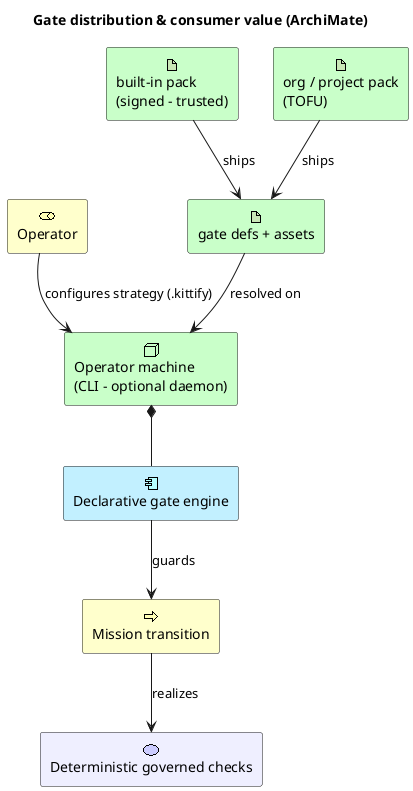
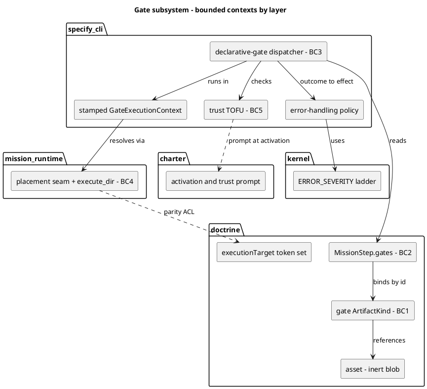
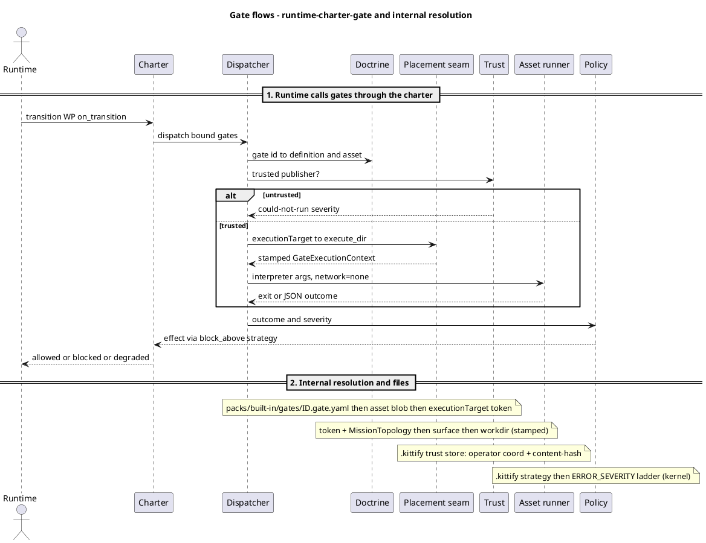

# Mission transition gates — declarative, asset-backed, trust-gated

> **Status: design (Proposed).** This page describes the intended model captured across
> ADRs 2026-08-13-2 … -5. It is being hardened before implementation; treat it as the design
> of record, not a description of shipped behaviour.

A **transition gate** is a deterministic check that runs when a work package crosses a lane
edge (e.g. `in_progress → for_review`) and returns a pass/fail verdict that can block the
transition. This page explains the declarative model that replaces the legacy
named-Python-handler registry.

## The moving parts

| Concern | Answer | ADR |
|---|---|---|
| **What a gate is** | A first-class doctrine `gate` artefact kind (declarative YAML), reusable by id, tiered like every other kind. | [-2](../adr/3.x/2026-08-13-2-gates-are-declarative-asset-backed-doctrine-artefacts.md) |
| **What the check is** | Code shipped as an `asset` (inert blob, resolved by id), invoked by the gate's `entrypoint` oneliner. | [-2](../adr/3.x/2026-08-13-2-gates-are-declarative-asset-backed-doctrine-artefacts.md) |
| **Where it runs** | An `executionTarget` surface selector (doctrine-owned token set) resolved through the existing stamped `GateExecutionContext` via the topology placement seam's `execute_dir` verb. | [-3](../adr/3.x/2026-08-13-3-gate-execution-targets-through-kernel-surface-selector.md) |
| **Whether it may run** | Trust: built-in trusted (release-signed target); org/project packs are trust-on-first-use, keyed on operator coordinate + content-hash. | [-4](../adr/3.x/2026-08-13-4-executable-doctrine-runs-only-from-trusted-publishers.md) |
| **What its outcome does** | The outcome carries a typed severity (`BLOCKING`/`RECOVERABLE`/`WARN`/`INFO`); the operator's error-handling strategy (`block_above(threshold)` in `.kittify`) decides the CLI effect. | [-6](../adr/3.x/2026-08-13-6-gate-outcomes-carry-severity-operator-strategy-decides-effect.md) |
| **How fast (later)** | *Open.* Parse-amortization is sound (content-addressed parse cache, no daemon); a deterministic *verdict* cache is contested and held open. | [-5](../adr/3.x/2026-08-13-5-local-daemon-amortizes-doctrine-parse-and-caches-gate-verdicts.md) |

## Diagrams

> Rendered locally by the no-egress PlantUML pipeline (`scripts/docs/plantuml_render.py`,
> `--network=none`, SANDBOX profile). The distribution view uses PlantUML's **native ArchiMate**
> (bundled in the pinned jar — no `!include`, no egress).

### Distribution & consumer value (ArchiMate)



### Bounded contexts by layer (component)



### Runtime flow + internal resolution (sequence)



## Definition vs binding

Two separated concerns:

- **Definition** — the `gate` artefact says *what the check is*: which asset holds the code,
  the `entrypoint`, the `executionTarget`, the timeout, and the fail disposition.
- **Binding** — the `MissionStep` says *when it fires*: an `on_transition` edge plus the gate
  id. Definition is reusable across steps and mission types; binding is per-step and ships in
  the per-type mission bundle.

```yaml
# gate definition — packs/built-in/gates/docs-structural-lint.gate.yaml
id: docs-structural-lint
schema_version: "1.0"
description: "DIRECTIVE_042 structural lint for documentation missions"
asset: common-docs-structural-lint       # code blob (asset kind, inert, resolved by id)
interpreter: python                       # structured invocation — no shell string
args: ["{asset}", "--strict"]            # {asset} → resolved asset path, as one argv element
executionTarget: primary                  # doctrine-owned selector → placement seam execute_dir
timeout_seconds: 120
severity: RECOVERABLE                      # outcome severity; operator strategy decides the effect
```

```yaml
# binding — packs/built-in/missions/mission-steps/documentation/validate/step.yaml
id: validate
# … unified MissionStep fields …
gates:
  - on_transition: "in_progress->for_review"
    gate: docs-structural-lint
```

## Execution model

1. A lane transition fires; the generic `declarative-gate` dispatcher (alongside a few
   grandfathered code gates such as `spec-kitty-pre-review`) is invoked with a
   `TransitionGateContext`.
2. The dispatcher resolves the gate's `executionTarget` selector through the placement seam,
   given the mission's `MissionTopology`, to a **stamped `GateExecutionContext`** (not a bare
   path — the stamp is what refuses a surface that cannot hold the artifact).
3. It resolves the pack's **trust** (operator coordinate + content-hash). An untrusted pack is a
   *could-not-run* outcome carrying a severity — it is **not** a silent skip.
4. If trusted, it resolves the referenced asset to a path and runs `interpreter` + `args` in the
   resolved context under a bounded, network-denied sandbox. The structured outcome (pass /
   failed / could-not-run) carries a **severity**; the operator's error-handling strategy
   (`block_above(threshold)`) maps that severity to the CLI effect (block vs proceed-degraded).

## Invariants

- Gates are **deterministic and side-effect-free** — pure checks, never mutate mission state.
  This must be **enforced by the sandbox** (network-denied, bounded), not merely asserted.
- The `asset` kind stays inert — resolved to a path, never self-executing. The gate is the
  only thing that turns a path into an invocation.
- Trust is only ever consulted for **executing code**; inert doctrine needs no trust decision.
- There is **one disposition model**: every outcome (pass / failed / could-not-run, the last
  including *untrusted*) carries a severity, and the operator's error-handling strategy decides
  the effect uniformly — so a security gate fails **closed by default** regardless of *why* it
  did not pass, and a missing CI trust seed **blocks loudly** rather than silently no-ops.

## Relationship to the mission subtree

Gates that are mission-type dependent (documentation linting, per-type consistency checks)
ship inside the per-type bundle under `packs/built-in/missions/<type>/`; shared gates live at
the built-in tier and are referenced by id. This follows the nested, self-contained mission
subtree fixed by [ADR 2026-08-13-1](../adr/3.x/2026-08-13-1-built-in-mission-subtree-stays-nested-retire-legacy-step-contracts.md).
