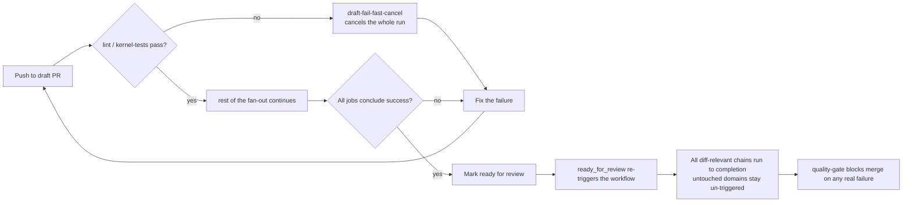

# CI contract: draft vs ready, and green-before-RFR

`CI Quality` (`.github/workflows/ci-quality.yml`) runs a different shape of
signal depending on whether a pull request is a **draft** or **ready for
review**. This page is the contract: what each mode guarantees, why the
`draft-fail-fast-cancel` job and the red-first re-run exist, and the one rule
every contributor and agent follows before flipping a PR out of draft
(FR-013, SC-006 — mission `ci-flake-report-workflow`).

## The contract in one picture

## Draft PR: fail-fast for quick iteration

While a PR is a **draft**, the `draft-fail-fast-cancel` job watches the two
earliest, unconditional gates in the fan-out — `lint` and `kernel-tests`. The
moment either one fails on a draft PR, `draft-fail-fast-cancel` calls the
GitHub Actions run-cancel API and stops the whole workflow run
(`actions: write`, `if: failure() && github.event.pull_request.draft == true`).
Heavier suites (`integration-tests-core-misc`, `e2e-cross-cutting`) are
already path-filtered off drafts entirely — the canceller trims what remains
of the fan-out on top of that.

This is an **optimization, not a gate**: it exists to save CI minutes and get
you to the first failure fast while you're still iterating. It does not
replace `quality-gate`, which remains the sole blocking authority regardless
of whether the canceller fires.

**Consequence — a red draft run is inherently partial by design.** Because
the run can be cancelled after the first failure, a red draft run does **not**
give you the full list of what's broken — only the first thing that broke.
Don't read a cancelled draft run as "everything else must be fine"; you
haven't seen everything else yet.

## Ready PR: full *relevant* signal

Once a PR is marked **ready for review**, the diff-relevant suites run to
completion — chained with `if: always()` so an early failure in one suite
does not skip a sibling suite that also needs to report. You see every
relevant failure in a single pass instead of fixing one, pushing, and
discovering the next.

"Full signal" here means full **relevant** signal, not run-everything:
domains the diff didn't touch stay un-triggered by the same path-filtering
that applies in draft mode. A PR that only touches `src/specify_cli/status/`
does not suddenly run the dashboard or upgrade suites just because it left
draft state.

Flipping a PR to ready re-triggers `CI Quality` from the `ready_for_review`
event (it's in the workflow's `types:` trigger list), so every
branch-protection-required check context for the touched domains gets
re-emitted — a draft's cancelled or skipped checks don't leave the PR stuck
showing a stale or missing status.

## Red-first re-run: fail fastest on a still-broken fix

When a PR gets a new push (`synchronize`) and its previous run left failing
tests behind, CI restores those failing node IDs from a persisted cache
(`.ci-cache/flake-lastfailed.txt`, via
`scripts/ci/collect_failed_nodeids.py`) and seeds pytest's own `lastfailed`
cache with them. The suite then runs with `--ff` ("failed first"), so the
tests that were red last time run **first** in the new push's suite.

> **Scope (current):** red-first is wired into the **`fast-tests-cli`** suite
> only — a deliberate first-cut pilot on a small, self-contained gating job.
> A failure in another suite (integration, slow, e2e, shards) is not yet
> reordered. Widening the pilot to more suites is tracked as follow-up.

If your fix didn't work, you find out from the first tests that execute —
not after waiting for the rest of an unrelated 40-minute suite to grind
through first. If the previous run was green, or no cache exists (first
push, cache miss, corrupt file), this degrades harmlessly to normal test
ordering — nothing about this changes what "passing" means, only what order
failures surface in.

## The rule: monitor draft to green before flipping to ready (SC-006)

**Draft-PR authors and agents monitor their draft run until every job
concludes `success` before marking the PR ready for review.**

A ready-for-review pass is meant to be a reviewer's full-relevant-signal
check, not a second attempt at catching a failure you already know about.
Because a red draft run is partial (see above), the only way to know a draft
is actually clean is to watch it run to completion green — not to eyeball
the first few jobs and assume the rest will pass.

Don't:

- Flip to ready while jobs are still running, assuming they'll pass.
- Flip to ready right after `draft-fail-fast-cancel` fires, without first
  fixing the failure and re-running to a clean, uncancelled pass.
- Treat "the parts that ran were green" as equivalent to "the draft run
  concluded `success`" — a cancelled run has jobs that never ran at all.

Do:

- Push, wait for the draft run to reach a terminal state, and confirm every
  job concluded `success` (not `cancelled`, not `skipped`-when-it-shouldn't-be,
  not `failure`) before flipping the PR out of draft.

## Merge-gate: unchanged in both modes

`quality-gate` reads real step outcomes (`needs.<job>.result`) and blocks
merge on any real failure — in draft mode and in ready mode alike. Neither
the canceller nor the red-first re-run touches this: full-relevant-signal is
never achieved by loosening a gating job with `continue-on-error`, and
branch protection is unaffected by which mode produced the result.

## See also

- [Review gates: PR draft and WIP-title conventions](how-to/review-gates.md#pr-draft-and-wip-title-conventions)
- [Review gates: Pre-review regression gate](how-to/review-gates.md#pre-review-regression-gate-move-task---to-for_review)
- [Test-flakiness handling policy](testing/testing-flakiness.md) — the
  suite-wide "never retry-to-green" rule this contract does not relax; the
  red-first re-run changes ordering, never pass/fail outcome.
- The weekly, artifacts-only `ci-flake-report.yml` workflow measures the
  false-red rate of `CI Quality` over time (findings only — no repo commit,
  never gating, never wired into this or any other doc per C-001).
