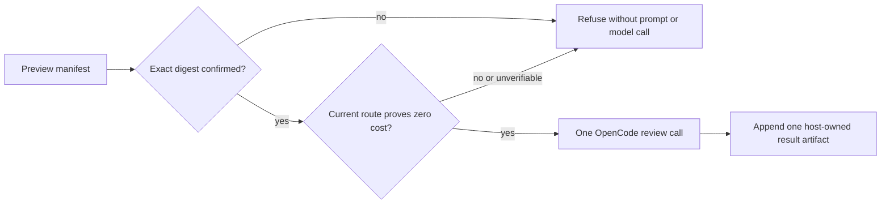

# Review a Mission specification with an external model

`spec-kitty spec-review` sends one Mission's canonical `spec.md`, the bundled
review rubric, response schema, and prompt template through the local OpenCode
CLI. The result is advisory: it does not edit the specification, change Mission
lifecycle state, select a fallback model, or become a mandatory acceptance gate.

## Prerequisites

- Install OpenCode and complete its login yourself. Spec Kitty does not store or
  manage OpenCode, OpenRouter, or provider credentials.
- Select a Mission whose canonical `spec.md` is no larger than 256 KiB.
- Remove private, corporate, credential, and personal data before previewing.

The built-in scanner rejects several sensitive-data patterns, but it is
heuristic. It can produce false positives and false negatives and is **not a
guarantee of anonymization**. There is no override in this version.

## Preview exactly what would be disclosed

Preview is metadata-only and makes no pricing, prompt, network, or model call:

```bash
spec-kitty spec-review --mission <mission> --model opencode/x-preview-f-free --preview
```

The output identifies the transport and requested route, then shows the size
and SHA-256 of `spec.md`, the rubric, response schema, and prompt template. It
also shows the total payload size and a consent digest covering the complete
manifest.

The route is only a requested OpenCode identifier. Its spelling, including a
suffix such as `-free`, does **not** prove availability, provider ownership,
price, data retention, zero data retention, anonymization, or the model that
will actually answer. Verify provider terms separately before sending data.



## Consent to one run

For an interactive terminal, omit `--confirm-digest`. Spec Kitty displays the
current manifest and asks whether to transmit exactly that package:

```bash
spec-kitty spec-review --mission <mission> --model opencode/x-preview-f-free
```

For a non-interactive run, copy the exact `Digest согласия` value from a fresh
preview:

```bash
spec-kitty spec-review \
  --mission <mission> \
  --model opencode/x-preview-f-free \
  --confirm-digest <exact-sha256-from-preview>
```

The digest is invocation-scoped consent for the manifest that is recomputed at
launch. Every run must provide or interactively confirm it again; if the
manifest is unchanged, its digest can remain the same. A missing or mismatched
value exits with code 2 before pricing, prompt composition, or the model runner.
Any change to the specification, route, rubric, schema, template, or scanner
version requires a new preview and consent.

After consent, the pricing gate checks the exact requested route. A paid,
unknown, incomplete, stale, unreadable, or otherwise unverifiable zero-cost
snapshot fails closed with `SPEC_REVIEW_MODEL_NOT_FREE` before prompt
composition or transmission of `spec.md`. Spec Kitty does not substitute
another route or provider.

Use `--timeout <seconds>` to change the response timeout from its 180-second
default; accepted values are 10 through 600.

## Interpret the result

A successful run prints `completed`, host-computed finding counts by severity,
and the artifact path. It creates a new append-only file:

```text
kitty-specs/<mission>/reviews/spec-review-<run-id>.yaml
```

The file uses `schema: spec-review-run/v1`. Its host-owned fields include the
Mission, specification SHA-256, requested route, transport, timestamps, status,
diagnostic code, validated findings, and severity summary. `actual_model:
unverified` means the provider response did not supply independently verifiable
model provenance.

Review each finding manually. Line ranges refer to the specification snapshot
identified by `spec_sha256`; they are not edits or approval decisions. Spec
Kitty never applies findings automatically and never modifies `spec.md` as part
of this command.

## Status, exit code, and remediation

| Outcome | Exit | Artifact | What to do |
|---|---:|---|---|
| Preview, completed review, or interactive cancellation | 0 | Only a completed review is stored | Inspect findings manually, or stop |
| Consent missing or digest mismatch | 2 | No | Run a fresh preview and confirm its exact digest |
| Input or preflight refusal | 3 | No | Remove sensitive markers, fix the canonical path, encoding, or size, then preview again |
| Route not provably free, CLI/auth failure, provider error, or HTTP 429 | 4 | Provider/auth failures after external start are stored; pre-start refusal is not | Resolve the named condition, then start a new preview and separately consented run |
| Timeout | 5 | Yes | Check OpenCode/provider health or adjust `--timeout`, then start a new consented run |
| Invalid or unsafe provider output | 6 | Yes | Treat the response as unusable; start a new consented run only if desired |
| Local artifact write failure | 7 | No | Repair the Mission artifact path or permissions; the external call is not repeated |

There are no automatic external retries. In particular, HTTP 429 is a provider
error, not permission to resend. Retrying is a new manual operation with a new
preview and consent digest. Earlier artifacts are never overwritten.

## Privacy and trust boundary

The command transmits the full accepted `spec.md`, not only safe metadata. It
does not transmit `plan.md`, task files, source code, diffs, conversation
history, or arbitrary attachments. Preview output and local diagnostics avoid
printing the specification, prompt, raw provider body, credentials, or raw
reasoning.

Spec Kitty's local handling does not establish the external provider's
retention, privacy, ownership, availability, or pricing policy. If those facts
cannot be independently verified for the current route, do not send the
specification.
