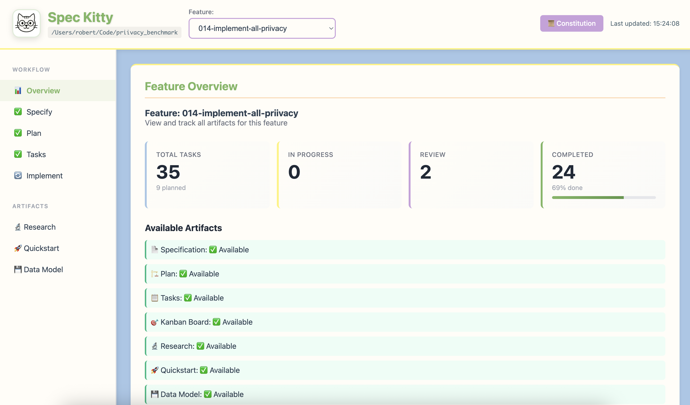
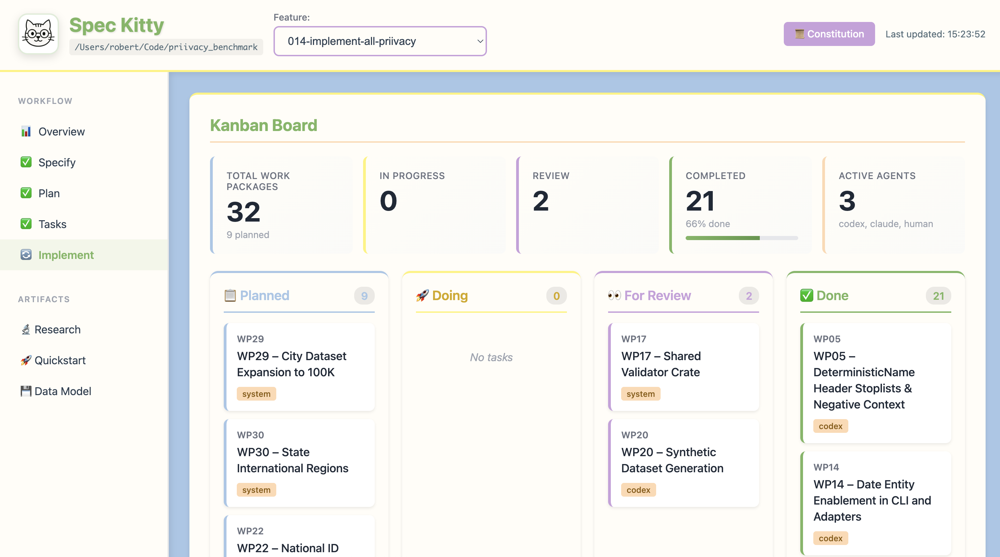

# How to Use the Spec Kitty Dashboard

The dashboard provides live, project-wide visibility into work packages, lanes, and agent activity. It launches during `spec-kitty init` and can be opened anytime.

## Starting the Dashboard

```bash
spec-kitty dashboard
# or
/spec-kitty.dashboard
```

If the dashboard isn't already running, Spec Kitty starts it in the background and opens a browser tab.

## Dashboard URL

Spec Kitty records the active dashboard URL in `.kittify/.dashboard`. If the browser doesn't open automatically, copy the URL from that file.

## Dashboard Views

### Kanban Board

The kanban board mirrors the lane workflow (`planned -> doing -> for_review -> done`).



### Feature Overview

The overview summarizes feature progress, artifacts, and worktrees.



## Custom Port

If you need a specific port, pass `--port`:

```bash
spec-kitty dashboard --port 8080
```

If the port is taken, Spec Kitty finds the next available port.

## Stopping the Dashboard

```bash
spec-kitty dashboard --kill
```

This stops the background process and clears the `.kittify/.dashboard` metadata.

## Dashboard Auto-Start

`spec-kitty init` starts the dashboard automatically for each project. You can re-run `spec-kitty init .` if the dashboard metadata is missing or stale.

---

## Command Reference

- [CLI Commands](../reference/cli-commands.md) - Dashboard commands
- [Slash Commands](../reference/slash-commands.md) - `/spec-kitty.dashboard`

## See Also

- [Parallel Development](parallel-development.md) - Monitor multi-agent work
- [Review a Work Package](review-work-package.md) - Track review status

## Background

- [Kanban Workflow](../explanation/kanban-workflow.md) - Lane system explained
- [Multi-Agent Orchestration](../explanation/multi-agent-orchestration.md) - Agent coordination

## Getting Started

- [Your First Feature](../tutorials/your-first-feature.md) - See dashboard in action
- [Claude Code Integration](../tutorials/claude-code-integration.md) - Dashboard with Claude
