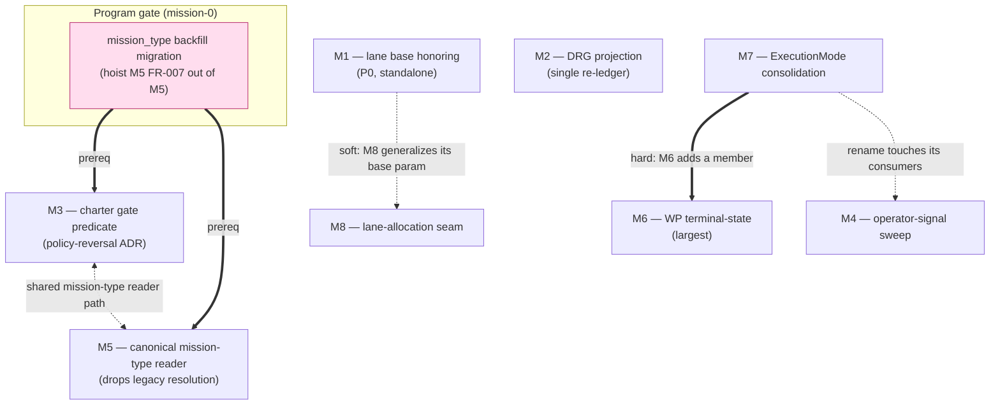

# rc3 friction burndown: delivery approach & sequencing

This is the delivery plan for the eight rc3 missions described in the
[program overview](rc3-friction-burndown-overview.md). It encodes the
cross-mission dependencies, the wave order, the two deliberate behavior-change
sign-offs and their shared migration prerequisite, and how the bundle is cut and
landed before rc2.

## Dependency DAG

Four hard/soft edges and one program-level gate govern the order. Everything
else is independent.

**Edge legend.** `==>` hard prerequisite; `-.->` soft/coordination edge.

1. **`mission_type` backfill → M3 and M5 (hard program gate).** M5 drops legacy
   `{"mission":…}` resolution and M3 makes a typeless/typo'd `mission_type`
   hard-fail. *Together*, an unmigrated legacy mission goes silently-resolving →
   typeless (M5) → hard-fail (M3). `migrate backfill-identity` mints only
   `mission_id`; it does **not** backfill `mission_type`. A dedicated
   `mission_type` backfill **must land and run before either M3 or M5 reaches a
   real project.** It is authored inside M5 today (FR-007) but is a shared
   prerequisite for both — hoist it into a mission-0 / migration step.
2. **M7 → M6 (hard).** M6's D1 completion-mode value is a new member on the
   enum M7 renames/cleans. M6 fails closed if M7 has not landed (M6 NFR-003,
   C-002). M7 lands first.
3. **M1 → M8 (soft).** M8 generalizes the allocation seam *around* M1's `base`
   parameter — it references M1's point-fix, it does not re-land it (M8 C-001,
   C-002). Design may begin before M1 merges; the seam subsumes the threading.
4. **M2 single re-ledger (internal).** Both of M2's extractor edits move the
   golden `*.graph.yaml` fragments; a dedicated post-merge step runs
   `regenerate-graph` **once** after both land (M2 FR-009, C-002). Neither edit is
   "done" until that step runs.

## Wave sequencing

Waves are landing order on the shared pre-rc2 branch, not calendar weeks. Within
a wave, missions are independent and may proceed in parallel.

### Wave 0 — ship the P0 and open the gate

- **M1** — the P0 point-fix. Standalone, smallest, highest severity (silent *and*
  fabricates success). Ships first so the operator-facing regression is closed
  immediately.
- **`mission_type` backfill migration** (hoisted from M5). Lands and is verified
  here so Wave 2's behavior-changers are safe for real projects. No mission that
  reads a mission type depends on it *functionally*, but M3 and M5 depend on it
  for **safety** — see the sign-off section.

### Wave 1 — independent, cross-cutting first

- **M7** — enum consolidation. Placed early because it is a hard prerequisite for
  M6 **and** because its rename touches every consumer of the ownership enum,
  including the net-new `infer_execution_mode` consumer that M4's #3590 detector
  introduces (see integration notes). Landing M7 first means M4 and M6 build on
  the renamed symbol rather than churning it.
- **M2** — DRG projection. Self-contained within Cluster A; its only sequencing
  constraint is internal (the single re-ledger step comes last within M2).
- **M4** — operator-signal sweep. Independent six-site sweep; sequence *after* M7
  so its detector references the renamed enum.

### Wave 2 — gated behavior-changers and the deep fixes

- **M3** and **M5** — both require the Wave-0 backfill gate. They may run in
  parallel with each other **but must coordinate the shared mission-type reader
  path**: M3's `resolve_mission_type_key` fast path must compose with M5's
  canonical `read_mission_type()`, or the two readers re-diverge — the exact
  defect M5 exists to kill.
- **M6** — the deep terminal-state fix. Hard-gated on M7 (Wave 1). Largest blast
  radius (the FSM ↔ accept ↔ merge spine); land it once M7 is proven.
- **M8** — the lane-allocation seam. Soft-gated on M1 (Wave 0). Largest Cluster-B
  surface; sequence its internal WPs low-risk-first: authoritative predicate swap
  (#3460) → allocation seam (subsumes M1's `base`) → anti-bypass guard →
  read-side degrade companion (#3462) → #3536 refusal fix.

## Per-mission size & risk

| Mission | Size | Dominant risk | Mitigation |
|---------|------|---------------|------------|
| M1 | S | Legacy `mission_branch` route must keep working (#1684); signature fan-out on `allocate_lane_worktree`. | Red-first repro already exists; pin the legacy path; enumerate call sites at plan. |
| M2 | M/L | Golden double-churn; #3488 stale-issue re-fix risk (largely shipped on `main`). | Single dedicated re-ledger step; verify-first + the FR-008 anti-divergence bind (pin the *invariant*, not the rc1 symptom). |
| M3 | L | Import-time/hot-path budget; red-by-design tests "fixed backwards"; ~35 test files reference the literal triple. | Thread the loaded graph; name every red-by-design reversal in the ADR; WP-slice the artifact seam. |
| M4 | M | Heuristic false positives (#3590 detector); signal routed into a still-swallowed sink. | Warn-only + false-positive control fixture; NFR-001 requires an already-operator-visible surface per site. |
| M5 | M/L | Legacy-retirement blast radius — every `{"mission":…}`-only mission stops resolving. | The backfill gate (Wave 0) lands before behavior changes; per-reader test-pinned steps; structural parity test. |
| M6 | XL | The highest-leverage correctness surface; a wrong terminal-lane semantic green-washes live work. | FR-009 + regressions for every non-terminal lane; default diff path unchanged behind an explicit completion-mode gate; hard-gate on M7. |
| M7 | M | Governance-gate symbol (arch test + ADR); rename blast radius (~8 consumers, plus M4/M6 new consumers). | Update the surface test + ADR in the same change; mypy catches missed references; guard permits M6's additive member. |
| M8 | L | Touches the coord-topology core; legacy coord-mission routing changes for exactly the #3460 cells. | Land the low-risk predicate swap first; red-first legacy-coord coverage; keep #3536 cross-referenced to epic #2739. |

## Deliberate behavior-change sign-offs (M3, M5) and the shared prerequisite

Two of these missions are **not** byte-identical refactors. They ship a
behavior change under an ADR, and they share a migration prerequisite.

- **M3 — one policy-reversal ADR.** (a) Declared non-bootstrap actions
  (`tasks`, `retrospect`) begin delivering their doctrine grain instead of
  short-circuiting to `compact`; (b) a typo'd/unregistered `mission_type` with no
  matching per-type profile at any layer begins hard-failing instead of resolving
  silently with fabricated provenance. Named red-by-design test reversals
  (`test_json_non_bootstrap_action_is_explicitly_ruled_out`,
  `test_project_with_overrides_does_not_hard_fail_for_unknown_type`, and the
  stray-`spec.md` presence assertions) must each be pointed at by the ADR — an
  implementer who "fixes them back" re-breaks the fix.
- **M5 — legacy `{"mission":…}` resolution dropped entirely.** Convergence is
  *downward* to the canonical `mission_type` field; the silent `software-dev`
  defaults are removed. A legacy mission carrying only `{"mission":…}` stops
  resolving.
- **The shared prerequisite (the program gate).** M3's typeless hard-fail and
  M5's legacy-drop compound: an unmigrated legacy mission moves silently-resolving
  → typeless (M5) → hard-fail (M3). The `mission_type` backfill is the safety net
  that makes both non-breaking, and **it must precede both reaching real
  projects.** Because the backfill is authored inside M5 but is required by M3
  too, treat it as a mission-0 gate (Wave 0), not an M5-internal step. Document
  the interaction in the shared ADR line so neither mission ships the compound
  break unguarded.

## The #3488 "keep-the-invariant-not-the-fix" note

M2 folds #3488, but **#3488's rc1 gaps are largely already fixed on `main`**
(`operating-procedures` is data-driven into the DRG with a fail-closed doctor
check; step `description` renders; styleguide/toolguide pointer-only is a
documented deliberate choice). The fold's durable deliverable is therefore the
**FR-008 anti-divergence invariant** binding the emit and delivery seams — *not*
re-fixing shipped code. The canonical-source and campsite discipline applies:
verify the delivery path on current `main` first; close only the residual; an
implementer who takes the rc1 report at face value could revert working code.

## rc3 cut & land plan

The bundle is delivered like the charter bundle: specify now, run later against a
single branch.

1. **Spec-now.** All eight LIGHT specs are authored and operator-decided
   (2026-08-20). They are *not* finalized — no `mission create` yet.
2. **Sequence to rc2.** The eight missions feed a **single-branch pre-rc2 PR**.
   Land in wave order (Wave 0 → Wave 1 → Wave 2). The Wave-0 backfill gate is the
   one hard stop before any Cluster-A behavior-changer.
3. **Run like the charter bundle.** Finalize tasks per mission, run the
   implement/review loop, and consolidate onto the shared branch. Cluster B (M1,
   M4, M6, M8) runs fully parallel to Cluster A (M2, M3, M5); M7 lands before M6
   and before M4's new consumer.
4. **Golden discipline.** M2's single `regenerate-graph` step is the one
   golden-moving commit; ensure M3's action-gate tests run against the
   re-ledgered goldens (M3 reads `bundle.merged`, it does not regenerate).
5. **Baseline-red discipline.** M6 and M7 are behavior-preservation-heavy; attribute
   reds against a green merge-base baseline before folding them, per
   [ADR 2026-07-17-1](../../../adr/3.x/2026-07-17-1-red-main-is-honest-ci-is-release-authority.md).

## Integration notes (cross-mission coordination surface)

These are not blockers; they are coordination points the plan phase must honor so
two missions on one branch do not collide.

- **M3 ↔ M5 — shared mission-type reader.** Both operate the mission-type
  resolution path. Confirm M3's `resolve_mission_type_key` composes with M5's
  canonical `read_mission_type()` rather than retaining a parallel legacy-honoring
  path.
- **M7 ↔ M4 — rename consumer.** M4's #3590 detector consumes
  `infer_execution_mode`, which returns the ownership-enum members M7 renames.
  M4's net-new detector must use the renamed symbol; land M7 first.
- **M3 ↔ M4 — `expected-artifacts.yaml`.** M3 relocates `ExpectedArtifactManifest`
  into `src/doctrine/missions/` and reads it for gate sets; M4 makes its
  malformed-load fail loud in `repository.py`. Same area — coordinate the touch.
- **M5 ↔ M6 — `audit/classifiers/wp_files.py`.** M6 retires the misnamed
  `_TERMINAL_LANES` constant (`:16`); M5's #2901 fold routes the WP-frontmatter
  reader in the same file through the tolerant reader. Different symbols, one file.
- **M5 ↔ M8 — `retrospective/generator.py`.** M5 touches the mission-type reader
  (`:1319`); M8 migrates a read-side degrade site (`:271`). Different lines,
  one file.

## See also

- [rc3 fail-loud friction burndown: program overview](rc3-friction-burndown-overview.md) — the program BLUF, root cause, and mission table.
- [Processing & charter friction bugs: shared root causes and mission scope](../../investigations/friction-bugs-processing-charter-root-cause.md) — the five-lens investigation and the proposed mission shape this plan sequences.
- [Red main is honest; CI is release authority (ADR 2026-07-17-1)](../../../adr/3.x/2026-07-17-1-red-main-is-honest-ci-is-release-authority.md) — the baseline-red discipline M6/M7 depend on.
