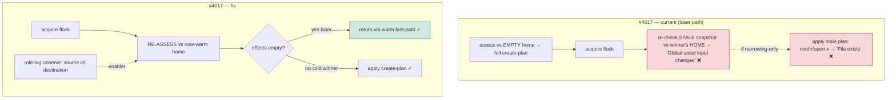

# Mission Specification: CI Suite Stability & Test-Isolation

**Mission Branch**: `issue-4017-ci-suite-stability`
**Created**: 2026-09-09
**Status**: Draft (revised post-spec adversarial squad)
**Input**: Combined Mission B of the CI-rework remainders (parent epic #1931), after Mission A (#4032/#4047) and #4022 landed on main via #4082. Two issues as separate WP clusters: #4017 (P2, runtime concurrency) and #4015 (P3, timing-guard residual + folded flaky wall-clock gates). Grounded by a pre-mission research squad; reshaped by a post-spec adversarial squad.

## Context

**Cluster A — #4017 (P2): `ensure_runtime` shared-home concurrency crash.** Concurrent installed-CLI invocations sharing one `spec-kitty-home` (the real two-owned-worktree model, #3328/FR-008) abort with `RuntimeError`. Grounded + **sharpened by the post-spec squad** into a precise mechanism:

- The cold-installer **anchor flock already serializes** correctly (`asset_preparation.py:516-522`).
- `assess_runtime()` computes the loser's plan against an **empty** home (`bootstrap.py:162-185`) — a full create-tree.
- The **post-lock re-check re-validates the loser's STALE observation snapshot** and sees the winner's materialized HOME destination nodes → raises `"Global asset input changed"` (`asset_preparation.py:490`).
- **Narrowing the observation scope alone does NOT fix this** — it makes the re-check pass, but the loser then applies its stale empty-home create-plan over the winner's bytes: `path.mkdir(...)` (`:545`) and `open("x")` (`:617`) are **non-idempotent** → `FileExistsError` → `global_asset_write_failed` → `ensure_runtime` still raises. Narrowing merely trades one error for another.

**The race fix is to re-ASSESS under the held lock**: after acquiring the existing cold-installer flock, recompute effects against the now-warm home so the loser finds `effects==[]` and returns via the warm fast-path (`bootstrap.py:200-201`). The observation-scope narrowing is a **role-tagging enabler/semantic cleanup** (HOME destination is an output, not an asset-input), done by tagging `observe()` entries source-vs-destination and filtering at the compare site — **not** a geographic strip of `PreparedAssets.observations` (those feed the InputObservation fingerprint and cross-family agreement invariants, and sources can share the HOME prefix under test layouts, so a strip would hide genuine source drift).

**Cluster B — #4015 (P3, chore): timing-guard residual + flaky wall-clock gates.** 74 mixed timing+functional tests and 9 guard-vocabulary-blocked timing-only tests remain on the per-PR blocking path; the #3665 guard (`test_performance_marker_guard.py`) forbids a non-timing assertion under `@performance`. The flaky wall-clock/NFR gates bullet is fully absorbed here (census: the genuinely-flaky-on-main gates are already off the blocking path); its only new element is a sanctioned **delete** disposition for persistently-flaky low-value timing-only gates.

## User Scenarios & Testing *(mandatory)*

### User Story 1 — Concurrent installed-CLI invocations sharing one cold home both succeed (#4017) (Priority: P1)

**Why this priority**: The user-facing P2 bug; breaks the supported two-owned-worktree concurrency model.

**Independent Test**: A **deterministic apply-interleave** test (force the loser to observe the winner mid-materialize) proving the loser converges to a no-op after re-assess — plus the real installed-CLI concurrent harness (the quarantined tests).

**Acceptance Scenarios**:
1. **Given** a cold shared `spec-kitty-home` and two concurrent cold-start invocations, **When** both run, **Then** both exit 0 with **zero** `"Global asset input changed"` AND **zero** `"global_asset_write_failed"` (both failure modes must be absent).
2. **Given** the loser acquired the flock after the winner materialized HOME, **When** it re-assesses under the held lock, **Then** it recomputes `effects==[]` against the now-warm home and returns via the warm fast-path (it does NOT apply a stale create-plan).
3. **Given** a concurrent peer materializes HOME **destination** nodes, **When** the recheck runs, **Then** that materialization is NOT counted as an asset-input change (destination nodes are role-tagged as outputs and filtered at the compare site).
4. **Given** a genuine package-**source** change between assess and apply, **When** the recheck runs, **Then** it IS still caught (the role-tagging must not over-narrow away legitimate source-drift detection).
5. **Given** a warm (canonical) home, **When** the CLI starts, **Then** it performs exactly **one** assess and takes **no** lock (warm fast-path preserved).
6. **Given** both quarantined tests (`test_worktree_owned_root_concurrency.py::test_installed_cli_keeps_two_owned_worktrees_isolated` and the charter epic golden-path test quarantined by `90d9be8823`), **When** the fix lands, **Then** both are un-skipped and pass.
7. **Given** the upgrade path (which inherits `ensure_runtime` via `init.py`/`migrate_cmd.py`), **When** the fix lands, **Then** #4082's dry-run repair-disclosure and authority-recovery preview are byte-unchanged.

---

### User Story 2 — Timing-guard residual moved off the per-PR path without losing coverage, and still enforced nightly (#4015) (Priority: P2)

**Why this priority**: Chore-class CI hygiene; removes per-PR flakiness without dropping functional coverage or silently never-running the budgets.

**Independent Test**: #3665 guard green; a per-split mapping table shows each functional assertion retained verbatim on the per-PR path; relocated timing tests run+pass on the nightly performance lane with the budget value preserved.

**Acceptance Scenarios**:
1. **Given** the 9 vocab-blocked timing-only tests, **When** remediated, **Then** each is marked `@pytest.mark.performance` via the shared `assert_timing_budget(measured, budget)` helper (guard-clean call-site) or a local rename, or **deleted** (evidence-gated) — and the #3665 guard passes with `TIMING_ASSERTION_VOCABULARY` unchanged.
2. **Given** the 74 mixed tests, **When** split, **Then** the functional assertion stays on the per-PR path unmarked and the timing assertion moves to a `@performance` test that is **collected and green on the nightly lane** with its budget value preserved (not orphaned/loosened).
3. **Given** `test_lane_dependency_cycle_performance.py` (currently `skipif` nightly-only), **When** split, **Then** its functional cycle-detection assertion now runs on the per-PR path (recovers missing coverage).
4. **Given** a candidate deletion, **When** judged, **Then** it carries (a) a recorded flake-rate observation justifying "persistently-flaky", (b) a mechanical AST confirmation the body has **zero functional assertions**, and (c) operator sign-off — otherwise it is split/relocated, never deleted.

### Edge Cases
- **#4017:** a loser whose assess saw an empty home must, after re-assess-under-lock, find `effects==[]` (confirm `asset()`/`tree()` recognize the winner's freshly-written canonical bytes as owned/equal) — not re-apply.
- **#4017:** the re-assess fires only on the **cold/effects** path; it must not add a second assess or any lock to the warm fast-path.
- **#4017:** role-tagging must survive shared source/home prefixes (editable/`SPEC_KITTY_TEMPLATE_ROOT`/test layouts) — classify by role, not purely by geography.
- **#4017:** `check_assets` is a **generic** surface (runtime + agent_commands + agent_skills + managed_skills owners); the fix must state whether it lands generically (all owners) or runtime-scoped, and the acceptance must exercise the real `global_assets`/`ensure_runtime` batch path (not a unit-level `check_assets`), covering the triple-nested recheck.
- **#4015:** a split must not leave the functional test depending on timing-loop repetition it no longer needs (use the minimal functional call count).

## Requirements *(mandatory)*

### Functional Requirements

| ID | Title | User Story | Priority | Status |
|----|-------|------------|----------|--------|
| FR-001 | Re-assess under the held lock (race fix, MANDATORY) | As a maintainer, I want the loser to recompute effects against the now-warm home after acquiring the existing cold-installer flock, so it converges to a no-op instead of applying a stale create-plan. This is the core #4017 fix. | High | Open |
| FR-002 | Role-tag the observation set (enabler) | As a maintainer, I want `observe()` entries tagged source-read vs destination-probe and filtered at the compare site, so a peer materializing HOME destination is not mis-read as an asset-input change — WITHOUT stripping `PreparedAssets.observations` (they feed the fingerprint + cross-family invariants). | High | Open |
| FR-003 | Preserve legitimate source-drift detection | As a maintainer, I want a genuine package-*source* change between assess and apply to still be caught after role-tagging (no over-narrowing). | High | Open |
| FR-004 | Cover the global_assets recheck for all owners; verify-or-exclude the command-completion recheck | The fix lands in the `check_assets`/`recheck_assets` **global_assets** recheck shared by all owners (HiC-confirmed generic). NOTE: `_recheck_command_completion` (`managed_skills.py:165`) is a SEPARATE recheck that does NOT call `check_assets` and carries its own #4082 `recheck_applied()` idempotency — WP-A must either drive it to confirm it needs no equivalent re-assess, or bring it into scope with rationale (do not silently assume coverage). Acceptance exercises the real batch path incl. a non-runtime owner and the `merge.py` recheck nesting. | High | Open |
| FR-005 | Preserve the warm no-lock fast-path | As a maintainer, I want warm (canonical-home) startup to do exactly one assess and take no lock — the re-assess fires only on the cold/effects path. | High | Open |
| FR-006 | Red-first (captured FIRST) + un-skip both tests | Capture the RED-first repro of the exact `"Global asset input changed"` signal via the installed-CLI concurrent harness **before any code change lands** (role-tag alone flips the signal to `global_asset_write_failed: File exists`, so the original signal is unreproducible afterward); document the intermediate File-exists state after role-tag-alone (proving the P1 blocker). Plus the deterministic apply-interleave test; BOTH quarantined tests un-skipped and DRIVEN green. | High | Open |
| FR-007 | #4082 regression guard — live composition interplay | Prove #4082 intact after the fix via (a) upgrade dry-run repair-disclosure byte-unchanged AND (b) a test driving the LIVE `managed_skills` composition apply path (`managed_skills.py:333-350`: global_assets recheck + `_recheck_command_completion` under one lock) asserting the #4082 `recheck_applied()` YAML-receipt suppression still holds after re-assess lands. | Medium | Open |
| FR-008 | Shared timing-budget helper (#4015) | As a test owner, I want a shared `assert_timing_budget(measured, budget)` helper with guard-clean call-site text, so vocab-blocked timing tests can be marked `performance` without widening the guard vocabulary. | Medium | Open |
| FR-009 | Remediate the 9 vocab-blocked tests (#4015) | As a test owner, I want each of the 9 marked `performance` (helper/rename) or deleted (evidence-gated). | Medium | Open |
| FR-010 | Split the 74 mixed tests (#4015) | As a test owner, I want the timing assert split into a `performance` test (collected+green nightly, budget preserved) while the functional assert stays on the per-PR path. | Medium | Open |
| FR-011 | Evidence-gated delete disposition (#4015) | As the operator, I want deletion allowed only with recorded flake-rate evidence + a mechanical AST proof of zero functional assertions + operator sign-off; load-bearing functional asserts are split, never deleted. | Low | Open |
| FR-012 | Guard integrity; no vocab widening (#4015) | As a maintainer, I want `test_performance_marker_guard.py` green and `TIMING_ASSERTION_VOCABULARY` unchanged (the helper is the mechanism). | Medium | Open |
| FR-013 | Verifiable no-coverage-loss mapping (#4015) | As a reviewer, I want a per-split mapping table (original test → functional assertion retained verbatim per-PR; timing assertion relocated) so no-coverage-loss is diffable, not faith-based. | Medium | Open |
| FR-014 | Traceability (#4017 + #4015) | As the operator, I want every item mapped to #4017 or #4015 in the issue matrix. | Medium | Open |

### Non-Functional Requirements

| ID | Title | Requirement | Category | Priority | Status |
|----|-------|-------------|----------|----------|--------|
| NFR-001 | Concurrency correctness (real batch path) | On the real `global_assets`/`ensure_runtime` batch path, two concurrent cold-home invocations both exit 0 with 0 `"Global asset input changed"` AND 0 `"global_asset_write_failed"`; the deterministic apply-interleave test shows the loser converges to a no-op. | Reliability | High | Open |
| NFR-002 | Warm-path preservation | Warm startup performs exactly one assess, takes no lock, and is behavior/latency-unchanged vs pre-mission. | Performance | High | Open |
| NFR-003 | No functional-coverage loss (diffable) | Per-split mapping exists; the count and text of functional assertions on the per-PR path after the sweep is ≥ before (no functional assertion relocated off per-PR or weakened). | Reliability | High | Open |
| NFR-004 | Nightly budget enforcement | Every relocated timing test is collected and green on the nightly performance lane (`SPEC_KITTY_RUN_PERFORMANCE=1`), with its budget value preserved from the original. | Reliability | Medium | Open |
| NFR-005 | Guard integrity | `test_performance_marker_guard.py` passes; 0 functional assertions under a `performance` marker; `TIMING_ASSERTION_VOCABULARY` unchanged. | Maintainability | Medium | Open |

### Constraints

| ID | Title | Constraint | Category | Priority | Status |
|----|-------|------------|----------|----------|--------|
| C-001 | #4017 fix = re-assess-under-lock (core) + role-tagged narrowing (enabler) | Narrowing ALONE is insufficient (converts "input changed" → "File exists"); re-assess-under-lock is the mandatory race fix. Per-worker/per-test home isolation is a DODGE and is rejected. | Technical | High | Open |
| C-002 | Do not strip observations | The narrowing is role-tag + compare-site filter; `PreparedAssets.observations` is NOT stripped (feeds fingerprint + cross-family agreement/membership invariants). | Technical | High | Open |
| C-003 | Functional asserts never deleted (#4015) | Delete only evidence-gated pure-timing low-value gates; any functional assertion is split, never deleted. | Technical | High | Open |
| C-004 | No suppression / no vocab widening | No new `# noqa`/`# type: ignore`/per-file ignore; `TIMING_ASSERTION_VOCABULARY` not widened. | Technical | Medium | Open |
| C-005 | Canonical per-test source | The 74+9 lists come from sweep commit `1d59ed2ca6` (verified current). | Technical | Medium | Open |
| C-006 | Two clusters, independent | #4017 and #4015 share only epic #1931 — no cross-dependency. | Process | Medium | Open |
| C-007 | CI-lane placement (secondary) | Moving the heavy concurrency e2e to the nightly `-m e2e` lane is optional layer-on-top of the code fix; the plan decides. | Technical | Low | Open |

### Key Entities
- **Cold-installer anchor flock** (`asset_preparation.py:516-522`): already serializes; the fix re-assesses *inside* it.
- **`ensure_runtime`/`assess_runtime`** (`runtime/bootstrap.py:157-207`): the warm fast-path (`:200-201`) + the cold-effects path where the re-assess lands.
- **`observe()`/`check_assets`/`recheck_assets`** (`asset_preparation.py:177-195`, `:482-496`, `:499-530`): single observe entry for source+destination (needs a role tag); triple-nested recheck (`bootstrap.py:202`, `asset_preparation.py:567`, `merge.py:94`).
- **Non-idempotent apply ops** (`asset_preparation.py:545` `mkdir`, `:617` `open("x")`): why narrowing-alone fails.
- **`#3665` performance-marker guard** + **`TIMING_ASSERTION_VOCABULARY`** (`tests/architectural/test_performance_marker_guard.py`).
- **Shared timing-budget helper** (new, guard-clean call-site).

## Success Criteria *(mandatory)*

### Measurable Outcomes
- **SC-001**: Both #4017-quarantined tests un-skipped and passing; 0 `"Global asset input changed"` AND 0 `"global_asset_write_failed"` under concurrent shared cold home.
- **SC-002**: A **deterministic** apply-interleave test (forces the loser to observe the winner mid-materialize) shows the loser re-assesses to `effects==[]` and returns no-op — a structural guarantee, not a dice-roll; the SAME test is RED-first (reproduces the exact signal) before the fix.
- **SC-003**: A test proves a genuine package-*source* change between assess and apply is still caught after role-tagging (over-narrowing guard).
- **SC-004**: Warm startup performs exactly one assess and takes no lock (asserted by test/benchmark).
- **SC-005**: Upgrade dry-run repair-disclosure + #4082 authority-recovery preview byte-unchanged after the fix.
- **SC-006**: The real `global_assets`/`ensure_runtime` batch path (all three recheck nestings) is exercised by the acceptance test; the generic-vs-owner scope decision is recorded.
- **SC-007**: #3665 guard green; 0 functional assertions under `performance`; `TIMING_ASSERTION_VOCABULARY` unchanged.
- **SC-008**: All 74 mixed split (functional retained per-PR incl. the lane-cycle test now per-PR); all 9 vocab-blocked remediated; relocated timing tests collected+green on the nightly lane with budgets preserved.
- **SC-009**: Per-split coverage-mapping table exists; per-PR functional-assertion count/text after ≥ before.
- **SC-010**: Each deletion carries flake-rate evidence + AST zero-functional-assert proof + operator sign-off; every item traceable to #4017 or #4015.

## Rescope note (2026-09-09, HiC)
WP03's re-assess-under-lock fixed the #4017 post-lock recheck race for the runtime owner (charter-epic e2e green, 0 "Global asset input changed"). Un-skipping `test_worktree_owned_root_concurrency` exposed a SECOND, distinct, pre-existing race: a torn-read DURING the unlocked `observe()`/assess phase (`asset_preparation.py:193` "Asset changed during preparation"), hit via the agent_skills owner. Operator decision: fix it generically (all owners) in the assess/observe path so BOTH quarantined e2e pass. SC-001 now requires zero "Asset changed during preparation" as well; this work is folded into WP03 as a recorded out-of-map edit to `asset_preparation.py`.

## Assumptions
- The flock already exists and serializes cold installers (`asset_preparation.py:516-522`); the defect is the re-check validating a stale plan + the non-idempotent apply, so re-assess-under-lock is the minimal correct fix.
- Role-tagging is implementable at the `observe()` seam without stripping the stored observation set; the plan will confirm the exact tag/filter placement and the generic-vs-owner scope.
- Nightly (`ci-nightly.yml`) is the sole lane selecting `-m performance`/`-m e2e` and sets `SPEC_KITTY_RUN_PERFORMANCE=1` (census-confirmed) — so relocated budgets are enforced there.
- The 74+9 counts from commit `1d59ed2ca6` are current (grounding spot-checked 6).
