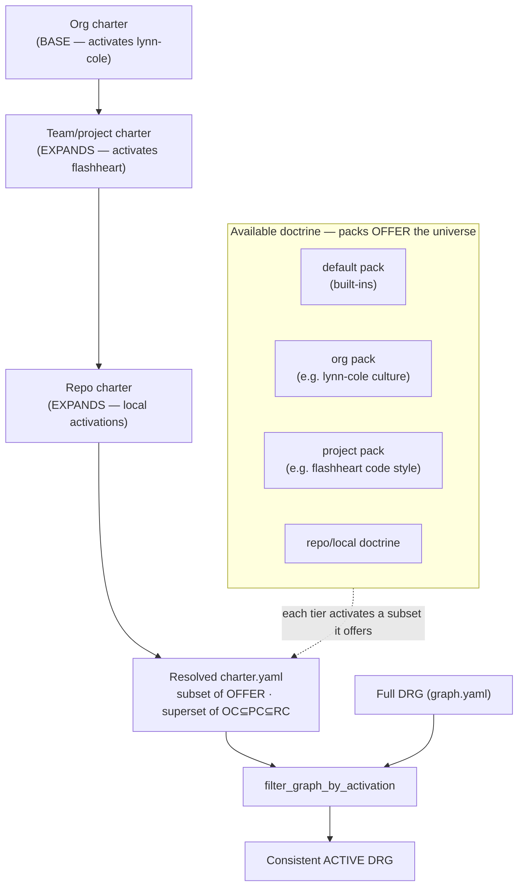

# Contract: Active-doctrine resolution flow (config → charter.yaml → pack.yaml → active DRG)

How the runtime loop calls the charter module to obtain a **consistent active DRG**, under the post-inversion design. The charter module aggregates every relevant doctrine artefact (the project charter's activation + overrides, layered over the offered pack catalogue) and filters the full doctrine graph down to exactly what is active.

**Grounded surfaces (canonical):**
- Consume sites: `charter/context.py:925` (`build_charter_context` / `_build_doctrine_service`), `charter/compiler.py:826`, `charter/reference_resolver.py:67`, `charter/consistency_check.py:300`, `specify_cli/mission_step_contracts/executor.py`, `doctrine/drg/merge.py`.
- Charter module: `charter/pack_context.py:152 PackContext.from_config`, `charter/default_pack.py:44 load_default_pack_activation_ids`, `charter/pack_manager.py:703 merge_defaults`, `charter/drg.py:323 filter_graph_by_activation`.
- Post-inversion change: the activation state (`activated_*` / `activated_kinds` / `mission_type_activations`) is read from **`charter.yaml`** (not `config.yaml`); `config.yaml` holds a one-line `charter:` **pointer** the resolver follows.

## Sequence

```mermaid
sequenceDiagram
    autonumber
    participant RL as Runtime loop<br/>(build_charter_context / executor / compiler)
    participant CM as Charter module<br/>(PackContext + drg filter)
    participant CFG as .kittify/config.yaml<br/>(pointer + non-doctrine)
    participant CHY as charter.yaml<br/>(project charter)
    participant PK as default.yaml + org packs<br/>(offered catalogue)
    participant DRG as DRG graph.yaml<br/>(full doctrine graph)

    RL->>CM: resolve active doctrine<br/>PackContext.from_config(repo_root) + full DRG
    activate CM

    CM->>CFG: read config
    CFG-->>CM: charter: pointer + org_packs<br/>(NO activated_* here anymore)

    CM->>CHY: load charter.yaml (via pointer)
    Note right of CHY: fail-loud if pointer dangles<br/>or file corrupt (#2530) — no fallback
    CHY-->>CM: activation {activated_kinds,<br/>mission_type_activations, activated_*}<br/>+ overrides + governance + directives + catalog

    CM->>PK: load layer-0 default pack + org packs<br/>load_default_pack_activation_ids()
    PK-->>CM: offered catalogue<br/>(all built-in artefact IDs, per kind)

    Note over CM: AGGREGATE — resolve the active set (tiered)<br/>higher-order charters (org⊆team) form the BASE;<br/>charter.yaml EXPANDS it → superset of inherited tiers,<br/>subset of what packs OFFER<br/>· absent per-kind key → default pack<br/>· explicit empty list → fail-closed frozenset()<br/>· non-empty → that exact set · + overrides

    CM->>DRG: load full DRG (graph.yaml)
    DRG-->>CM: full graph (all offered nodes/edges)

    Note over CM: filter_graph_by_activation(full_drg, pack_context)<br/>gate by activated_kinds + mission_type_activations<br/>+ per-kind activated-ID sets → consistent active DRG

    CM-->>RL: active DRG<br/>(only activated doctrine elements)
    deactivate CM

    RL->>RL: consume ONLY the active DRG
```

## Charter tiers & set semantics

A resolved `charter.yaml` sits between two bounds:

- **SUBSET of all available doctrine.** Packs *offer* the universe of artefacts; a charter *activates* a subset of them. `charter.yaml ⊆ (default pack ∪ org packs ∪ project packs ∪ local doctrine)`.
- **SUPERSET of the higher-order charters it inherits.** Higher tiers set an enforced **base**; lower tiers **expand** it (add, never subtract the inherited base). Accumulating downward:

```
org_active  ⊆  team/project_active  ⊆  repo_active (the resolved charter.yaml)  ⊆  all_offered_doctrine
```

> ⚠ **Status: the subset bound is shipped; the tier accumulation below is the TARGET model, not what this mission builds.** Today activation is a single flat set resolved from one file; the existing `pack_roots` / `merge_three_layers` overlay applies to artifact *definitions* (the offered universe), not to activation tiers (paula MAJOR-4). The org⊆team⊆repo charter accumulation is future work fenced OUT by C-008 (ADR 2026-07-15-1). This mission relocates the single flat activation surface onto `charter.yaml`; the diagram documents the intended end-state so the schema is authored to be forward-compatible.

### Layering (how the "consistent active DRG" is composed)



### Grounded user journey — org base + project expansion

1. **Org tier.** The lead architect mandates *lynn-cole engineering culture* for all projects → authors an **org-level charter** (activating the lynn-cole doctrine artefacts from the org pack). This is the enforced base.
2. **Project tier.** The "project flashpoint" team lead wants a specific code style for all their repos → the tech lead authors the *flashheart code style* doctrine artefacts, adds them to the **flashheart doctrine pack**, and authors a **flashheart charter** that expands the org base.
3. **Repo tier.** A developer creates a new repository and configures it to pull in the **project pack (flashheart) + the org pack**. The repo's resolved `charter.yaml` inherits the org base and the project expansion → the repository adheres to **lynn-cole culture *and* flashheart code style** (a superset of both higher-order charters, and a subset of everything the pulled-in packs offer).

## Guarantees
- **AR1**: the runtime loop consumes ONLY the active DRG — unactivated doctrine is invisible (ADR 2026-07-15-1 claim 3, on the surface this mission touches).
- **AR2**: activation (flat root keys) is resolved from `charter.yaml`, located via the `config.yaml` `charter:` pointer; `default.yaml` supplies the absent-key fallback/seed. `config.yaml` no longer carries `activated_*` but DOES retain `org_packs` → `from_config` is a two-file read (config for pointer + org_packs; charter.yaml for activation).
- **AR6 (set bounds)**: the **subset** bound is a REAL, preserved invariant — a resolved `charter.yaml` activation set is `⊆ (default ∪ org ∪ project ∪ local)` offered doctrine; `filter_graph_by_activation` gates the offered universe down to the activated set. The **superset / tier-accumulation** bound (`org_active ⊆ team ⊆ repo`) is **FORWARD-INTENT, not current behavior** — today activation is a single flat set from one file, and `pack_roots` overlays artifact *definitions* (the offered universe), NOT activation tiers (paula MAJOR-4). This mission relocates the single flat activation surface; the charter-tier accumulation is future work fenced OUT by C-008 (below).
- **AR3**: fail-closed is preserved — absent per-kind key → default pack; explicit empty list → `frozenset()` (never re-expand); corrupt charter / dangling pointer → raise (#2530), never fall back to a legacy file.
- **AR4**: the charter module is the single aggregation seam producing the active DRG — one authority, no split-brain between a "hash file" and a "parity file".
- **AR5 (fence, C-008)**: this mission relocates the activation *surface* and keeps `filter_graph_by_activation` behavior byte-preserved; the broader ADR 2026-07-15-1 runtime-gating / new-DRG-node restructure is OUT.

## Note — current vs. target
The call chain (`PackContext.from_config` → `filter_graph_by_activation` → active DRG) is **unchanged in shape**. This mission moves only the *source of activation* (config.yaml → charter.yaml, reached via the pointer) and unifies governance/directives/catalog into the same `charter.yaml`. The behavior-preserving guarantee (SC-008/INV-4) is exactly that the resolved active DRG is identical before and after the relocation.
