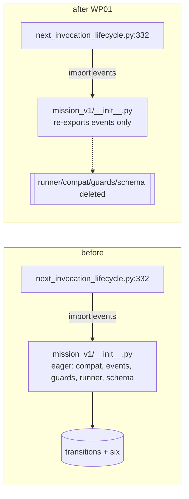

# Implementation Plan: Dead-Port Disposition

**Branch**: `missions/coreloop-proto-missions` | **Date**: 2026-09-06 | **Spec**: [spec.md](spec.md)
**Input**: Mission specification from `kitty-specs/dead-port-disposition-01M1TZVN/spec.md`; ground truth `research/29-missionB-research-dossier.md`; planning decisions in `decisions/` (nine records `DM-01M1VAHE…` … `DM-01M1VAHS…`).

**Branch contract**: current branch at plan start `missions/coreloop-proto-missions`; planning/base branch `missions/coreloop-proto-missions`; completed changes merge into `missions/coreloop-proto-missions` (the PR #3904 branch, which targets `main`). `branch_matches_target: true`. **Mission-level sequencing (C-001)**: this mission's WPs are claimed only after Mission A `fsm-write-path-integrity-01M1TZV6` has merged into this branch.

## Summary

Retire the dormant mission-DSL v1 (**FULL** extent, decision OD1) and drop the `transitions` dependency from the hot path of every `spec-kitty next` (WP01); repair the four-site glossary-runner fiction by canonicalizing the lazy self-bootstrap and recording the FR-020 enforcement gap honestly (WP02); route and retire the gate-adjacent residue with single gate ownership, and ship the emitter slice in its **shrunk** form because the disposition ADR (PR #3898) is still Proposed (WP03); delete the two dead DSL readers in `decision.py` once Mission A has merged (WP04). No emitter behaviour, name, or signature changes; no touches to Mission A's surfaces.

**Gate states verified at plan time (2026-09-06)**: PR #3888 **merged** into `main` and already in this branch (`ba58652f0`) → FR-013's `test_layer_rules.py` hunk is unblocked. PR #3898 **open**, ADR `status: Proposed` → FR-012 not executable; FR-011 record + docstring correction only. PR #3899 (quick-wins) **open, draft**; its file list carries none of the `src/mission_runtime` residue → OD8 default holds.

## Technical Context

**Language/Version**: Python 3.11+ (repo floor)
**Primary Dependencies**: **removes** `transitions>=0.9.2` (`pyproject.toml:82`; lock `0.9.3` + its `six` edge — `six` stays via `python-dateutil`). No additions. `uv lock` regenerates the lock; never hand-edited (C-004). Supply-chain check: a removal-only change; see `research.md` §6.
**Storage**: N/A (no persistent formats touched; the runtime run-state store is Mission A's)
**Testing**: pytest; `make test-fast` baseline + blast radius `tests/specify_cli/mission_v1/` (trimmed), `tests/missions/`, `tests/research/`, `tests/next/`, `tests/doctrine/missions/`, `tests/architectural/test_no_dead_symbols.py`, `tests/architectural/_gate_coverage.py` consumers, `tests/architectural/test_pyproject_shape.py`, `tests/architectural/test_layer_rules.py`, `tests/specify_cli/test_wp_frontmatter_fold.py`, `tests/specify_cli/next/test_next_invocation_lifecycle_seam.py`; the red-first import-hygiene ratchet is subprocess-isolated; terminology guard before doc pushes
**Target Platform**: macOS/Linux dev + CI (`ci.yml`, `clean-install-verification` job is the surface that notices the dependency drop), Windows CI
**Project Type**: single Python package (`src/specify_cli`, `src/kernel`, `src/charter`, `src/runtime`, `src/mission_runtime`), existing layout
**Performance Goals**: NFR-001 — `import specify_cli.mission_v1.events` in a fresh subprocess leaves `transitions` and `six` out of `sys.modules` (permanent ratchet)
**Constraints**: C-001 Mission-A sequencing (no edits to `runtime_bridge_io.py`, `_internal_runtime/engine.py`, `decision.py`, `runtime_bridge_engine.py` until A merges); C-003 emitter ADR gate (record-don't-touch); C-004 dependency mechanics (CHANGELOG entry under the current `[Unreleased] - 3.2.7rc1` section; no separate version bump — the cycle is already open at rc1); C-005 same-PR gate edits; C-006 `_BufferingRuntimeEmitter` untouchable; C-007 runtime ledger discipline (`mission_v1` stays ledgered at `test_layer_rules.py:194` because `next_invocation_lifecycle.py:332` keeps the live edge); layer rules `kernel ← charter ← {glossary, runtime, mission_runtime} ← specify_cli`; complexity ≤15; no suppressions
**Scale/Scope**: 4 WPs; ~1,190 LOC deleted (FULL), ~530 LOC of tests trimmed/deleted, 4 doc sites rewritten, 1 dependency removed, 6 gate files edited in-WP, 1 verified-record artifact extracted

**Operator-only decisions (resolved 2026-09-06 by Robert):** OD2 = NO roadmap, retire (FULL); OD6 = accept documented-but-unwired. Records: `decisions/DM-01M1VAHFNEQ2P8FJRFT0PD7N5B.md`, `decisions/DM-01M1VAHN0CMY21NH3AJTRNXB7V.md`.


## Charter Check

*GATE: evaluated against `.kittify/charter/charter.md` (`spec-kitty charter context --action plan`). Re-checked post-design below.*

| Principle / standing order | Status | How this plan satisfies it |
|---|---|---|
| Single canonical authority | PASS | One registration contract for the glossary runner (the self-bootstrap, documented at all four sites); one owner per gate file (WP01 owns `test_no_dead_symbols.py`; WP03's re-pins are a sequenced out-of-map edit). |
| Architectural alignment | PASS | Deletions only inside `specify_cli.mission_v1`, `mission_runtime`, `team_projection`; layer direction untouched; runtime ledger entry preserved; no `status`/`coordination` touches (Mission A). |
| DDD + tiered rigour | PASS | The kernel registry seam is documented as it behaves; no new abstractions. |
| ATDD-first | PASS | WP01's import-hygiene ratchet is RED on main; WP02's bootstrap-contract test pins today's incidental behaviour; WP04's deletion is covered by the deprecated tests' removal + a no-caller AST check. |
| Terminology adherence | PASS | "Mission" throughout; the retired DSL's "mission_v1" package name is a code identifier, kept per OD4. |
| Decision documentation (003) | PASS | Nine decision records; two operator-only items deferred with explicit assumptions and override windows. |
| Close defect class by construction (043) | PASS | The ratchet test makes re-eager-ing structurally visible; gates re-pinned in the same change as every deletion (NFR-003). |
| Campsite cleaning / mission tracer files | PASS | FR-011 verified record extracted to `research/emitter-adr-inputs.md`; FR-010 honesty note + tracker text drafted. |
| Smallest viable diff / locality (024) | PASS | Four WPs with disjoint owned files; emitter surface limited to a docstring. |
| Draft-PR-first, operator merges | PASS | Lands on the PR branch; operator merges. |

No violations; no Complexity Tracking entries.

## Project Structure

### Documentation (this mission)

```
kitty-specs/dead-port-disposition-01M1TZVN/
├── spec.md
├── plan.md                              # this file
├── research.md                          # decisions, gate-state verification, drift, risks, supply-chain
├── data-model.md                        # retired/retained module inventory, gate-pin ledger, residue table
├── quickstart.md                        # ratchet repro + verification commands per WP
├── contracts/
│   ├── dsl-retirement.md                # FULL extent: delete/keep/trim lists, gate edits, dependency mechanics
│   ├── glossary-bootstrap.md            # the canonical registration contract + FR-020 honesty text
│   └── residue-and-emitter-shrunk.md    # residue routing, docstring correction, FR-011 record, follow-up mint
├── research/
│   ├── 29-missionB-research-dossier.md
│   └── emitter-adr-inputs.md            # FR-011 (written by WP03)
├── decisions/                           # DM-*.md (9)
└── tasks.md                             # /spec-kitty.tasks
```

### Source Code (repository root)

```
src/specify_cli/mission_v1/
├── __init__.py                          # WP01: eager block (:20-29) → re-export events only; delete load_mission* dispatch; rewrite docstring
├── events.py                            # KEEP (live: next_invocation_lifecycle.py:332; decision.py:200 until WP04)
├── compat.py  runner.py  guards.py  schema.py   # WP01: DELETE (FULL)
src/specify_cli/mission.py               # WP01: comment on MISSION_COMPAT_IGNORED_FIELDS (:59-67) naming the retired DSL (kept)
packs/built-in/missions/{software-dev,plan,research}/mission.yaml   # WP01: delete orphan states:/transitions: blocks
src/specify_cli/review/gate_registry.py  # WP01: docstrings (:7,:132) re-pointed at git history
pyproject.toml (:82) · uv.lock · CHANGELOG.md                       # WP01

src/kernel/glossary_runner.py (:14-16,:33-38) · src/kernel/__init__.py (:38-42) · src/kernel/README.md (:18)
src/charter/offering/missions/glossary_hook.py (:16-17; .. note:: for FR-020)   # WP02

src/mission_runtime/context.py (:338,:342) · src/mission_runtime/__init__.py (:127,:139-142)   # WP03: ActionContext alias
src/specify_cli/team_projection/         # WP03: DELETE tombstone package (check wheel includes)
src/mission_runtime/__init__.py, src/mission_runtime/lifecycle_phase.py, src/kernel/paths.py   # WP03: 13 __all__ demotions
src/runtime/next/event_emitter.py (:1-10)                            # WP03: docstring correction only
tests/architectural/test_layer_rules.py (:65-73)                     # WP03: delete stale constitution exclusion

src/runtime/next/decision.py (:187-235)  # WP04: delete derive_mission_state + evaluate_guards (after Mission A merges)

tests/
├── specify_cli/mission_v1/              # WP01: delete runner/compat/guards/schema/bulk-edit tests; TRIM test_mission_v1_events_unit.py (:228-304)
├── missions/, research/                 # WP01: delete e2e/loading DSL tests; trim schema-validation halves
├── architectural/test_no_dead_symbols.py (:720-727, :3278)          # WP01 owner; WP03 re-pins (out-of-map, sequenced)
├── architectural/_gate_coverage.py (:1456)                          # WP01
├── specify_cli/test_wp_frontmatter_fold.py (:60)                    # WP01
├── specify_cli/mission_v1/test_import_hygiene.py                    # WP01 NEW ratchet
├── doctrine/missions/test_glossary_hook.py                          # WP02
└── next/test_decision_unit.py (:189-219 legacy section)             # WP04
```

**Structure Decision**: existing layout; net deletions. No `pyproject.toml` structural change beyond the dependency line, but the file IS touched, so `tests/architectural/test_pyproject_shape.py` and the `clean-install-verification` job are in WP01's blast radius (cross-cutting rule).

## Design



Glossary contract (WP02): the hook is both consumer and lazy provider. `get_runner()` → `None` → `import_module("glossary.attachment")` → `register(GlossaryAwarePrimitiveRunner)` → retry. Degradation occurs only when `glossary.attachment` is unimportable. Details in `contracts/glossary-bootstrap.md`.

## Parallel Work Analysis

### Dependency Graph

```
[Mission A merged into the branch]  ← mission-level gate (C-001)
WP01 (DSL retirement) ∥ WP02 (glossary repair)
WP03 (residue + emitter shrunk)  ← after WP01 (test_no_dead_symbols.py re-pins sequence behind WP01's pin drops)
WP04 (decision.py dead readers)  ← no intra-mission dependency; C-001 only
```

### Work Distribution

- **Parallel streams**: WP01 ∥ WP02 ∥ WP04 (disjoint files) once Mission A has merged.
- **Sequential**: WP03 after WP01 (single gate-file owner rule).
- **Owned files**: as tagged in §Project Structure; `test_no_dead_symbols.py` owned by WP01; WP03's demotion re-pins are an out-of-map edit with rationale.

### Coordination Points

- **Mission A merge first**: `spec-kitty merge --mission fsm-write-path-integrity-01M1TZV6` consolidates A into this branch; only then claim B's WPs.
- **Gate re-check at tasks-finalize**: if PR #3898 has merged-and-Accepted by then, WP03's scope grows to FR-012 (one pass over the 29 `sync_emitter` sites, flush-target adjudication, parity-oracle update) — otherwise the follow-up is minted (`contracts/residue-and-emitter-shrunk.md` §4).
- **PR #3899**: before assembling the PR, re-verify its file list still carries none of the residue (SC-006 "checked open PRs against its gate files at PR-assembly time").
- **Doc contention**: none with Mission A (A edits CLAUDE.md status section + `status-model.md`; B edits `kernel/README.md` + module docstrings).

## Implementation Concern Map

| # | Concern | Spec anchors | WP | Red-first target | Contract |
|---|---|---|---|---|---|
| IC-1 | Break the eager block; delete DSL (FULL); drop `transitions`; pack-DSL honesty; gate edits; CHANGELOG | FR-001..007, NFR-001..003, C-004, C-005, SC-001..003 | WP01 | subprocess `import specify_cli.mission_v1.events` ⇒ `transitions` in `sys.modules` (RED today) | `contracts/dsl-retirement.md` |
| IC-2 | Four-site fiction repair; bootstrap-contract pin; FR-020 honesty | FR-008..010, SC-004, SC-005 | WP02 | bootstrap test pins incidental behaviour (green today; becomes a contract) | `contracts/glossary-bootstrap.md` |
| IC-3 | Residue routing; `constitution` exclusion; demotions; tombstone; alias; emitter docstring; FR-011 record; follow-up mint | FR-011, FR-012 (shrunk), FR-013, FR-014, C-003, C-006, C-007, SC-006..008 | WP03 | `test_layer_rules.py` exclusion for a nonexistent package (present today) | `contracts/residue-and-emitter-shrunk.md` |
| IC-4 | Delete `derive_mission_state` + `evaluate_guards` | FR-015, OD9 | WP04 | AST zero-caller proof; legacy tests removed | `contracts/dsl-retirement.md` §5 |

## Post-Design Charter Re-check

No new gaps. One plan-level correction over the spec: the FULL extent must also drop the `specify_cli.mission_v1.schema::strip_v1_keys` pin at `test_no_dead_symbols.py:3278` (the spec lists only the three at `:720-727`) — recorded in `research.md` §3 as drift D-1, folded into WP01's contract.

## Verification at every WP boundary (test policy)

```bash
make test-fast
.venv/bin/pytest tests/specify_cli/mission_v1 tests/missions tests/research tests/next tests/doctrine/missions -q
.venv/bin/pytest tests/architectural/test_no_dead_symbols.py tests/architectural/test_pyproject_shape.py tests/architectural/test_layer_rules.py tests/specify_cli/test_wp_frontmatter_fold.py tests/architectural/test_no_legacy_terminology.py -q
```

WP01 touches `pyproject.toml` → also run `tests/architectural/` in full once before handoff (cross-cutting rule), plus a clean-install smoke: `uv sync --frozen --all-extras` in a fresh temp venv per `quickstart.md`.
