# Data Model: Dead-Port Disposition

No persistent schema changes. This mission changes *which object* receives runtime emissions on two paths and *where* the seam is constructed. The entities below are the runtime objects and the one durable record they touch.

## Entities

### RuntimeEventEmitter (Protocol) — canonical seam interface
- **Location**: `src/runtime/next/_internal_runtime/events.py`
- **Surface**: eight `emit_*(payload)` methods, one per runtime moment (`MissionRunStarted`, `NextStepIssued`, `NextStepAutoCompleted`, `DecisionInputRequested`, `DecisionInputAnswered`, `MissionRunCompleted`, `SignificanceEvaluated`, `DecisionTimeoutExpired`).
- **Invariant**: the only class with this name under `src/runtime/next/` (SC-001). Not widened by this mission (R-2).

### NullEmitter — default seam implementation
- **Fields**: `correlation_id: str = ""` (existing); **new** `mission_slug: str`, `mission_type: str`, `mission_id: str | None` (set by `for_mission`, default `""`/`""`/`None` for the bare constructor so existing `NullEmitter()` call sites keep working).
- **New members**: `for_mission(*, feature_dir, mission_slug, mission_type) -> NullEmitter` (classmethod; `mission_id` resolved via `resolve_mission_identity`, degrades to `None` on any exception); `seed_from_snapshot(snapshot) -> None` (no-op).
- **Invariants**: every method is a no-op that never raises; no I/O on any path.

### Emitter factory + registry (module-level, `events.py`)
- `runtime_emitter_for_mission(*, feature_dir, mission_slug, mission_type) -> RuntimeEventEmitter`
- `register_runtime_emitter_factory(factory: Callable[..., RuntimeEventEmitter]) -> None`
- `reset_runtime_emitter_factory() -> None`
- **State**: one module-private `_registered_factory: Callable | None`.
- **Invariants**: (1) with `SPEC_KITTY_SYNC_MINIMAL_IMPORT` truthy, returns `NullEmitter.for_mission(...)` regardless of registry; (2) with no registration, returns `NullEmitter.for_mission(...)`; (3) with a registration, returns whatever the registered callable returns; (4) `reset` restores state (2). The returned object *should* expose `seed_from_snapshot`; the bridge tolerates its absence (existing `try`).

### DecisionGitLog — durable decision sink (existing; one addition)
- **Location**: `src/specify_cli/events/decision_log.py`
- **Existing behavior**: appends sanitized `DecisionInputRequested` / `DecisionInputAnswered` to the decision log; commits on answered; delegates every emit to `inner`.
- **New member**: `seed_from_snapshot(snapshot) -> None` — delegates to `inner.seed_from_snapshot` if present, else no-op.

### _BufferingRuntimeEmitter — strict-policy buffer (existing; unchanged)
- Records `(method_name, payload)` in order; `flush(target)` is one-shot; `discard()` drops. Already carries `seed_from_snapshot`.

### DecideNextContext (existing; unchanged shape)
- `sync_emitter: RuntimeEventEmitter` — the factory's return (plain seam; after this mission it is referenced only for seeding and as `DecisionGitLog.inner`).
- `emitter_for_engine: Any` — `DecisionGitLog(inner=sync_emitter)`; after this mission it is the **only** emitter handed to engine-facing calls (legacy advance, gated flush, composition advance).

## Durable record

### `kitty-specs/<mission>/decisions.events.jsonl` (existing; no schema change)
- Coordination-branch partition (`MissionArtifactKind.DECISION_LOG`).
- **Change in what reaches it**: decision requests raised on strict-policy `decision_required` advances and on composition dispatch now append here (FR-005, FR-006). Answers were already committed via the answer path (`runtime_bridge.py:2754`) and are unchanged.

## State transitions (strict retrospective policy)

```mermaid
stateDiagram-v2
    [*] --> Buffering: block_on_retrospective and pre-state captured
    Buffering --> Refused: terminal and gate raises
    Buffering --> Flushed: gate passes, or decision is non-terminal
    Refused --> [*]: buffer.discard(); rollback state.json + run.events.jsonl; no log write
    Flushed --> [*]: buffer.flush(ctx.emitter_for_engine)  [was ctx.sync_emitter]
```

**Invariants that must hold after the change**
1. Refused ⇒ zero writes to the decision log and zero `MissionRunCompleted` released.
2. Flushed ⇒ each buffered `DecisionInputRequested` / `DecisionInputAnswered` appended exactly once.
3. Non-decision moments in the buffer pass through `DecisionGitLog` to `inner` unchanged.
4. Re-poll of a pending decision emits nothing new (engine-level dedupe, unchanged).
