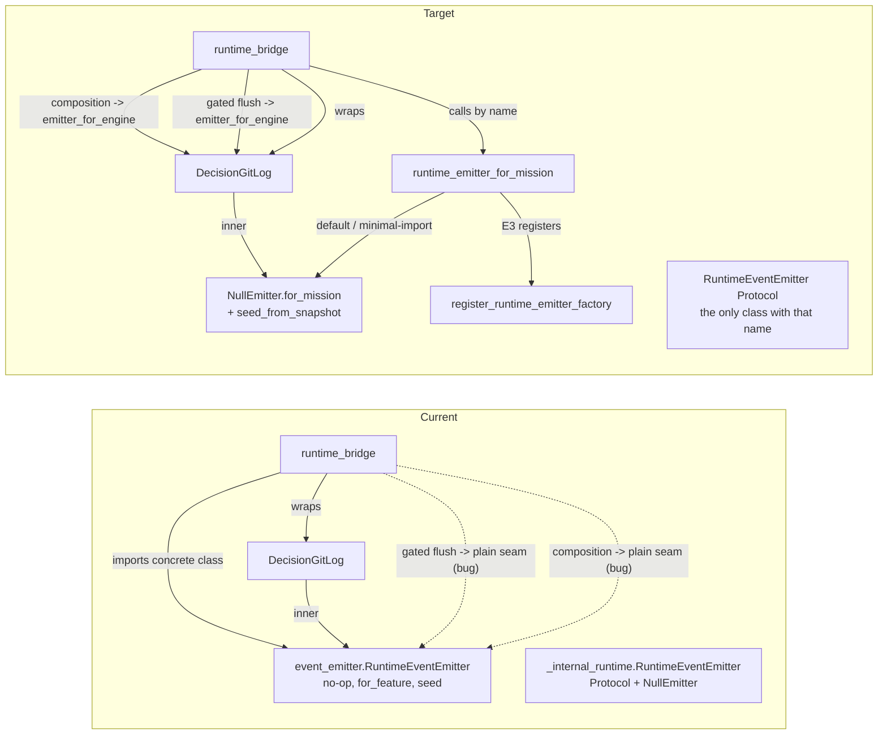

# Implementation Plan: Dead-Port Disposition: RuntimeEventEmitter Seam Consolidation

**Branch**: `feat/dead-port-disposition` | **Date**: 2026-09-06 | **Spec**: [spec.md](spec.md)
**Input**: Feature specification from `kitty-specs/dead-port-disposition-01M1VRA2/spec.md`
**Governing decision**: [ADR 2026-09-06-2](../../docs/adr/3.x/2026-09-06-2-runtime-event-emitter-disposition.md) (Accepted, Option 1)

**Branch contract**: current branch `feat/dead-port-disposition`; planning/base branch `feat/dead-port-disposition`; completed changes merge into `feat/dead-port-disposition`, which then lands on `main` through a PR (mission is PR-bound).

## Summary

Consolidate the duplicate concrete `RuntimeEventEmitter` (`src/runtime/next/event_emitter.py`, 88 lines, permanently no-op) into the canonical Protocol and `NullEmitter` in `src/runtime/next/_internal_runtime/events.py`, and replace the bridge's concrete-class binding with a named factory plus registry hook. While on that chain, fix the two paths on which decision-request events bypass the coordination-branch decision log: the strict-policy buffer flush (`runtime_bridge.py:2187`) and the composition dispatch emitter (`runtime_bridge.py:1976`). No live producer is wired.

Planning answers (all resolved, no deferred decisions):

| Question | Answer | Decision |
|---|---|---|
| Scope | Exactly the ADR boundary | `01M1VRJAJSF8A42WKBAPB74YSR` (specify) |
| Alias policy | Clean rename to `for_mission`, no alias | `01M1VRM6HN09R2NX6C4A3YJZ5E` (specify) |
| Disclosure | CHANGELOG entry + tests | `01M1VRQ40GTHHZBDZCP1GFY3A4` (specify) |
| Substitution seam | Named factory on the bridge module + registry hook | `01M1VSEWHJM4WAQD7EGN5PA4XJ` (plan) |

## Technical Context

**Language/Version**: Python 3.11+ (repo standard; `pyproject.toml`)
**Primary Dependencies**: `spec_kitty_events` 9.1.6 (payload models, already installed; untouched), stdlib `typing.Protocol`; no dependency added, upgraded, or removed
**Storage**: `kitty-specs/<mission>/decisions.events.jsonl` on the coordination branch (existing `DecisionGitLog` sink); run-local `state.json` / `run.events.jsonl` (existing)
**Testing**: pytest with the repo markers (`unit`, `fast`, `regression`); red-first per `034-test-first-development`; `make test-fast` baseline plus the blast-radius set in §Test Plan
**Target Platform**: CLI on macOS/Linux/Windows (no platform-specific code touched)
**Project Type**: single Python package (`src/runtime/next/` + `src/specify_cli/events/`)
**Performance Goals**: none new; emission remains fire-and-forget and must not add I/O on the null path
**Constraints**: ADR-BLOCKED list is binding (C-001); no live producer (C-002); zeitgeist fan-out in `status/adapters.py` untouched (C-003); behavior preserved except the two flush fixes (C-004); complexity ≤ 15 per function; ruff + mypy clean; zero new `feature*` identifiers in added lines
**Scale/Scope**: ~6 source files, ~16 test files (2 new, 14 mechanical rewrites), 1 CHANGELOG line; net LOC decreases (NFR-003)

## Charter Check

*GATE: passed before Phase 0; re-checked after Phase 1 (no new gaps).*

| Charter rule | How this plan honors it |
|---|---|
| Single canonical authority | One `RuntimeEventEmitter` (the Protocol); one factory; one registration hook. The concrete duplicate is deleted, not aliased. |
| Architectural alignment / Internal Runtime Boundary | All new code lives in `src/runtime/next/_internal_runtime/events.py`; the bridge depends on the Protocol + factory only. `resolve_mission_identity` comes from `specify_cli.mission_metadata`, which `_internal_runtime/planner.py:46` already imports, so the enforced `runtime -> specify_cli` direction and the shrink-only outbound ledger are unchanged. No import from `specify_cli.cli` or `specify_cli.next`. |
| ATDD-first / `034-test-first-development` | The two flush fixes land behind red-first regression tests written before the fix (NFR-001). The consolidation lands behind the existing bridge-parity and conformance suites (NFR-002). |
| `003-decision-documentation-requirement` | Governing ADR is Accepted; every design fork is a recorded Decision Moment (table above). |
| `010-specification-fidelity-requirement` | ADR traceability table in spec.md maps every clause to FR/NFR/C rows; this plan maps every FR to a concern (§Implementation Concern Map). |
| `024-locality-of-change` / `change-apply-smallest-viable-diff` | No refactor of `DecisionGitLog`, the buffer, the gate, or the engine. Only the flush target and the composition emitter argument change on the bridge; the rest is rename-and-delete. |
| `025-boy-scout-rule` | Applied narrowly: the stale docstring and the two conformance-test comments are corrected because they misdirect; nothing else opportunistic. |
| `043-close-defect-class-by-construction` | Both bypasses are the same defect class (a plain-seam reference where the decision-log wrap belongs). The plan removes the plain seam from every engine-facing call and adds a guard test that greps the bridge for `sync_emitter=ctx.sync_emitter` / `flush(ctx.sync_emitter)` so the class cannot recur (§Concern E). |
| Terminology Canon / `046` | Promoted constructor is `for_mission`; no `feature*` identifier is minted (NFR-006). Existing `feature_dir` parameter names are tolerated legacy and are not renamed (out of scope; bulk-edit check below). |
| Supply-chain (`051`) | No dependency change; check recorded as not applicable in `research.md`. |
| PRs-only (`045`) / Agent Push Authorization | Lands via `feat/dead-port-disposition` → PR to `main`; tests + counts recorded in the PR body. |

**Bulk-edit check**: This mission renames `for_feature` → `for_mission` at exactly two production call sites and 14 test sites, all inside one bounded seam and one test tree, and deletes one module. It does not rename a term across the codebase (the `feature_dir` parameter name is deliberately left alone). Not a bulk edit; no `occurrence_map.yaml`.

**Supply-chain check**: no dependency added/upgraded/removed → not applicable (recorded in `research.md`).

## Design

### Current vs target topology



### Seam design (Concern A)

In `src/runtime/next/_internal_runtime/events.py`:

- `NullEmitter.for_mission(*, feature_dir, mission_slug, mission_type) -> NullEmitter` — classmethod; resolves `mission_id` via `resolve_mission_identity(feature_dir)` and degrades to `None` on any exception (same tolerance as today). Stores `mission_slug`, `mission_type`, `mission_id` for a future producer's use; `correlation_id` default preserved.
- `NullEmitter.seed_from_snapshot(snapshot) -> None` — no-op pass-through.
- `runtime_emitter_for_mission(*, feature_dir, mission_slug, mission_type) -> RuntimeEventEmitter` — module-level factory. Under `SPEC_KITTY_SYNC_MINIMAL_IMPORT` (truthy) returns `NullEmitter.for_mission(...)` unconditionally; otherwise calls the registered factory if any, else `NullEmitter.for_mission`.
- `register_runtime_emitter_factory(factory) -> None` and `reset_runtime_emitter_factory() -> None` — module-level registry, mirroring `status/adapters.py`'s `ensure_zeitgeist_moment_handlers` / `reset_handlers` idiom. E3 registers here; tests reset here.
- The Protocol is **not** widened with `for_mission`/`seed_from_snapshot`: engine call sites type against the eight `emit_*` methods only. `seed_from_snapshot` is called by the bridge and the engine adapter on the object the factory returned; both `NullEmitter` and `_BufferingRuntimeEmitter` provide it structurally. (Decision: keep the Protocol minimal so a future producer is not forced to implement seeding it does not need; recorded in `research.md` R-2.)
- `_internal_runtime/emitter.py` re-export shim additionally exports the factory and registry names, keeping `test_internal_runtime_coverage.py::__all__` assertion updated in the same change.

### Bridge rewiring (Concern B)

`src/runtime/next/runtime_bridge.py`:
- Replace `from runtime.next.event_emitter import RuntimeEventEmitter` (`:195`) with `from runtime.next._internal_runtime.events import RuntimeEventEmitter, runtime_emitter_for_mission`.
- `:1552` and `:2739`: `RuntimeEventEmitter.for_feature(...)` → `runtime_emitter_for_mission(...)`.
- Type annotations at `:293`, `:1215`, `:1472` already name `RuntimeEventEmitter`; they now bind to the Protocol.
- `runtime_bridge_engine.py:80` `TYPE_CHECKING` import → Protocol module.

### Flush-target fixes (Concern C)

- `runtime_bridge.py:2187`: `buffer.flush(ctx.sync_emitter)` → `buffer.flush(ctx.emitter_for_engine)`. Ordering is unchanged: `_dn_terminal_retrospective_gate` (`:2178-2181`) runs first and discards on refusal; `_BufferingRuntimeEmitter.flush` is one-shot (`runtime_bridge_retrospective.py:138-149`). No double emit: on the gated path the engine wrote only into the buffer.
- `runtime_bridge.py:1976`: `sync_emitter=ctx.sync_emitter` → `sync_emitter=ctx.emitter_for_engine`. `advance_run_state_after_composition` calls `seed_from_snapshot` on it (`runtime_bridge_engine.py:344`); `DecisionGitLog` does not define `seed_from_snapshot`, so **`DecisionGitLog` gains a `seed_from_snapshot` pass-through that delegates to `inner`** (one method, `src/specify_cli/events/decision_log.py`). This is the single touch outside the runtime tree and is required for fix two to be a drop-in.
- Comment at `:2183-2186` updated to say "flush into the decision-log-wrapped engine emitter".

### Red-first tests (Concern D)

New file `tests/runtime/test_bridge_decision_log_flush.py` (markers `regression`, `unit`, `fast`):
1. `test_strict_policy_decision_required_reaches_decision_log` — monkeypatch `_resolve_retrospective_policy_for_runtime` to a policy with `enabled=True, timing="before_completion", failure_policy="block"`; drive `_dn_decision_materialize` (or the smallest bridge entry that reaches it) with a run whose next decision is `decision_required`; assert exactly one `DecisionInputRequested` line in `decisions.events.jsonl`. Red before, green after.
2. `test_composition_dispatch_decision_required_reaches_decision_log` — reuse the composition-path fixture shape from `tests/specify_cli/next/test_runtime_bridge_composition.py`; assert one request line. Red before, green after.
3. `test_strict_policy_refused_terminal_gate_writes_nothing` — same strict policy, `_run_retrospective_learning_capture` raises; assert the decision log is unchanged and the buffer was discarded (no `MissionRunCompleted` reached the sink). Green before and after (regression guard for FR-007).
4. `test_gated_flush_does_not_duplicate` — count entries after one gated `decision_required` advance == 1 (NFR-004).

### Consolidation tests + mechanical rewrites (Concern E)

- `tests/next/test_internal_runtime_coverage.py`: extend `__all__` assertion; add factory tests: default → `NullEmitter`; minimal-import env → `NullEmitter` even with a registered factory; registered factory honored; reset restores default; `for_mission` degrades `mission_id` to `None` on a missing/corrupt `meta.json`.
- New guard test in `tests/architectural/` (or appended to an existing bridge-guard file): exactly one `class RuntimeEventEmitter` under `src/runtime/next/` (SC-001); no `runtime.next.event_emitter` import anywhere under `src/` or `tests/`; bridge source contains neither `flush(ctx.sync_emitter)` nor `sync_emitter=ctx.sync_emitter` (closes the defect class by construction).
- Mechanical rewrites (patch the factory name instead of the class): `tests/runtime/_bridge_oracle.py:471-481`, `tests/runtime/test_bridge_decide_next.py:242,282,328,369,416`, `tests/next/test_runtime_bridge_blocked_paths.py:205,260,311,362`, `tests/next/test_runtime_bridge_unit.py:245,610,858,2159`, `tests/specify_cli/next/test_runtime_bridge_composition.py:63`.
- `tests/specify_cli/events/test_decision_log_coord.py:17` → import the Protocol from `_internal_runtime.events` (`MagicMock(spec=Protocol)` keeps the eight emit methods).
- `tests/status/test_producer_conformance.py:10-14` and `tests/contract/test_identity_contract_matrix.py:33-37` comments → point at `runtime_emitter_for_mission` / `register_runtime_emitter_factory`.

### Docs + disclosure (Concern F)

- Module docstring for the factory/registry block: names `status/adapters.py::ensure_zeitgeist_moment_handlers` as the *existing* zeitgeist seam and `register_runtime_emitter_factory` as the E3 producer registration point.
- CHANGELOG `## [Unreleased] - 3.2.7rc1` → `### Fixed`: one entry naming the two decision-log bypasses, the behavior change on the strict-gated path, and the seam consolidation.
- No version bump (`src/specify_cli/__init__.py` untouched).

## Project Structure

### Documentation (this mission)

```
kitty-specs/dead-port-disposition-01M1VRA2/
├── plan.md              # This file
├── research.md          # Phase 0 output
├── data-model.md        # Phase 1 output
├── quickstart.md        # Phase 1 output
├── contracts/
│   ├── emitter-seam.md          # factory / registry / NullEmitter surface
│   └── decision-log-flush.md    # flush-target + composition-path behavior contract
└── tasks.md             # Phase 2 output (/spec-kitty.tasks - NOT created here)
```

### Source Code (repository root)

```
src/runtime/next/
├── event_emitter.py                       # DELETED
├── _internal_runtime/
│   ├── events.py                          # + NullEmitter.for_mission, seed_from_snapshot,
│   │                                      #   runtime_emitter_for_mission, register_/reset_ factory
│   └── emitter.py                         # re-export shim: + factory & registry names
├── runtime_bridge.py                      # import swap; :1552/:2739 factory; :1976 & :2187 flush targets
└── runtime_bridge_engine.py               # :80 TYPE_CHECKING import -> Protocol module

src/specify_cli/events/
└── decision_log.py                        # + DecisionGitLog.seed_from_snapshot pass-through

tests/runtime/
├── test_bridge_decision_log_flush.py      # NEW: red-first regression tests (Concern D)
├── _bridge_oracle.py                      # patch factory name
└── test_bridge_decide_next.py             # patch factory name (5 sites)
tests/next/
├── test_internal_runtime_coverage.py      # __all__ + factory/registry tests
├── test_runtime_bridge_blocked_paths.py   # patch factory name (4 sites)
└── test_runtime_bridge_unit.py            # patch factory name (4 sites)
tests/specify_cli/next/test_runtime_bridge_composition.py   # patch factory name (1 site)
tests/specify_cli/events/test_decision_log_coord.py         # import Protocol
tests/status/test_producer_conformance.py                   # comment
tests/contract/test_identity_contract_matrix.py             # comment
tests/architectural/test_runtime_emitter_seam.py            # NEW: single-class + no-plain-seam guard
CHANGELOG.md                                                # one Fixed entry
```

**Structure Decision**: single package; all new production code is confined to `src/runtime/next/_internal_runtime/events.py` plus one pass-through method in `src/specify_cli/events/decision_log.py`. The bridge changes are four lines plus one import.

## Complexity Tracking

No Charter Check violations. The one cross-tree touch (`DecisionGitLog.seed_from_snapshot`) is a one-line delegating method required so that fix two is a drop-in; the alternative (special-casing the composition path to seed the inner emitter separately) would duplicate the seed call and re-introduce a plain-seam reference, which is the defect class being closed.

## Implementation Concern Map

| Concern | Description | FRs / NFRs | Files | Depends on |
|---|---|---|---|---|
| **A. Seam consolidation** | `NullEmitter.for_mission`, `seed_from_snapshot`, factory, registry, env gate, shim exports | FR-002, FR-003, FR-004, NFR-005 | `_internal_runtime/events.py`, `_internal_runtime/emitter.py` | — |
| **B. Bridge rewiring + deletion** | Import swap, two construction sites, `TYPE_CHECKING` import, delete `event_emitter.py`, update the live test importer | FR-001, FR-010, NFR-003 | `runtime_bridge.py`, `runtime_bridge_engine.py`, `event_emitter.py`, `test_decision_log_coord.py` | A |
| **C. Flush-target fixes** | `:2187` → `emitter_for_engine`; `:1976` → `emitter_for_engine`; `DecisionGitLog.seed_from_snapshot` | FR-005, FR-006, FR-007, FR-008, NFR-004 | `runtime_bridge.py`, `decision_log.py` | D (red first) |
| **D. Red-first regression tests** | Four tests in `test_bridge_decision_log_flush.py`; must be red on the pre-fix tree for tests 1–2 | NFR-001, NFR-004 | new test file | A (for the null emitter fixture), independent of C's code |
| **E. Consolidation tests + mechanical rewrites** | Factory/registry unit tests; single-class + no-plain-seam guard; 14 patch-site rewrites | NFR-002, NFR-006, SC-001 | 8 test files + 1 new arch test | A, B |
| **F. Docs + disclosure** | Docstring, two conformance comments, CHANGELOG | FR-009, FR-011 | `events.py` docstring, 2 test comments, `CHANGELOG.md` | B, C |

## Parallel Work Analysis

### Dependency Graph

```
A (seam) ──► B (bridge rewiring + delete) ──► E (rewrites + guard) ──► F (docs + CHANGELOG)
   │
   └──► D (red-first tests, written against A's NullEmitter fixture) ──► C (flush fixes) ──► F
```

### Work Distribution

- **Sequential**: A must land first (everything imports the factory). B and D can start once A is available.
- **Parallel streams**: after A — stream 1 is B then E (consolidation); stream 2 is D then C (correctness). They touch different lines of `runtime_bridge.py` (B: `:195, :1552, :2739`; C: `:1976, :2187`) and different test files, so lanes can run concurrently with a single trivial merge.
- **Agent assignments**: one implementer per stream; the guard test in E must be written last because it asserts the post-C bridge text.

### Coordination Points

- **Sync**: after C and E both land, run F and the full blast-radius set below on the merged tree.
- **Integration proof**: `tests/runtime/test_bridge_parity.py` and `tests/runtime/test_bridge_engine.py` green on the merged tree; the four Concern-D tests green; the arch guard green.

## Test Plan (blast radius, per CLAUDE.md §Test policy)

| Command | Purpose |
|---|---|
| `make test-fast` | baseline |
| `pytest tests/runtime/ tests/next/ tests/specify_cli/next/` | owning subsystem of `src/runtime/next/**` |
| `pytest tests/specify_cli/events/` | owning subsystem of `decision_log.py` |
| `pytest tests/status/test_producer_conformance.py tests/contract/test_identity_contract_matrix.py` | reserved-seam conformance |
| `pytest tests/architectural/test_layer_rules.py tests/architectural/test_no_legacy_terminology.py tests/architectural/test_runtime_emitter_seam.py` | layer direction, terminology, single-class guard |
| `ruff check . && mypy src/runtime/next/_internal_runtime/events.py src/specify_cli/events/decision_log.py` | style + types on the diff |

Record commands and passed/failed counts in the PR body. Retired-surface scan: run the canonical regex from `tests/architectural/test_no_retired_subsystems.py` over added lines; expect 0 hits.

## Risks

| Risk | Mitigation |
|---|---|
| A test site patches the class in a way the grep missed | The arch guard's "no `runtime.next.event_emitter` import under `tests/`" assertion fails loudly at collection; fix in E. |
| `DecisionGitLog` gets `seed_from_snapshot` but a future wrapper does not | The composition path now calls it on the wrap; the guard test asserts the composition call receives `emitter_for_engine`, and `advance_run_state_after_composition`'s existing `_FakeSyncEmitter.seeded` assertion (`test_bridge_engine.py:425`) covers the seed contract. |
| Fix one changes ordering of events observed by the oracle spies | The oracle records on `_wrap_with_decision_git_log`'s return; flushing into it means gated-path events now appear in `coord_commit_calls` where before they appeared in `sync_emitter_calls`. Parity tests that assert on the *sync* sink for gated runs must be updated in E; none currently exercise the strict gate through the oracle (verified: `grep block_on_retrospective tests/runtime/test_bridge_parity.py` → 0). |
| Minimal-import gate read at call time vs import time | Read at call time in the factory (cheap `os.environ` lookup) so tests can toggle it without reloading the module; documented in `contracts/emitter-seam.md`. |
