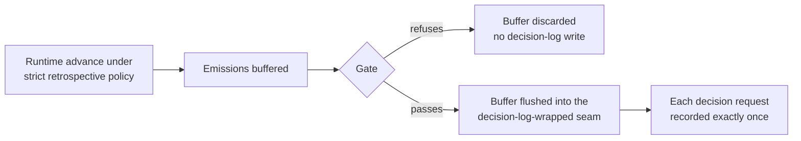

# Mission Specification: Dead-Port Disposition: RuntimeEventEmitter Seam Consolidation

**Mission Branch**: `feat/dead-port-disposition`
**Mission Handle**: `dead-port-disposition-01M1VRA2` (mission_id `01M1VRA2VWSET7NAR2M5Z6TZ5M`)
**Created**: 2026-09-06
**Status**: Draft
**Input**: User description: "the dead-port-disposition mission"
**Governing decision**: [ADR 2026-09-06-2 — RuntimeEventEmitter Seam Disposition](../../docs/adr/3.x/2026-09-06-2-runtime-event-emitter-disposition.md) (Accepted, Option 1: rewire-ready consolidation)

## Intent Summary *(confirmed 2026-09-06)*

The `next` runtime bridge carries a permanently no-op event-emission seam that the
dead-code census leaned toward deleting. The accepted ADR adjudicated
**consolidate, do not delete**: the seam is a reserved, contract-backed port for a
future live producer, and it hides two real defects — a name collision between a
concrete class and the canonical Protocol of the same name, and two paths on which
decision-request events never reach the coordination-branch decision log.

This mission executes that decision inside the ADR's fail-closed boundary. When it
is done: exactly one class named `RuntimeEventEmitter` exists under the runtime
tree; the bridge obtains the seam from a factory that yields the null emitter by
default; the constructor is promoted as `for_mission` with no alias; decision
requests on both bypass paths are durably recorded; the seam stays no-op end to
end; and no live producer is wired.

**Behavior change disclosed:** on strict-policy `decision_required` advances,
decision requests will begin to be committed to the coordination branch. This is
surfaced with a CHANGELOG entry and red-first regression tests. No operator-facing
docs change, because the non-gated path already behaved this way.

## Domain Language

| Canonical term | Meaning in this mission | Avoid |
|---|---|---|
| **Mission** | The domain object whose identity the seam resolves | `feature` (Terminology Canon); the promoted constructor is `for_mission` |
| **Emitter seam** | The call surface through which the bridge reports runtime moments (run started, step issued, decision requested/answered, run completed) | "port deletion", "the sync emitter" |
| **Null emitter** | The canonical no-op implementation of the seam; what the factory returns until a live producer registers | "stub", "mock" |
| **Decision log** | The durable, coordination-branch record of decision requests and answers | "journal", "outbox" (retired sync vocabulary) |
| **Strict retrospective gate** | The policy under which a terminal advance may be rolled back, so emissions are buffered until the gate passes | "the gate" without qualifier |
| **Live producer (E3)** | A future adapter that forwards runtime moments to the hosted zeitgeist service | Out of scope; never "wire it while we're here" |

## User Scenarios & Testing *(mandatory)*

### User Story 1 - Decision requests are durably recorded under strict policy (Priority: P1)

As an operator running a mission under the strict retrospective policy, when the
runtime reaches a step that requires my input, I want that decision request
recorded in the coordination-branch decision log exactly as it is on the
non-gated path, so that the decision history is complete regardless of policy.

**Why this priority**: This is the correctness defect the ADR requires to be fixed
rather than frozen. Today, every strict-policy `decision_required` advance buffers
its decision request and then flushes it into the no-op, so the decision log is
silently incomplete. A second bypass exists on the composition dispatch path
regardless of policy.

**Independent Test**: Run a mission to a `decision_required` step under strict
policy and read the decision log; the request is present. Run a mission through
composition dispatch to a `decision_required` step; the request is present. Both
tests fail before the fix and pass after it.

**Acceptance Scenarios**:

1. **Given** a mission run under strict retrospective policy, **When** the runtime
   advances to a step that requires a decision, **Then** the decision request is
   appended to the decision log after the gate passes, and it appears exactly once.
2. **Given** a mission run dispatched through the composition path, **When** the
   runtime reports a decision request, **Then** that request is appended to the
   decision log.
3. **Given** a mission run under strict retrospective policy at its terminal
   advance, **When** the gate refuses and the advance is rolled back, **Then**
   nothing is written to the decision log and no run-completed moment escapes.
4. **Given** a mission run under strict retrospective policy at its terminal
   advance, **When** the gate passes, **Then** the buffered run-completed moment is
   released once and the decision log is unchanged (run-completed is not a decision
   event).

---

### User Story 2 - One canonical emitter seam (Priority: P2)

As a maintainer of the runtime bridge, I want exactly one class named
`RuntimeEventEmitter`, obtained through a factory rather than a concrete import, so
that the seam has one owner, the duplication smell is gone, and a future producer
can register without reshaping the bridge.

**Why this priority**: The name collision and the concrete-class binding are the
structural defects the census flagged. Resolving them is what makes the seam
"rewire-ready"; it also removes 88 lines of dead surface.

**Independent Test**: A search of the runtime tree finds one class definition with
that name. The bridge's construction sites call a factory, and that factory returns
the null emitter by default and under the minimal-import environment gate. The
capability the bridge relies on (mission-identity resolution at construction, and
seeding from a snapshot) survives on the consolidated seam. All existing
bridge-parity and producer-conformance tests stay green.

**Acceptance Scenarios**:

1. **Given** the runtime tree after this mission, **When** a maintainer searches
   for classes named `RuntimeEventEmitter`, **Then** exactly one is found and it is
   the canonical Protocol.
2. **Given** the bridge constructs the seam, **When** no live producer is
   registered, **Then** the factory returns the null emitter and every emission is
   a no-op.
3. **Given** the minimal-import environment gate is set, **When** the bridge
   constructs the seam, **Then** the factory returns the null emitter without
   importing any producer.
4. **Given** the promoted constructor, **When** the bridge resolves mission
   identity at construction, **Then** it does so through `for_mission`, and no
   `for_feature` name exists on the seam.
5. **Given** the existing bridge-parity, producer-conformance, identity-contract,
   and decision-log tests, **When** the suite runs after consolidation, **Then**
   all of them pass unchanged in intent (comment and import updates only).

---

### User Story 3 - Accurate guidance for the future producer (Priority: P3)

As the engineer who will eventually wire the live producer, I want the seam's
documentation and the conformance tests' comments to point at the real
registration point and the real zeitgeist seam, so that I am not misdirected into
a place the fan-out already bypassed.

**Why this priority**: The current docstring claims the zeitgeist moment fan-out
will register at this seam, but that fan-out already lives elsewhere. Correcting
it is cheap and prevents a future mis-implementation; it is not urgent on its own.

**Independent Test**: Read the seam's module docstring and the two conformance
tests' reservation comments; each names the consolidated seam and the factory as
the registration point and names the status-adapters module as the existing
zeitgeist seam.

**Acceptance Scenarios**:

1. **Given** the consolidated seam module, **When** a reader looks for where a
   live producer registers, **Then** the docstring names the factory and states
   that the zeitgeist moment fan-out already lives in the status adapters.
2. **Given** the two conformance tests that reserve the seam, **When** a reader
   follows their comments, **Then** the comments point at the consolidated seam,
   not at the deleted module.

### Edge Cases

- **Gate refusal on a terminal advance**: the buffer is discarded; no decision-log
  write and no run-completed moment escape. This must remain true after the flush
  target changes.
- **Re-poll of an already-pending decision**: the engine emits a decision request
  only on first occurrence; the fix must not introduce a second append on re-poll.
- **Decision answered on the gated path**: the answer event is a decision event
  and must also reach the log through the same corrected flush.
- **Minimal-import environment**: the factory must not import any producer or
  hosted-client module; the null emitter is the only outcome.
- **Snapshot seeding**: seeding the seam from a persisted snapshot remains a
  no-op on the null emitter and must not raise.
- **Emission failure**: emission is fire-and-forget instrumentation; nothing on the
  seam may raise into control flow. A decision-log commit failure stays logged and
  non-fatal, as today.

## Requirements *(mandatory)*

### Functional Requirements

| ID | Title | User Story | Priority | Status |
|----|-------|------------|----------|--------|
| FR-001 | Single canonical seam class | As a maintainer, I want exactly one class named `RuntimeEventEmitter` under the runtime tree (the Protocol), with the duplicate concrete class removed, so that the seam has one owner. | High | Open |
| FR-002 | Factory-based construction | As a maintainer, I want the bridge to obtain the seam from a factory that returns the null emitter by default and under the minimal-import gate, never from a concrete class import, so that a future producer registers at one seam. | High | Open |
| FR-003 | Promoted constructor `for_mission` | As a maintainer, I want the mission-identity-resolving constructor promoted onto the consolidated seam as `for_mission`, with `for_feature` removed and no alias, so that the seam keeps its identity capability without minting a `feature` name. | High | Open |
| FR-004 | Snapshot seeding on the seam | As a maintainer, I want seeding-from-snapshot available on the null emitter as a no-op pass-through, so that the bridge's seed sites keep working against the consolidated seam. | High | Open |
| FR-005 | Strict-policy decision requests reach the log | As an operator, I want a decision request raised on a strict-policy `decision_required` advance appended to the decision log once the gate passes, so that the decision history is complete under every policy. | High | Open |
| FR-006 | Composition-path decision requests reach the log | As an operator, I want a decision request raised through the composition dispatch path appended to the decision log, so that this path stops bypassing the durable record. | High | Open |
| FR-007 | Gate refusal writes nothing | As an operator, I want a refused terminal gate to discard the buffer with no decision-log write and no released run-completed moment, so that rollback stays clean. | High | Open |
| FR-008 | Exactly-once flush | As an operator, I want each buffered decision event to reach the log exactly once on gate pass, so that the log carries no duplicates. | High | Open |
| FR-009 | Corrected seam documentation | As the future producer engineer, I want the seam's docstring and the two conformance tests' reservation comments to name the factory as the registration point and the status adapters as the existing zeitgeist seam, so that I am not misdirected. | Medium | Open |
| FR-010 | Live importer updated | As a maintainer, I want the one test that imports the concrete class updated to the consolidated seam, so that the suite collects after deletion. | Medium | Open |
| FR-011 | Change disclosed | As a release reader, I want a CHANGELOG entry under Unreleased naming the gated-path decision-log fix as a behavior change, so that it is called out, not slipped in. | Medium | Open |

### Non-Functional Requirements

| ID | Title | Requirement | Category | Priority | Status |
|----|-------|-------------|----------|----------|--------|
| NFR-001 | Red-first regression proof | Each of the two flush-target fixes (FR-005, FR-006) lands with a regression test that fails on the pre-fix tree and passes on the post-fix tree; 2 of 2 tests demonstrably red before, green after. | Reliability | High | Open |
| NFR-002 | Existing suites stay green | The bridge-parity, producer-conformance, identity-contract, and decision-log test files pass at 100% after the change, with only import and comment edits. | Reliability | High | Open |
| NFR-003 | Net surface reduction | The concrete seam module (88 lines) is deleted and the net line count under the runtime `next` tree decreases. | Maintainability | Medium | Open |
| NFR-004 | No duplicate log entries | For a strict-policy `decision_required` advance, the decision log gains exactly 1 request entry per decision, measured by counting entries before and after. | Reliability | High | Open |
| NFR-005 | Layer rules hold | The architectural layer-rule suite and the shrink-only outbound ledgers for the runtime modules pass unchanged; no new import from the CLI or `specify_cli.next` into the runtime tree. | Architecture | High | Open |
| NFR-006 | Terminology guard | Zero new identifiers matching `feature*` in the added lines of the change; the terminology guard test passes. | Governance | Medium | Open |
| NFR-007 | Complexity ceiling | No function touched by the change exceeds cyclomatic complexity 15; ruff and mypy report zero issues on the diff. | Maintainability | Medium | Open |

### Constraints

| ID | Title | Constraint | Category | Priority | Status |
|----|-------|------------|----------|----------|--------|
| C-001 | ADR boundary is binding | The ADR's ADR-BLOCKED list governs: no pure port deletion, no removal of the constructor or snapshot-seed capability, no freezing either flush bug, no live producer. Any deviation requires amending the ADR first. | Governance | High | Open |
| C-002 | No live producer | Wiring a zeitgeist producer is E3 feature work with hosted-egress and redaction implications and is out of scope. The seam remains no-op end to end. | Scope | High | Open |
| C-003 | Zeitgeist fan-out untouched | The existing zeitgeist moment fan-out in the status adapters is a separate, live seam and is not modified. | Technical | High | Open |
| C-004 | Behavior preserved except the two fixes | Every current caller's observable behavior is unchanged apart from FR-005 and FR-006. Plain-door callers gain no commit semantics. | Technical | High | Open |
| C-005 | Clean rename | `for_feature` is removed outright; no deprecated alias is shipped (decision `01M1VRM6HN09R2NX6C4A3YJZ5E`). | Governance | Medium | Open |
| C-006 | Disclosure form | The behavior change is surfaced by a CHANGELOG entry and tests only; no operator docs change (decision `01M1VRQ40GTHHZBDZCP1GFY3A4`). | Governance | Medium | Open |
| C-007 | Delivery path | The change lands via a topic branch and a PR targeting `main`, with the tests run and their counts recorded in the PR. | Process | Medium | Open |

### Key Entities

- **Emitter seam**: the surface through which the bridge reports runtime moments;
  one canonical Protocol, one null implementation, one factory.
- **Null emitter**: the default seam implementation; every emission is a no-op;
  carries the promoted constructor and snapshot seeding.
- **Decision buffer**: holds emissions during a strict-policy advance until the
  gate rules; one-shot flush or discard.
- **Decision log**: the durable coordination-branch record of decision requests
  and answers; the only real channel today.
- **Retrospective gate**: the policy check that can refuse a terminal advance and
  trigger rollback.
- **Runtime moments**: run started, step issued, step auto-completed, decision
  requested, decision answered, run completed; the six the hosted contract already
  provisions.

## Success Criteria *(mandatory)*

### Measurable Outcomes

- **SC-001**: Exactly one class named `RuntimeEventEmitter` exists under the runtime tree (count = 1).
- **SC-002**: Two new regression tests exist, one per bypass path; both are red on the pre-fix tree and green on the post-fix tree.
- **SC-003**: 100% of strict-policy `decision_required` advances in the test corpus produce exactly one decision-log request entry.
- **SC-004**: The bridge-parity, producer-conformance, identity-contract, decision-log, layer-rule, and terminology suites pass at 100%.
- **SC-005**: The seam docstring and both conformance-test comments name the factory and the status adapters; zero references to the deleted module remain outside historical mission snapshots.
- **SC-006**: One CHANGELOG entry under Unreleased names the gated-path decision-log fix.

## Assumptions

- The two bridge construction sites and the two seed sites are the only in-tree
  callers of the concrete class besides one test; no out-of-tree caller exists, so
  a clean rename is safe.
- The hosted events package already provisions the six runtime moments; this
  mission does not touch that package.
- The decision log's existing commit-failure handling (logged, non-fatal) is
  adequate and is not changed.

## ADR Traceability

| ADR clause | Spec requirement |
|---|---|
| (a) Rewire target + registry mechanism | FR-001, FR-002 |
| (b) The Protocol's missing surface, `for_mission` | FR-003, FR-004, C-005 |
| (c) The buffer flush-target bug, both paths | FR-005, FR-006, FR-007, FR-008, NFR-001, NFR-004 |
| (d) The name collision | FR-001, NFR-003 |
| (e) Mission B scoping | C-001, C-002, C-003, C-004 |
| Negative consequences: touch list, disclosure | FR-009, FR-010, FR-011, C-006 |
| Confirmation (1)–(4) | SC-001 through SC-004 |
