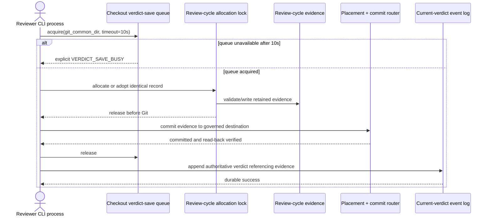

# Implementation Plan: Durable Concurrent Review-Cycle Records

**Branch**: `mission/durable-concurrent-review-cycle-records` | **Date**: 2026-08-23 | **Spec**: [spec.md](spec.md)
**Input**: GitHub issue [#3235](https://github.com/Priivacy-ai/spec-kitty/issues/3235) and the confirmed mission specification.

## Summary

Make automatic verdict saves truthful by serializing only their review-cycle evidence commit path with a checkout-wide, cross-process queue. A contender waits up to 10 seconds; if it cannot acquire the queue, it fails explicitly without a business-level retry. The new review-cycle allocation/status-lock section ends before its evidence Git operation; existing authoritative status transactions remain unchanged. A failed evidence commit retains its artifact, and an identical retry adopts and commits that same record. `--no-auto-commit` remains an explicit local-only, non-durable mode. Production-path, mutation-sensitive tests must prove both the event and evidence durability legs independently.

## Engineering Alignment

- Queue behavior: wait in line; no automatic retry after timeout.
- Serialization scope: automatic verdict evidence saves only.
- Queue scope: all missions and linked worktrees sharing one Git common directory.
- Timeout: 10 seconds measured by the CLI process's monotonic clock; then return a typed busy failure.
- Failure recovery: retain the written artifact and let an identical retry adopt it without cleanup.
- Authority: the event log remains authoritative for the current verdict; the review-cycle artifact remains authoritative for evidence content.
- Compatibility: preserve `--no-auto-commit` unchanged as explicit local-only behavior.

## Technical Context

**Language/Version**: Python 3.11+

**Primary Dependencies**: Typer/Click command surface, `filelock`, existing `CoordCommitRouter`/`safe_commit`, `kernel.git_topology.git_common_dir`; no new runtime dependency

**Storage**: Event-sourced mission status plus Markdown review-cycle evidence committed to the placement-selected Git destination; queue lock rooted at the canonical Git common directory

**Testing**: pytest, pytest-benchmark, multiprocessing with the portable `spawn` start method, real Git repositories/worktrees

**Target Platform**: Linux, macOS, and Windows

**Project Type**: Python CLI monorepo

**Performance Goals**: An uncontended end-to-end verdict save, including evidence and current-verdict persistence, completes in under 2 seconds

**Constraints**: 10-second queue acquisition limit; no daemon; no business retry; the new review-cycle allocation/status lock must not span its evidence Git operation; existing status-transaction behavior remains unchanged; no duplicate placement or verdict authority; preserve unrelated staging
**Scale/Scope**: At least 50 synchronized rounds with two persistent OS processes, all four mission topologies, both automatic-commit modes, and independent event/evidence mutation controls

## Constitution Check

*Pre-design gate: PASS. Post-design re-check: PASS.*

- **Single canonical authority**: PASS. The event log remains the only current-verdict authority, the artifact remains evidence-content authority, placement stays with the existing router, and the lock key uses canonical Git-topology resolution.
- **Architectural alignment / bounded context**: PASS. The new primitive belongs to the review verdict-save domain; generic Git commit and status-lock infrastructure remain unchanged.
- **ATDD-first and red-main discipline**: PASS. Work begins by strengthening the existing issue-pinned production-path reproduction and its mutation controls; no skip, quarantine, or assertion weakening is allowed.
- **Cross-platform and quality gates**: PASS. The design uses `filelock`, `pathlib`, `spawn`, `sys.executable`, strict typing, targeted lint/type checks, and native Linux/macOS/Windows coverage.
- **Smallest viable diff / locality**: PASS. Production changes are confined to the review queue, cycle writer, verdict persistence/result propagation, and the smallest necessary command integration seams. Cleanup is limited to touched surfaces.
- **Git/workflow discipline**: PASS. Planning and implementation remain on `mission/durable-concurrent-review-cycle-records`; the eventual protected-branch landing is a human-merged PR to `main`.
- **Mission hygiene**: PASS. Issue #3235 is assigned to `robertDouglass`, claimed for this mission in the populated issue matrix, and evidenced by [the tracker comment](https://github.com/Priivacy-ai/spec-kitty/issues/3235#issuecomment-5387211052); planning decisions and three required tracer files are recorded.
- **Dependency hygiene**: PASS. No dependency or supply-chain change is planned.

The dedicated verdict queue deliberately spans the evidence write and Git commit. This does not violate C-002 because it is not the inter-process status lock; only the short review-cycle allocation/status-lock section used by the new evidence path must be released before its Git subprocess. Existing authoritative status-transaction locking is outside this invariant and remains unchanged.

## Design

Audience: Spec Kitty core maintainers implementing or reviewing the durability fix.



### Critical-section and lock order

1. Automatic mode acquires the checkout-wide verdict-save queue.
2. While queued, take the existing short review-cycle allocation/status-lock section only long enough to discover an adoptable retained record or allocate, validate, and write a new one.
3. Release that allocation lock before calling the evidence Git subprocess; do not generalize this rule to existing authoritative status transactions.
4. Commit through the existing placement and commit router; independently verify the artifact at the governed destination ref.
5. Treat only a verified `committed` result, or a verified already-committed identical adopted record, as evidence durability. Returned errors, wrong-surface no-ops, unverified `unchanged`, exceptions, and timeouts are explicit failures and retain the artifact.
6. Release the verdict queue, then append the current-verdict event. No new evidence path may acquire the verdict queue while holding its review-cycle allocation lock or the event status lock.
7. Any later evidence-deletion compensation that runs Git must use the same verdict queue.

Releasing the queue before event emission keeps the evidence queue independent from status-event serialization and avoids a queue-to-status/status-to-queue deadlock. If event emission fails, orchestration must first run the existing evidence-deletion compensator under the verdict queue. Successful compensation removes the evidence; only a loud compensation failure, or an explicit future policy change, may leave the immutable evidence record as non-current history. The command remains non-successful in every event-failure case.

### Retained-record adoption

An automatic-save failure leaves the generated evidence file byte-identical and reports its path. An identical retry searches pending review-cycle records for the same mission, work package, reviewer identity, rendered evidence body, and affected-file set, ignoring only allocation metadata such as timestamp and cycle number. It adopts only a record absent from the governed destination ref; if the record is already committed, destination read-back makes the retry idempotent. A non-identical retry must not adopt or overwrite the retained artifact.

No verdict field or second verdict authority is added to the artifact. Identity is derived from canonical evidence content already owned by the artifact schema.

### Result contract

- **Durable success**: exit success; `verdict_durably_persisted=true`; stable evidence reference; committed destination verified; event references that evidence.
- **Busy or persistence failure**: nonzero exit; typed reason; `verdict_durably_persisted=false`; no success envelope; retained evidence path included when a file was written.
- **Explicit local-only mode**: exit success under `--no-auto-commit`; `verdict_durably_persisted=false`; reason remains `no_auto_commit`; queue and Git commit are bypassed.

## Project Structure

### Documentation (this mission)

```text
kitty-specs/durable-concurrent-review-cycle-records-01M0QRX7/
├── plan.md
├── research.md
├── data-model.md
├── quickstart.md
├── contracts/
│   └── verdict-save-queue.md
├── tracers/
│   ├── approach.md
│   ├── design-decisions.md
│   └── tooling-friction.md
└── tasks.md                 # created only by /spec-kitty.tasks
```

### Source Code (repository root)

```text
src/specify_cli/
├── review/
│   ├── verdict_commit_queue.py       # new checkout-wide queue primitive
│   └── cycle.py                      # retain/adopt/write/commit evidence
├── cli/commands/agent/
│   ├── tasks_move_task.py            # production verdict orchestration
│   └── tasks_verdict_persistence.py  # truthful outcome and compensation

src/kernel/git_topology.py            # existing canonical common-dir resolver

tests/
├── review/
│   ├── test_verdict_commit_queue.py
│   └── test_cycle.py
├── integration/
│   ├── review/test_reject_from_in_review.py
│   ├── review/test_verdict_save_topologies.py
│   └── test_review_durability_matrix.py
├── specify_cli/cli/commands/agent/test_move_task_durability.py
└── review/test_verdict_save_performance.py

.github/workflows/review-verdict-durability.yml
```

**Structure Decision**: Add one review-domain queue module and integrate it at the existing evidence writer/orchestration seam. Do not modify generic status locking, create a second placement mechanism, or add a daemon/service.

## Verification Strategy

1. **Red-first production acceptance**: replace the synthetic/manual-event headline test with two persistent `spawn` workers invoking the real reviewer command for at least 50 synchronized rounds.
2. **Independent durable oracle**: for every claimed success, inspect event history for a distinct evidence reference and use `git show` at the placement-selected destination ref to verify the matching reviewer/body. Working-tree existence is insufficient.
3. **Allowed round outcomes**: exactly two distinct durable successes, or one durable success plus one explicit nonzero refusal backed by a measured 10-second queue timeout or an independently valid state refusal. Include a deterministic concurrent two-success round where the first writer releases the queue within 10 seconds. Warning-only, false durability, unexplained immediate refusal, duplicated references, and uncommitted-only artifacts fail.
4. **Mutation controls**: independently disable the actual production event-serialization paths—including the fallback bindings and `coordination.transaction.feature_status_lock`—and fabricate evidence-commit success without changing Git; at least one coordination-topology negative control and the same oracle must turn red for the exact intended cause.
5. **Outcome truth table**: cover router `committed`, `unchanged`, `error`, wrong-surface no-op, exception, timeout, and `--no-auto-commit`.
6. **Recovery**: cover retained clean/staged/partially staged artifacts, raised and returned commit failures, interruption after write, identical adoption, non-identical non-adoption, and already-committed idempotence.
7. **Topology matrix**: cover single-branch, lanes, coordination, and lanes-with-coordination against automatic and local-only modes; verify actual governed refs.
8. **Cross-platform**: run the issue-pinned production node in native Linux, macOS, and Windows CI with `spawn`, `pathlib`, and no POSIX-only signal or path assumptions.
9. **Performance and quality**: benchmark an uncontended real command statistically; run focused pytest, Ruff, strict mypy, and changed-line coverage of at least 90%.

## Implementation Sequencing

1. **WP01** strengthens the production-path oracle, proves a concurrent wait-in-line two-success case, and makes both mutation controls causally red.
2. **WP02** adds the checkout-wide queue primitive and its cross-platform unit/contract tests; it can proceed in parallel with WP01.
3. **WP03** adds a non-acquiring evidence persistence operation for retention, identical adoption, governed-ref read-back, and typed outcomes after WP02.
4. **WP04** becomes the sole queue-acquisition owner and integrates truthful command outcomes and serialized compensation after WP02 and WP03.
5. **WP05** verifies all governed topology/mode cells and compensation after WP01 and WP04; **WP06** benchmarks the integrated uncontended path after WP04 and can run in parallel with WP05.
6. **WP07** adds the native three-OS gate and records exact quality evidence after WP01, WP05, and WP06.

The queue primitive and acceptance harness can be developed in parallel after the red-first oracle is fixed. Evidence adoption and command-result propagation must follow the queue contract and converge before the topology matrix.

## Complexity Tracking

No charter violations require justification. The dedicated queue is the minimum scope that serializes the shared Git evidence commit without broadening the status lock or changing generic Git behavior.
