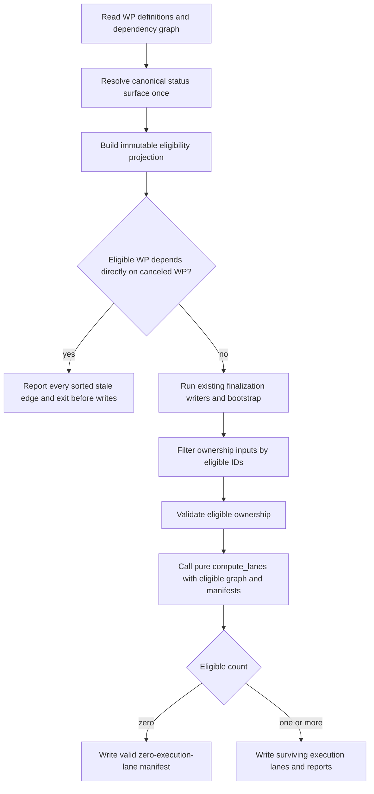

# Implementation Plan: Exclude Canceled Work Packages from Lanes

**Branch**: `fix/exclude-canceled-work-packages-from-lanes` | **Date**: 2026-08-24 | **Spec**: [spec.md](./spec.md)
**Input**: Mission specification from `/private/var/folders/h5/zqph_vqs3_77ctcqwvr_1b6m0000gn/T/spec-kitty-20260824-080044-XyYDT7/spec-kitty/kitty-specs/exclude-canceled-work-packages-from-lanes-01M0S6W4/spec.md`

## Summary

Make `finalize-tasks` derive one immutable eligibility projection from canonical event-derived lifecycle state before any finalization write. The projection excludes exactly current `canceled` work packages from ownership and execution-lane inputs, rejects every direct edge from eligible work to canceled work in one deterministic diagnostic, and lets an all-canceled Mission produce a valid zero-execution-lane manifest. `compute_lanes` remains pure and status-agnostic; `done` and all non-canceled states retain current behavior.

The first implementation commit must contain planning-base RED acceptance coverage. Production work follows only after that failure is recorded separately.

## Technical Context

**Language/Version**: Python 3.11+
**Primary Dependencies**: Typer, Rich, Pydantic/dataclasses, existing status surface resolver and append-only event reader; no new runtime dependency
**Storage**: Existing `status.events.jsonl` lifecycle authority and generated `lanes.json`; no schema migration or new store
**Testing**: pytest unit, CLI contract, integration, and regression suites; ruff and mypy on touched modules
**Target Platform**: Cross-platform Python CLI on Linux, macOS, and Windows 10+
**Project Type**: Single Python CLI repository
**Performance Goals**: Linear projection over at most 100 work packages and direct dependency edges; preserve the existing two-second finalization target
**Constraints**: Read lifecycle authority once; fail before finalization mutation on stale edges; exclude only `canceled`; preserve event history and prompt files; deterministic diagnostics; do not change #3431 cycle semantics or #3281 allocation recovery
**Scale/Scope**: One finalization boundary, one small pure projection seam, two finalization output paths, and focused tests

## Charter Check

*GATE: passed before research and re-checked after Phase 1 design.*

| Binding rule | Plan response | Result |
|---|---|---|
| Canonical mutable-state authority | Cancellation is read from the coordination-aware append-only event surface; prompt frontmatter and `lanes.json` never decide eligibility. | PASS |
| Specification fidelity | Only current `canceled` is excluded; `done`, reopening, retained definitions, all-canceled success, and stale dependency recovery match FR-001–FR-010. | PASS |
| Fail explicitly | Every direct eligible-to-canceled edge is sorted and reported with both work-package IDs and remove-or-repoint recovery before any finalization writer runs. | PASS |
| ATDD-first | The first implementation commit is a planning-base RED acceptance/contract test commit. | PASS |
| Existing authority boundaries | `compute_lanes` remains a pure allocator; #3431 post-collapse cycle detection remains unchanged; #3281 retry/history/propagation remains out of scope. | PASS |
| Campsite discipline | Add a small pure eligibility module and make narrow orchestration edits instead of growing the 2,996-line finalizer or duplicating filters at every consumer. | PASS |
| Terminology | The plan distinguishes lifecycle lanes from execution lanes and uses Mission/work-package terminology. | PASS |
| Git and workflow discipline | Spec Kitty owns Mission state and workspace flow; no direct push to `main`; eventual PR targets `main`. | PASS |
| Mission tracers | `traces/approach.md`, `traces/design-decisions.md`, and `traces/tooling-friction.md` are initialized during planning. | PASS |

Post-design re-check: the design adds no second status authority, no allocator policy, no lifecycle transition, and no allocation-retry behavior. All gates remain PASS.

## Architecture and Data Flow



### Eligibility boundary

After task files, the manifest, and the dependency graph have been read and structurally validated, `finalize-tasks` resolves the coordination-aware status read directory and reads current lifecycle lanes exactly once. A new pure helper receives the known work-package IDs, dependencies, and lifecycle map and returns an immutable `FinalizationEligibility` value:

- sorted `eligible_wp_ids` and `canceled_wp_ids`;
- the dependency graph projected onto eligible work packages;
- every sorted `StaleCanceledDependency` edge from an eligible dependent to a canceled prerequisite;
- counts needed to distinguish a valid all-canceled graph from genuinely missing lane inputs.

Unknown/corrupt status authority fails through the existing status error boundary. A known work package with no lifecycle entry is treated as not canceled so the first finalization can bootstrap it. A reopened package participates because only its current lane is consulted. The pure projection does not read files or emit output.

### Mutation ordering

The stale-edge check is moved ahead of `_persist_target_branch_override`, issue-matrix scaffolding, frontmatter writes, lifecycle bootstrap/events, `tasks.md` regeneration, `lanes.json`, acceptance-matrix generation, dossier sync, and commits. Read-only branch resolution and dependency validation may precede it. This makes both normal and `--validate-only` paths share the same guard and prevents partial finalization residue on rejection.

### Downstream filtering

The projection is applied once to generic maps after bootstrap/gathering and those filtered maps are passed to:

- the `kitty-specs/` owned-path check;
- ownership manifest construction, authoritative-surface/overlap/glob/audit validation;
- validate-only execution-lane preview;
- committed execution-lane computation;
- execution-lane collapse and parallelization reporting.

Prompt files, task-outline entries, event history, bootstrap bookkeeping, and static requirement traceability remain complete Mission records. Canceled nodes are removed only from execution eligibility.

### Zero executable work

Existing raw-input validation remains in force before projection. If eligible work exists but no ownership manifests can be resolved, finalization retains `LANE_COMPUTATION_ABORTED_EMPTY_INPUTS`. If the raw Mission is valid and the projection proves that every work package is canceled, the finalizer calls the already-empty-safe pure allocator with empty eligible maps and persists a normal `LanesManifest` containing zero execution lanes. Validate-only reports `computed: true` and `count: 0` for the same case.

## Project Structure

### Documentation (this Mission)

```text
/private/var/folders/h5/zqph_vqs3_77ctcqwvr_1b6m0000gn/T/spec-kitty-20260824-080044-XyYDT7/spec-kitty/kitty-specs/exclude-canceled-work-packages-from-lanes-01M0S6W4/
├── spec.md
├── plan.md
├── research.md
├── data-model.md
├── quickstart.md
├── contracts/
│   └── canceled-finalization.md
├── traces/
│   ├── approach.md
│   ├── design-decisions.md
│   └── tooling-friction.md
└── tasks.md                         # created only by /spec-kitty.tasks
```

### Source Code (repository root)

```text
/private/var/folders/h5/zqph_vqs3_77ctcqwvr_1b6m0000gn/T/spec-kitty-20260824-080044-XyYDT7/spec-kitty/src/specify_cli/cli/commands/agent/
├── mission_finalize.py                     # status read, ordering, filtering, output integration
└── finalization_eligibility.py             # immutable model and pure projection/edge detection

/private/var/folders/h5/zqph_vqs3_77ctcqwvr_1b6m0000gn/T/spec-kitty-20260824-080044-XyYDT7/spec-kitty/tests/specify_cli/cli/commands/agent/
├── test_finalization_eligibility.py        # pure projection unit coverage
├── test_finalize_canceled_work_packages.py # CLI acceptance and JSON contract
├── test_mission_finalize_phases.py         # filtered ownership/empty-lane phase coverage
└── test_finalize_lane_dependency_cycle.py  # unchanged surviving-graph regression
```

**Structure Decision**: Isolate the new deterministic policy in a small sibling module. Keep status-surface resolution and CLI rendering in `mission_finalize.py`, where those responsibilities already live. Do not add lifecycle knowledge to `src/specify_cli/lanes/compute.py`.

## Selected Design

Use an immutable projection as the single cancellation policy carrier. The orchestration layer resolves canonical status with `resolve_status_surface_with_anchor`, verifies the event log can be read, and passes its lane map to the pure projector. The projector intersects `canceled` state with known work-package IDs, detects cut edges before filtering, then produces the eligible graph. Generic keyed-map filtering ensures every ownership and allocator consumer receives the identical eligible set.

The CLI error code is `CANCELED_WP_DEPENDENCY`. JSON output contains a deterministically sorted `stale_dependencies` array; human output renders the same records. Each record names `dependent_wp_id`, `canceled_dependency_wp_id`, and the instruction to remove or repoint the dependency. No first-error short circuit is permitted.

### Alternatives considered

| Alternative | Decision | Rationale |
|---|---|---|
| One immutable eligibility projection at the finalization boundary | Selected | Reads authority once, prevents filter drift, supports both output paths, and keeps the allocator pure. |
| Teach `compute_lanes` to read lifecycle status | Rejected | Couples a deterministic allocator to filesystem topology and creates a second place that owns cancellation policy. |
| Filter canceled packages independently inside each ownership/lane helper | Rejected | Repeats authority reads and allows ownership, validation, preview, and committed computation to disagree. |
| Treat canceled dependencies as satisfied | Rejected | Silently bypasses an authored prerequisite and violates FR-004/FR-005. |
| Delete canceled prompts or ownership declarations | Rejected | Destroys governed history and makes lifecycle cancellation unusable as an audit mechanism. |
| Exclude all terminal states, including `done` | Rejected | Expands scope beyond cancellation and changes current finalized-Mission behavior. |

## Test Strategy

1. Commit RED CLI acceptance tests first. Seed canonical `canceled` events and prove the current implementation rejects a canceled package with missing/overlapping ownership, leaves it in an execution lane, or fails the all-canceled case.
2. Unit-test the pure projection: no canceled states, one canceled node, reopened/non-canceled state, canceled-to-canceled edges, multiple sorted eligible-to-canceled edges, and empty eligible output.
3. Exercise the exact `finalize-tasks` command in human and JSON modes. Assert the stale-edge error names all pairs, includes recovery text, returns nonzero, and leaves target-branch metadata, matrices, frontmatter, events, `tasks.md`, `lanes.json`, Git HEAD, and working-tree state unchanged.
4. Verify ownership filtering covers absent manifests, malformed authoritative surfaces, overlapping files, literal-path glob checks, and audit inputs on canceled packages while retaining each check for eligible packages.
5. Verify a mixed Mission writes execution lanes containing only eligible work and excludes canceled work from collapse and risk reports.
6. Verify all-canceled normal finalization writes a valid zero-lane manifest and validate-only reports `computed: true`, `count: 0`, with no mutation.
7. Pin cancellation-only behavior: `done` remains eligible, reopened work participates, no-canceled fixtures retain byte-equivalent lane membership/dependencies/collapse results, and #3431 cycle failures remain deterministic on the surviving graph.
8. Add corrupt/missing canonical-status cases that fail closed without consulting frontmatter or prior `lanes.json`.
9. Add a 100-work-package deterministic projection/finalization fixture and assert the existing two-second target without sleep or retries.
10. Run focused tests without retries, then ruff and mypy on touched modules and the repository terminology/architecture gates relevant to execution-lane allocation.

## Complexity Tracking

No charter violation is planned. The new pure module prevents further growth of the 2,996-line orchestration module; `mission_finalize.py` receives only narrow read/render/filter call sites. No blanket lint/type suppression or compatibility shim is permitted.

## Implementation Concern Map

### IC-01 — RED cancellation contract

- **Purpose**: Freeze current failure modes and the exact stale-dependency/no-executable-work CLI contract before production changes.
- **Requirements**: FR-002–FR-006, FR-008, NFR-001, NFR-002, NFR-005
- **Affected surfaces**: `tests/specify_cli/cli/commands/agent/test_finalize_canceled_work_packages.py`, `contracts/canceled-finalization.md`
- **Depends on**: none
- **Risks**: Mocking mutable frontmatter instead of canonical event-derived state would make the acceptance test vacuous.

### IC-02 — Canonical eligibility projection and pre-write guard

- **Purpose**: Read lifecycle state once, build the immutable projection, report every stale cut edge, and reject before finalization mutation.
- **Requirements**: FR-001, FR-004–FR-006, FR-009, NFR-001–NFR-004, C-001, C-006
- **Affected surfaces**: `finalization_eligibility.py`, the read/order seam in `mission_finalize.py`, focused unit/CLI tests
- **Depends on**: IC-01
- **Risks**: Coordination-surface resolution, first-finalize WPs without seeded lanes, deterministic ordering, and accidentally leaving an earlier writer ahead of the guard.

### IC-03 — Eligible ownership and execution-lane inputs

- **Purpose**: Feed the same eligible set to every ownership and execution-lane consumer without changing pure allocation semantics.
- **Requirements**: FR-002, FR-003, FR-007, FR-010, NFR-003, NFR-005, C-002–C-005
- **Affected surfaces**: ownership/path validation calls, validate-only preview, committed computation, parallelization reporting, phase tests
- **Depends on**: IC-02
- **Risks**: `_resolve_wp_manifests_for_validation` can reintroduce canceled WPs if unfiltered frontmatter is passed; filtered manifests and frontmatter must travel together.

### IC-04 — Zero work and regression closeout

- **Purpose**: Persist and preview a valid zero-execution-lane result only when eligibility proves all work is canceled, then verify unchanged behavior elsewhere.
- **Requirements**: FR-008, FR-010, SC-004–SC-006, NFR-003–NFR-005
- **Affected surfaces**: empty-input guard, execution-lane preview/write reports, #3431 regression suite, tracers
- **Depends on**: IC-02, IC-03
- **Risks**: Weakening the existing empty-manifest failure for non-canceled planning-artifact work or bypassing post-collapse cycle checks.

## Parallel Work Analysis

Implementation is intentionally sequential because the eligibility model, orchestration ordering, and downstream maps share one narrow finalization boundary. After the separately committed RED contract, IC-02 establishes the policy seam, IC-03 integrates it, and IC-04 closes regression coverage. Independent review may inspect commits, but parallel implementation would create overlapping ownership in `mission_finalize.py`.

## Delivery and PR Boundary

Implementation and review use Spec Kitty work-package workspaces. After acceptance and local Mission merge, the authorized branch may be pushed and a PR opened against `origin/main`. Do not push directly to `main`, enable auto-merge, or merge the PR as part of this Mission without a separate gate decision.
