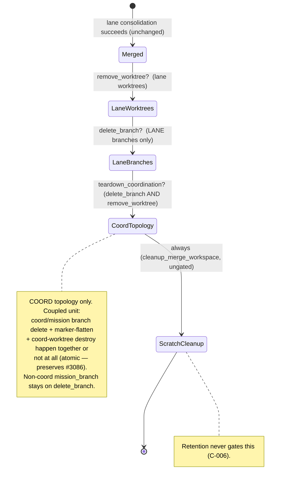

# Data Model: Merge Retention Policy (#3131)

## Entity: Retention policy (persisted in `meta.json`)

| Field | Type | Default | Meaning |
|-------|------|---------|---------|
| `retain_branches` | `bool` (JSON boolean) | absent = no policy | When `true`, lane + mission branches are retained after merge unless an explicit CLI delete override is given. |
| `retain_worktrees` | `bool` (JSON boolean) | absent = no policy | When `true`, lane worktrees (and, coupled, the coordination worktree) are retained after merge unless an explicit CLI remove override is given. |

- **Home**: mission `meta.json`, primary partition. Added to `MissionMetaOptional`
  (`mission_metadata.py`) as flat optional fields; `validate_meta` preserves them.
- **Write path**: `mission create` (via `create_mission_core` kwargs) writes a
  field ONLY when its value is `true`. No migration; legacy missions omit both.
- **Read path**: `read_retention_from_meta(primary_meta_dir)` over
  `load_meta_fail_closed` — `None` on absent file, `MissionMetaReadError` on
  corrupt (aborts the merge).
- **Validation / fail-closed**: a genuinely-present value that is not a JSON
  boolean (`""`, `0`, `"true"`, `"false"`, list, object) is treated as ambiguous →
  resolves to retain + warn; it is NEVER `bool()`-coerced. **JSON `null` is the
  exception**: `meta.get()` cannot distinguish `null` from an absent field, and
  `null` means "no value set", so `retain_branches: null` resolves as absent →
  default (delete/remove), preserving INV-3. (WP01 decision, review-ratified.)

## Value object: Effective cleanup decision (runtime, not persisted)

Produced by `resolve_merge_retention(...)`:

| Field | Type | Meaning |
|-------|------|---------|
| `delete_branch` | `bool` | Resolved: whether lane/mission branches are deleted. |
| `remove_worktree` | `bool` | Resolved: whether lane worktrees are removed. |
| `teardown_coordination` | `bool` | Coupled coord decision = `delete_branch AND remove_worktree` (tear coord topology only when both). |
| `branch_source` | `str` ∈ {`cli`, `meta`, `default`} | Provenance of `delete_branch`. |
| `worktree_source` | `str` ∈ {`cli`, `meta`, `default`} | Provenance of `remove_worktree`. |
| `warnings` | `list[str]` | Operator-visible messages (retention-honored, malformed-value). |
| `override_notices` | `list[str]` | Recorded notices when an explicit CLI delete overrode a mission retention policy. |

### Resolution rule (per resource)

```
explicit_flag is not None  → effective = explicit_flag ; source = "cli"
                             (if explicit deletes AND meta retains → append override_notice)
explicit_flag is None:
    meta says retain (true)         → effective = keep   ; source = "meta" ; append warning
    meta malformed (non-bool)       → effective = keep   ; source = "meta" ; append warning (malformed)
    meta absent / false             → effective = default(delete/remove) ; source = "default"
```

`delete_branch` is the negation of "retain branches"; `remove_worktree` is the
negation of "retain worktrees". `teardown_coordination = delete_branch AND remove_worktree`.

## State transitions (post-merge cleanup, gated by the decision)



**Topology-awareness (INV-2 detail).** For a `coord` mission the coordination
branch is `lanes_manifest.mission_branch`; its deletion, the `coordination_branch`
marker-flatten, and the coord-worktree teardown form ONE atomic unit gated by
`teardown_coordination`. For a non-coord (`single_branch`/`lanes`) mission there is
no coordination branch/marker/worktree, so the mission-branch deletion stays under
`delete_branch` exactly as today (no behavior change). This both preserves the
#3086 flatten-atomicity and fixes the pre-existing `--keep-worktree`-on-coord husk.

## Invariants

- **INV-1 (no silent deletion)**: no lane/mission branch, lane worktree, or
  coordination worktree of a retaining mission is deleted without either an
  explicit recorded override or an emitted warning — across success AND abort.
- **INV-2 (coord consistency)**: the coordination branch, worktree, and marker
  are always in a mutually consistent state (all retained or all torn down).
- **INV-3 (byte-identical default)**: a mission with neither field behaves
  exactly as before this change.
- **INV-4 (fail-closed)**: any ambiguity (corrupt meta → abort; malformed value
  → retain) never resolves to delete.
