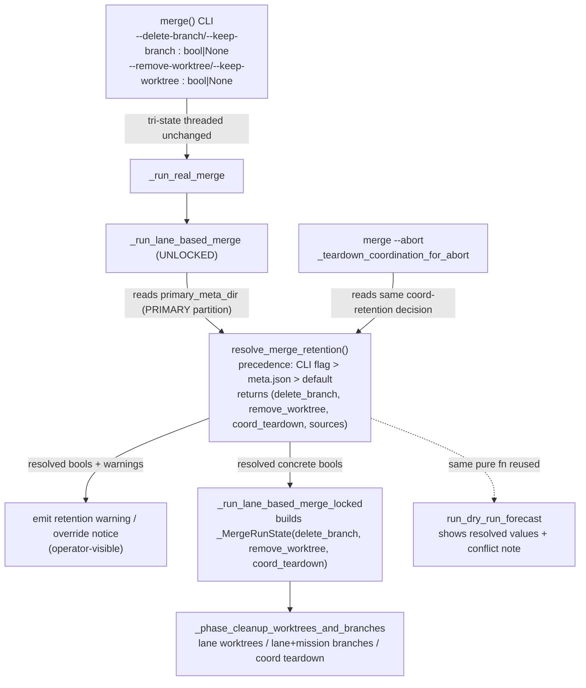

# Implementation Plan: Merge Honors Mission Retention Policy

**Branch**: `fix/3131-merge-retention` | **Date**: 2026-08-31 | **Spec**: [spec.md](./spec.md)
**Input**: Feature specification from `kitty-specs/merge-honor-retention-policy-01M1CA0E/spec.md`

## Summary

Make `spec-kitty merge` honor a machine-readable, per-mission branch/worktree
retention policy persisted in `meta.json` (`retain_branches` / `retain_worktrees`),
instead of unconditionally applying its default `--delete-branch` /
`--remove-worktree` cleanup. The cleanup flags become tri-state
(`bool | None`); a single pure resolver computes the effective cleanup decision
with precedence `explicit CLI flag > meta.json retention > default`, reading the
PRIMARY partition and failing closed toward retention on any ambiguity. The
resolver is consumed at one site in the executor (before the locked driver builds
`_MergeRunState`) and reused by the dry-run forecast. Coordination-topology
teardown is coupled into a single decision (retain unless both fields resolve to
delete/remove) so partial retention cannot half-tear the coord triple, and the
`--abort` teardown honors the same coordination-retention decision. Retention is
mintable at `mission create` via new `--retain-branches` / `--retain-worktrees`
flags. Red-first regression proves branches/worktrees survive a default merge on
a `coord`-topology retaining mission through the real entry point.

## Technical Context

**Language/Version**: Python 3.11+
**Primary Dependencies**: typer (CLI), rich (console), ruamel.yaml/json (meta I/O), pytest, mypy --strict, ruff
**Storage**: mission `meta.json` (per-mission JSON, primary partition) — the retention authority
**Testing**: pytest — `tests/merge/`, `tests/integration/test_merge_lane_planning_data_loss.py`, mission-creation + meta tests; new `@pytest.mark.regression` repro pinned to #3131
**Target Platform**: Linux/macOS/Windows CLI (cross-platform git worktree ops)
**Project Type**: single (CLI library — `src/specify_cli/`)
**Performance Goals**: merge CLI stays < 2s for typical projects; retention resolution is O(1) meta read, negligible
**Constraints**: no new blocking gate; fail-closed toward retention; zero silent deletions across success AND abort paths; ruff + mypy --strict clean; functions ≤15 complexity
**Scale/Scope**: ~7 touched surfaces (meta schema, resolver, executor cleanup, CLI flags, forecast, mission_creation, docs); no change to the lane-consolidation algorithm

### Supply-Chain Security (Planning)

No dependencies are added, upgraded, or removed. This mission is pure
first-party Python touching existing modules; the `051-supply-chain-install-safety`
directive raises no action item. Recorded here so silence is deliberate, not a gap.

## Constitution Check

*GATE: Must pass before Phase 0 research. Re-check after Phase 1 design.*

Charter (`.kittify/charter/charter.md`) is present. Relevant gates:

- **Single canonical authority** (Governing Principles): retention lives in ONE
  place — `meta.json` — with the `write_meta`/`load_meta_fail_closed` API. No
  second authority (no prose-parsing, no config.yaml tier). ✅ (spec C-002/C-003)
- **ATDD-first / red-first (C-011, ADR 2026-07-17-1)**: an issue-pinned
  regression is RED on current main through the real `spec-kitty merge` entry
  point BEFORE the fix, committed first in its lane. ✅ (spec NFR-002)
- **Close defect class by construction (DIRECTIVE_043)**: a regression that a
  silent-override path can never pass green, covering success AND abort paths. ✅
  (spec NFR-003)
- **Locality of change / smallest-viable-diff**: touch only the post-merge
  cleanup policy + its preflight/forecast + the create-time mint; do NOT touch
  the consolidation algorithm. ✅ (spec C-001)
- **Canonical sources**: mirror `resolve_merge_target_branch` precedent + provenance. ✅
- **Terminology canon**: `retain`/`retention`, no `feature*` alias; merge flags
  stay `--keep-*`/`--delete-*`/`--remove-*` with a documented retain⇔keep mapping. ✅ (C-004)
- **High-risk operation discipline**: destructive git surgery; scout squad mapped
  every cleanup call site with file:line before any change; two adversarial lenses
  (data-loss + canonical) reviewed the spec and their BLOCKER findings were folded. ✅

No violations to justify — Complexity Tracking omitted.

## Architecture & Approach

### Retention resolution flow (the one seam)



### Key design decisions (from spec D-1..D-5, sharpened by the squads)

1. **Authority = `meta.json`, two flat booleans** `retain_branches` /
   `retain_worktrees` added to `MissionMetaOptional` (`mission_metadata.py`).
   `validate_meta` preserves unknown fields (no strict schema), so this is a
   pure convention choice; flat mirrors every existing per-mission policy field
   (`target_branch`, `merged_push`, `topology`). Absence = "no stated policy";
   non-retaining missions are NEVER default-written the fields (SC-004 byte-identical).
2. **Single pure resolver** `resolve_merge_retention(...)` in `core/paths.py`
   next to `resolve_merge_target_branch`, precedence `explicit CLI flag >
   meta.json retention > default`, returning resolved booleans + provenance
   (`source ∈ {cli, meta, default}`) + coupled coord decision. Reads via a thin
   `read_retention_from_meta(primary_meta_dir)` over `load_meta_fail_closed`
   (reuses corrupt-meta → `MissionMetaReadError` → abort).
3. **Read the PRIMARY partition, resolve once.** Resolution happens in the
   UNLOCKED `_run_lane_based_merge` after `resolve_mission_identity(primary_meta_dir)`
   (executor.py:~1849), NOT in the locked driver (whose `feature_dir` is the
   coord STATUS husk with no `meta.json`). Resolved bools pass into the locked
   driver; `_MergeRunState` keeps `bool` fields; fresh AND `--resume` honored once.
4. **Tri-state flags**: `--delete-branch/--keep-branch` and
   `--remove-worktree/--keep-worktree` become `Optional[bool]` default `None`.
   `None` = unset (consult meta); explicit `True`/`False` = CLI wins. Existing
   callers passing explicit bools are unaffected.
5. **Fail direction**: meta retain + no explicit override → keep + WARN
   (operator-visible). Explicit delete override on a retaining mission → delete
   proceeds + recorded OVERRIDE NOTICE (never silent). Malformed (non-boolean)
   retention value → retain + warn (never truthiness-coerced to delete).
6. **Coupled coordination teardown (BLOCKER-1 fix)**: the coord marker-flatten
   (`executor.py:1557`, currently under `delete_branch`) and coord-worktree
   destroy (`executor.py:1570`, currently under `remove_worktree`) are driven by
   ONE coord-retention value = "tear down coord only if BOTH `delete_branch` and
   `remove_worktree` resolve to delete/remove." Otherwise the coord triple
   (branch + worktree + marker) is retained whole. Lane resources stay independent.
7. **Abort path (BLOCKER-2 fix)**: `_teardown_coordination_for_abort`
   (`cli/commands/merge.py:~319` → `teardown_coordination_topology`) consults the
   same coord-retention decision and skips + warns for a worktree-retaining mission.
8. **Forecast reuses the resolver**: `run_dry_run_forecast` calls
   `resolve_merge_retention` against `primary_meta_dir` and emits resolved
   `delete_branch`/`remove_worktree` + a `retention` provenance/conflict field
   instead of echoing raw flags (updates the forecast golden-key test).
9. **Create-time mint (FR-009)**: `create_mission_core` gains keyword-only
   `retain_branches=False`/`retain_worktrees=False`; the mint site
   (`mission_creation.py:~694-711`) writes the field only when true (field-absent
   otherwise). CLI `mission create` gains `--retain-branches`/`--retain-worktrees`
   typer options; the specify prompt documents the create-time opt-in.
10. **Scratch worktree stays ungated (C-006)**: `cleanup_merge_workspace`
    continues to run unconditionally; retention MUST NOT gate it.
11. **Second merge entry audited (C-007)**: `orchestrator_api/commands.py` merge
    entry routed through the resolver or documented out-of-scope with rationale.

## Project Structure

### Documentation (this mission)

```
kitty-specs/merge-honor-retention-policy-01M1CA0E/
├── plan.md              # This file
├── research.md          # Phase 0 output
├── data-model.md        # Phase 1 output
├── quickstart.md        # Phase 1 output
├── contracts/           # Phase 1 output (retention-resolver contract, adversarial-evidence)
└── tasks.md             # Phase 2 output (/spec-kitty.tasks — NOT created here)
```

### Source Code (repository root)

```
src/specify_cli/
├── mission_metadata.py        # ADD retain_branches/retain_worktrees to MissionMetaOptional
├── core/
│   ├── paths.py               # ADD resolve_merge_retention() + read_retention_from_meta()
│   └── mission_creation.py    # mint retention at create (create_mission_core kwargs + mint site)
├── cli/commands/
│   ├── merge.py               # tri-state flags; thread None down; abort honors retention; warning render
│   └── mission_create.py      # --retain-branches/--retain-worktrees typer options
├── merge/
│   ├── executor.py            # resolve once (unlocked); coupled coord teardown; _MergeRunState field
│   └── forecast.py            # reuse resolver; resolved values + conflict note in payload
└── orchestrator_api/commands.py  # audit second merge entry (C-007)

tests/
├── integration/test_merge_lane_planning_data_loss.py  # red-first: coord retaining mission survives
├── merge/test_executor_coverage.py                    # unit pin on coupled coord gate
├── merge/test_forecast_seam.py                        # updated golden key set
└── specify_cli/ (mission-creation + meta tests)       # create-time mint + schema round-trip
```

**Structure Decision**: Single-project CLI library. All changes are additive
edits to existing `src/specify_cli/` modules plus focused tests; no new package
or directory. The retention resolver co-locates with the existing target-branch
resolver in `core/paths.py` (canonical precedent).

## Parallel Work Analysis

### Dependency Graph

```
WP01 (red-first regression, RED on main) ──┐
                                           ├─► WP02 (meta schema + resolver, core) ──► WP03 (executor: resolve + coupled coord + abort)
WP01 ──────────────────────────────────────┘                                     └─► WP04 (forecast reuse)
WP02 ──► WP05 (create-time mint + CLI flags)
WP03,WP04,WP05 ──► WP06 (docs + CLAUDE.md correction + CHANGELOG)
```

### Work Distribution

- **Sequential foundation**: WP01 (the red-first repro) lands first and stays
  RED; WP02 (schema + pure resolver) is the shared dependency for WP03/WP04/WP05.
- **Parallel streams after WP02**: WP03 (executor enforcement incl. coupled coord
  + abort), WP04 (forecast), WP05 (create-time mint) touch disjoint files.
- **Convergence**: WP06 folds docs + CLAUDE.md stale-doc correction + CHANGELOG
  after enforcement lands and turns WP01 green.

### Coordination Points

- WP01's regression flips RED→GREEN when WP03 lands — the acceptance gate.
- WP02's resolver signature is the contract WP03/WP04 consume; freeze it in
  `contracts/` (Phase 1) before parallel work starts.

## Charter Check (post-design re-evaluation)

Re-checked after design: no new gaps. The design keeps a single authority,
mirrors the canonical resolver, fails closed toward retention on every ambiguity
(corrupt meta, malformed value, partial coord), and the abort path is explicitly
covered — closing the BLOCKER gaps the adversarial squad raised. The stale
`CLAUDE.md` preflight doc is corrected in WP06 (trace-the-gap, not work-around).
