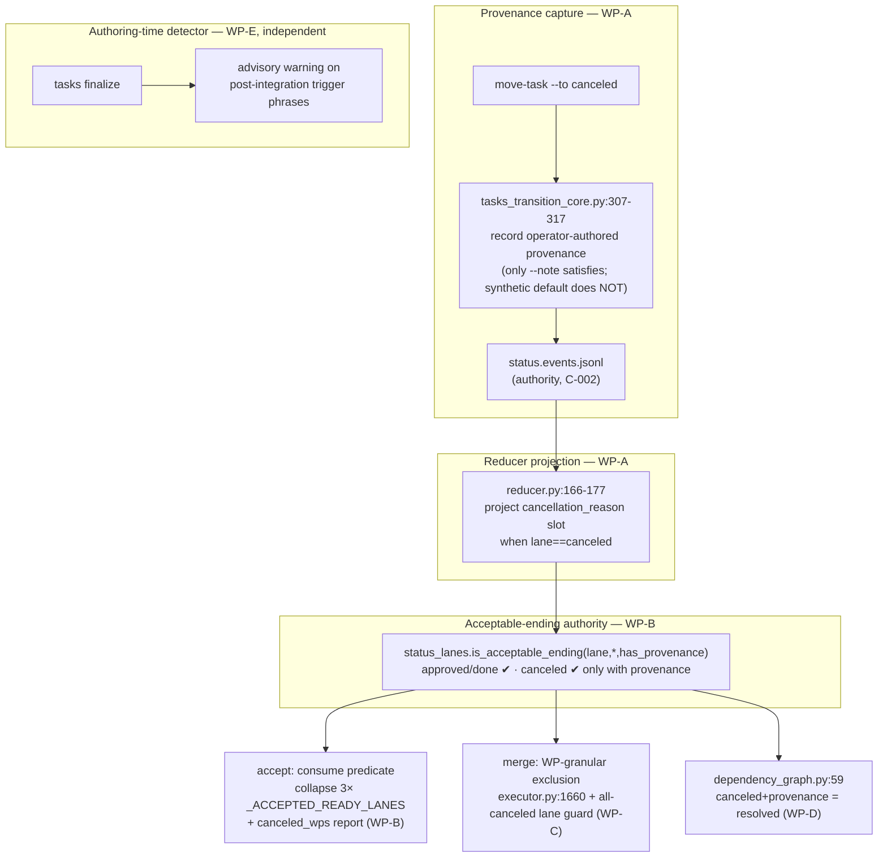

# Implementation Plan: Mission Completion Terminal State

**Branch**: `fix/mission-completion-terminal-state` | **Date**: 2026-08-28 | **Spec**: [spec.md](spec.md)
**Input**: Feature specification from `kitty-specs/mission-completion-terminal-state-01M129MV/spec.md`
**Squad map**: [research/post-spec-squad-findings.md](research/post-spec-squad-findings.md) (file:line anchors)

## Summary

Reconcile the mission lifecycle so a deliberately-canceled work package with
**operator-authored** provenance is an honest, accepted mission ending, and warn at
authoring time when the planner produces a work package whose success is only observable
post-integration. The change is a correctness reconciliation across five existing seams —
provenance capture, the acceptable-ending predicate, the reducer projection, merge's
per-work-package assertions, and the dependency-readiness gate — plus one advisory
authoring-time detector. No new dependencies, no state-machine change (C-001), event log
remains the authority (C-002).

## Technical Context

**Language/Version**: Python 3.11+
**Primary Dependencies**: typer, rich, ruamel.yaml (existing spec-kitty CLI stack) — **no new dependencies added, upgraded, or removed** (supply-chain check below is therefore N/A/clean)
**Storage**: append-only status event log `status.events.jsonl` (JSONL); no database, no schema migration
**Testing**: pytest — pinned suites in NFR-001 (`tests/specify_cli/test_canonical_acceptance.py`, `test_acceptance_regressions.py`, `tests/specify_cli/cli/commands/agent/test_finalize_canceled_work_packages.py`, `tests/status/test_transitions.py`, `test_reducer.py`, merge suite)
**Target Platform**: Linux/macOS developer CLI
**Project Type**: single (Python package `src/specify_cli/` + `src/doctrine/` templates)
**Performance Goals**: no change to accept/merge latency; correctness-only, no hot path touched
**Constraints**: no new deps; no transition-matrix change (C-001); provenance derived from the event log and read from the coord status surface (C-002); byte-identical behavior for canceled-free missions (NFR-002)
**Scale/Scope**: ~6 focused code seams + 1 detector; net-new tests at unit + command + merge + tasks-authoring layers. Baseline commit for NFR-001/SC-004: **`a59460ec15`** (branch base = `upstream/main` at mission start).

### Supply-Chain Security & Adversarial Evidence

No dependency is added, upgraded, or removed by this mission, so the
`051-supply-chain-install-safety` checks (registry authenticity, freshness, lifecycle
scripts, Node LTS) are **not applicable**. Adversarial evidence for the *design* was
gathered by the post-spec squad (four profile-loaded lenses); dispositions are recorded in
[research.md](research.md) per the adversarial-evidence contract.

## Constitution Check

*GATE: Must pass before Phase 0. Re-checked after Phase 1.*

Charter present (`.kittify/charter/charter.md`). Load-bearing directives and how this plan satisfies them:

- **043 close-defect-class-by-construction / 040 recurring-bug-structural-intervention** — the fix is a *single acceptable-ending authority* (FR-005) consumed by accept, merge, and the dependency gate, so the three consumers cannot drift again. The provenance redefinition (D2) removes the fake-green by construction, not by a test patch.
- **044 canonical-sources-and-unification** — collapses the three duplicated `_ACCEPTED_READY_LANES` copies onto one predicate; consumes the canonical `TERMINAL_LANES` for the canceled classification rather than minting a parallel set.
- **010 specification-fidelity / 003 decision-documentation** — every plan-phase mechanism decision is recorded in research.md (Decision/Rationale/Alternatives); product decisions D1–D3 are in the spec.
- **034 test-first / 036 black-box-integration-testing** — SC-001 proven by an in-diff black-box integration test (not post-merge observation); SC-003 measured against a fixed labeled corpus.
- **C-001** — no transition-matrix edit; **C-002** — no frontmatter reads; **C-004** — terminology canon, `merge` = lane consolidation.

No violations to justify → Complexity Tracking below is empty.

## Design

### Seam map (control flow)



### Decisions (mechanism — full rationale in research.md)

1. **Provenance = operator-authored (D2).** `tasks_transition_core.py:307-317` currently backfills a synthetic non-empty `reason` for every move. Decision: a cancellation is accept-eligible **only** when the operator supplied a reason via `--note`; the synthetic `"Force move to <lane>"` / `"move-task: …"` default is recorded but flagged as non-operator (a structured `reason_source: operator|synthetic` marker on the event, or the operator note kept in a distinct authoritative slot). This makes FR-003 reachable through the canonical command (force-cancel without `--note` → blocker) and non-forgeable. Backward-compat: a legacy `canceled` event whose `reason` was operator-supplied still reads as operator (NFR-002); where the source is indeterminable for legacy events, treat a reason that does not match the synthetic templates as operator-authored.
2. **Provenance read seam = reducer projection.** Project `cancellation_reason` into the per-WP snapshot (`reducer.py:166-177`) when `lane==canceled`, keeping accept single-read; extend `tests/status/test_reducer.py` golden expectations. (Alternative: log lookup by `last_event_id` — rejected as it scatters a second event read into `acceptance/`.)
3. **Acceptable-ending predicate** lives in `src/specify_cli/status_lanes.py` next to `TERMINAL_LANES`: `is_acceptable_ending(lane, *, has_provenance) -> bool`. Accept and merge consume it; the three `_ACCEPTED_READY_LANES` definitions (`acceptance/__init__.py:145`, `gates_core.py:52`, `summary_core.py:173,202`) are deleted in favor of it.
4. **FR-004 WP-granular merge.** Filter canceled WPs out of `all_wp_ids` at `merge/executor.py:1660` (feeds `_enforce_review_artifact_consistency`, `wp_order`, `_assert_merged_wps_done_on_target`); add an all-canceled lane guard in `_phase_merge_lanes` (`executor.py:416-459`) so a fully-canceled lane's branch is skipped. Cancellation record retained in the audit trail.
5. **FR-009 dependency closure.** `core/dependency_graph.py:59` treats `canceled` as non-satisfying; change so a `canceled`-**with-provenance** dependency is treated as resolved/removed (consulting the same acceptable-ending authority), so a surviving dependent is never stranded.
6. **FR-007 detector = prose trigger phrases + labeled corpus.** No structured post-integration signal exists (`ownership/models.py` has only `code_change`/`planning_artifact`); adding one is #3550 territory (C-003). Decision: an enumerable trigger-phrase detector over a work package's acceptance-criteria/subtask text (e.g. "after merge", "on a branch the forge will run", "consecutive runs", "merge-blocked-when-absent"), validated against a fixed labeled corpus of positive + adversarial-negative fixtures, advisory only (FR-008). Precision/recall target recorded in research.md.

### Project Structure

```
src/specify_cli/
├── status_lanes.py                     # + is_acceptable_ending() (WP-B)
├── status/reducer.py                   # project cancellation_reason slot (WP-A)
├── cli/commands/agent/
│   └── tasks_transition_core.py        # operator-authored provenance capture (WP-A)
├── acceptance/
│   ├── __init__.py                     # consume predicate; canceled_wps report (WP-B)
│   ├── gates_core.py                   # drop duplicated ready-set (WP-B)
│   └── summary_core.py                 # drop inlined ready-set (WP-B)
├── merge/
│   ├── executor.py                     # WP-granular exclusion + all-canceled guard (WP-C)
│   └── done_bookkeeping.py             # exclude canceled from done-assert (WP-C)
└── core/dependency_graph.py            # canceled+provenance = resolved (WP-D)

src/doctrine/missions/software-dev/...  # tasks authoring-time warning surface (WP-E)

tests/
├── status/test_reducer.py, test_transitions.py     # unit: predicate + projection
├── specify_cli/test_canonical_acceptance.py,
│   test_acceptance_regressions.py                   # command-level accept
├── specify_cli/cli/commands/agent/
│   └── test_finalize_canceled_work_packages.py      # approved+canceled→eligible; no-provenance→blocker
├── merge/…                                          # mid-mission-cancel lane exists (SC-001 in-diff integration)
└── specify_cli/cli/commands/agent/…                 # NEW: tasks authoring warning + AS-2 false-positive corpus
```

**Structure Decision**: single Python package; changes are localized edits to the six named seams plus the doctrine template surface for the authoring warning. No new modules beyond test files and the labeled corpus fixture.

## Complexity Tracking

*No Constitution Check violations — section intentionally empty.*

## Parallel Work Analysis

### Dependency Graph

```
WP-A (provenance capture + reducer projection)  ─┐
                                                  ├─→ WP-B (acceptable-ending predicate + accept)
                                                  │      ├─→ WP-C (merge WP-granular exclusion)  [needs predicate]
                                                  │      └─→ WP-D (dependency closure)           [needs predicate]
WP-E (authoring-time warning)  ── independent ────┘   (no dep on A–D; own detector + corpus)
WP-F (regression + gate-integrity harness) ── consumes A–D outputs, pins baseline
```

### Work Distribution

- **Sequential (foundation)**: WP-A (provenance signal + reducer slot) → WP-B (predicate + accept consume). Everything acceptance-side depends on the predicate existing.
- **Parallel after WP-B**: WP-C (merge) and WP-D (dependency gate) both consume the predicate and touch disjoint files (`merge/*` vs `core/dependency_graph.py`).
- **Fully parallel**: WP-E (authoring warning) shares no code with A–D; it must **not** be bundled with the accept work (planner F6 — it carries the detection-signal uncertainty and its own corpus).
- **Terminal**: WP-F wires the pinned-baseline regression + the gate-integrity test (canceled-terminal must not short-circuit acceptance-matrix/issue-matrix) once A–D land.

### Anti-trap self-check (planner F4/F6)

Per #3590's own lesson, no work package here may encode a post-integration observation as its DoD. SC-001's merge proof is an **in-diff automated integration test** (WP-C), not "run a mission through merge and watch". This is the first honest exercise of the WP-E warning.

### Coordination Points

- **Predicate is the single sync point**: WP-C/WP-D must import `is_acceptable_ending`, not re-derive lane sets.
- **Reducer golden tests**: WP-A's snapshot projection will move `test_reducer.py` goldens — expected, documented in that WP.
- **Boundary (C-005)**: do not touch `mission_finalize.py`/lane-compute (shipped #3432/PR#3713); design merge lane-skip to compose with future `merge --skip-lanes` (#2745).
