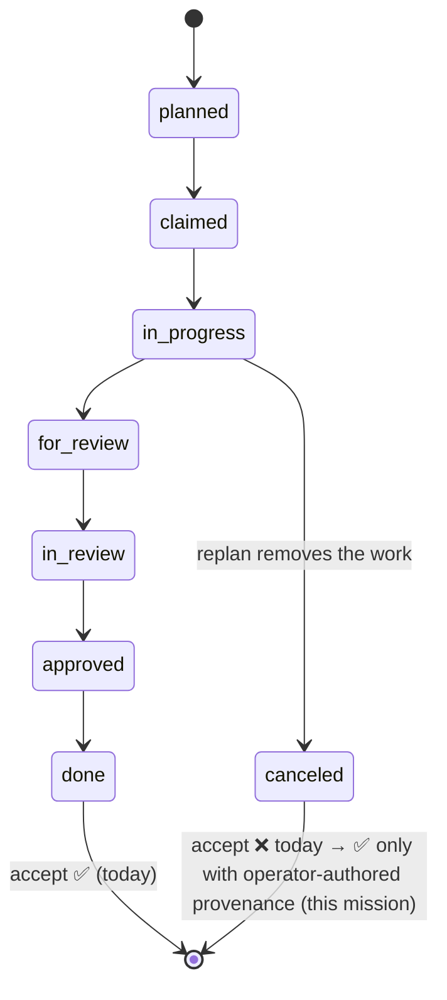

# Mission Specification: Mission Completion Terminal State

**Mission Branch**: `fix/mission-completion-terminal-state`
**Created**: 2026-08-27
**Revised**: 2026-08-28 (post-spec adversarial squad — see [research/post-spec-squad-findings.md](research/post-spec-squad-findings.md))
**Status**: Draft
**Input**: 3.2.6 closeout slice — GitHub #2945 (accept rejects canceled work packages) + #3590 (tasks authors a work package with no honest terminal state).

## Overview

A mission can currently reach a state it cannot honestly complete. Two independent
defects compose into the same dead end:

- **#2945** — `spec-kitty accept` refuses a work package that was deliberately
  *canceled* during a documented replan, even though `canceled` is defined as a
  **terminal** lane in the canonical nine-lane status model. The acceptance path
  keeps its own accept-ready set and treats `canceled` as a blocker, so the only exits
  are to resurrect and falsely approve removed work, or to leave the mission
  permanently unfinished.
- **#3590** — the `tasks` step can decompose a mission into an *action* work
  package whose completion is not a code change and whose acceptance criteria are
  only observable **after** integration. Such a work package has no honest terminal
  state: `done` demands checked subtasks that would be false pre-merge, and
  `canceled` is refused by accept (the #2945 face). The decomposition creates the
  trap, and the operator only discovers it at acceptance, once the code work is done.

This mission makes **canceled-with-operator-authored-provenance** an honest, accepted
ending, and has the planner **warn at authoring time** when it produces a work package
whose success can only be proven post-integration — so operators are never forced to
fake completion or strand a merged mission as unfinished.

> **Post-spec squad note.** A four-lens adversarial squad (architect, debugger,
> reviewer, planner) reviewed the first draft and returned CHANGES REQUESTED across the
> board. This revision folds their convergent, evidence-grounded findings. The two
> load-bearing corrections: (1) "provenance" cannot mean merely "non-empty reason" —
> the canonical `move-task` auto-synthesizes a non-empty reason, so provenance must be
> **operator-authored**; (2) the shared authority is an **acceptable-ending predicate**
> for accept/merge, not a single terminal-lane set for status+accept (terminality,
> acceptability, and provenance are three separable decisions). Full evidence with
> file:line anchors: [research/post-spec-squad-findings.md](research/post-spec-squad-findings.md).

## User Scenarios & Testing *(mandatory)*

### User Story 1 - Accept honors a deliberately-canceled work package (Priority: P1)

An operator replans mid-mission and cancels a work package whose scope was removed,
recording the reason through the canonical command. The remaining work packages are
reviewed and approved. The operator runs `accept` and expects the mission to be
merge-ready — the canceled work package was a legitimate, documented ending, not
outstanding work.

**Why this priority**: This is the load-bearing fix. Without it, any mission that
legitimately cancels a work package cannot complete — the exact trap that stranded a
merged, in-production mission as permanently non-terminal. Delivered alone, it lets
already-stuck missions complete honestly.

**Independent Test**: Create a mission, approve some work packages, cancel one with an
operator-authored reason, run `accept` — it passes and reports the cancellation
explicitly; `merge` then integrates only the surviving work.

**Acceptance Scenarios**:

1. **Given** a mission with every non-canceled work package `approved`/`done` and one
   work package `canceled` carrying **operator-authored** cancellation provenance,
   **When** the operator runs `accept`, **Then** acceptance passes (all other gates
   permitting) and the canceled work package is reported separately as a cancellation,
   not as a blocker.
2. **Given** the same mission, **When** the operator runs `merge`, **Then** the canceled
   work package is excluded from merge's per-work-package done/review assertions and
   from the merge order, its cancellation record retained; a lane whose work packages
   are *all* canceled is skipped for branch integration.
3. **Given** a work package moved to `canceled` **without** operator-authored provenance
   — i.e. carrying only the CLI's auto-synthesized default reason (`--force` with no
   `--note`), not an operator-supplied note — **When** the operator runs `accept`,
   **Then** acceptance fails with a structured blocker that names the work package and
   states that operator-authored cancellation provenance is required.
4. **Given** a mission with a work package still in a non-terminal lane
   (`planned`/`claimed`/`in_progress`/`for_review`/`in_review`/`blocked`), **When** the
   operator runs `accept`, **Then** that work package is still reported as a blocker
   with actionable diagnostics — this mission does not weaken any existing gate.
5. **Given** a mission where a work package still runs the acceptance-matrix / issue-matrix
   verdict gate, and one sibling work package is canceled-with-provenance, **When** the
   operator runs `accept`, **Then** the matrix/verdict gates still run and can still
   *fail* the mission — canceled-terminal must not short-circuit sibling gates.

---

### User Story 2 - The planner warns before authoring un-terminable work (Priority: P1)

An operator specifies a mission whose deliverable is its own verifier (a CI gate, a
deploy check, a proof to be observed after merge). When `tasks` decomposes it, one or
more work packages describe actions whose success can only be confirmed after
integration. The operator expects to be told this **at planning time**, so they can
deliberately re-home that content (e.g. to a tracked post-merge obligations document)
rather than discovering an unreconcilable state at acceptance.

**Why this priority**: This closes the defect class at its source (the decomposition),
so the #2945 exit is a safety net rather than the routine path. It is preventive and
advisory — it must not block authoring. It is **independent** of User Story 1 and
carries the higher uncertainty (the detection signal is a plan-phase decision).

**Independent Test**: Author a mission whose task decomposition includes a work package
whose acceptance criteria are only satisfiable post-integration, and confirm a warning
naming that work package is surfaced during task authoring/finalization, before
implementation begins — while an ordinary all-code decomposition produces no warning.

**Acceptance Scenarios**:

1. **Given** a task decomposition containing a work package whose acceptance criteria
   match a defined post-integration trigger signal, **When** the operator
   authors/finalizes tasks, **Then** a warning is surfaced that names the work package
   and the offending criterion.
2. **Given** an adversarial near-miss — a work package that *mentions* integration terms
   (e.g. "CI") but whose completion is genuinely observable in its own change set —
   **When** the operator authors/finalizes tasks, **Then** no warning is surfaced (the
   detector's false-positive fixtures pass).
3. **Given** the warning fires, **When** the operator proceeds anyway, **Then** task
   authoring still completes — the warning is advisory and never refuses to author the
   work package.

### Edge Cases

- **Every work package canceled**: a mission where no work package reached
  `approved`/`done` and all are canceled delivered nothing; `accept` must apply an
  **explicit** "delivered nothing" guard (not an accident of terminal-lane
  classification) and not silently report such a mission as complete.
- **Canceled after approval**: a work package canceled from an already-`approved` state
  (force required to leave a terminal lane) — its cancellation provenance is still the
  authority for acceptance, not its prior approval.
- **Legacy event logs**: a mission whose `canceled` event predates this change but
  already carries an operator-authored reason must be honored without a migration step.
- **Coord partition**: provenance and the retained cancellation audit record must be
  read from the coordination status surface (`resolve_status_surface`), not the open
  worktree or the primary `-coord` husk.

## Requirements *(mandatory)*

### Functional Requirements

| ID | Title | User Story | Priority | Status |
|----|-------|------------|----------|--------|
| FR-001 | Canceled-with-operator-provenance is an acceptable ending | As an operator, I want a work package I deliberately canceled with an **operator-authored** reason to count as a valid mission ending, so that a documented replan does not block completion. | High | Open |
| FR-002 | Accept reports cancellations separately | As an operator, I want `accept` to surface canceled work packages explicitly (distinct from approved/done and from blockers), so that a cancellation is visible in the acceptance record rather than hidden or misread as outstanding work. | High | Open |
| FR-003 | Cancellation without operator provenance stays a blocker | As an operator, I want `accept` to refuse a work package canceled without operator-authored provenance (i.e. carrying only the CLI's auto-synthesized default reason), with a diagnostic that names the work package and what is missing, so that cancellation cannot be used to skip work silently. | High | Open |
| FR-004 | Merge excludes canceled work packages at work-package granularity | As an operator, I want `merge` to exclude a canceled work package from its per-work-package done/review-artifact assertions and from the merge order (retaining the cancellation audit record), and to skip a lane's branch integration only when **every** work package in that lane is canceled, so that integration proceeds over the surviving work without breaking on the canceled one. | High | Open |
| FR-005 | Single acceptable-ending authority | As a maintainer, I want one acceptable-ending predicate — admitting `approved`/`done` unconditionally and `canceled` only with operator provenance, and referencing the canonical terminal-lane set only for the canceled classification — consumed by `accept` and `merge`, collapsing the duplicated accept-ready sets, so that acceptability is decided in exactly one place. | High | Open |
| FR-006 | Non-terminal lanes remain blockers | As an operator, I want every non-terminal, non-canceled lane to remain an acceptance blocker with useful diagnostics, so that this change relaxes nothing beyond the canceled case. | High | Open |
| FR-007 | Planner warns on un-terminable work | As an operator, I want `tasks` to warn when it authors a work package whose acceptance criteria match a defined post-integration trigger signal, naming the work package and criterion, so that I can re-home that content deliberately at planning time. | High | Open |
| FR-008 | Authoring warning is advisory | As an operator, I want the authoring-time warning to surface the risk without refusing to author the work package, so that legitimate post-integration work can still be planned when I accept the trade-off. | Medium | Open |
| FR-009 | A canceled dependency must not strand its dependent | As an operator, I want a surviving work package that depended on a canceled-with-provenance work package to remain completable (its dependency-readiness gate must treat the canceled-with-provenance dependency as resolved/removed, aligned with the same acceptable-ending authority), so that canceling a depended-upon work package does not re-create the "mission cannot complete" trap. | High | Open |

### Non-Functional Requirements

| ID | Title | Requirement | Category | Priority | Status |
|----|-------|-------------|----------|----------|--------|
| NFR-001 | No gate regression, pinned baseline | The acceptance-matrix, issue-matrix verdict, and safety gates continue to run and gate unchanged. The named regression suites — `tests/specify_cli/test_canonical_acceptance.py`, `tests/specify_cli/test_acceptance_regressions.py`, `tests/specify_cli/cli/commands/agent/test_finalize_canceled_work_packages.py`, `tests/status/test_transitions.py`, `tests/status/test_reducer.py`, and the merge suite — remain green against the pre-change baseline commit recorded in the plan, with zero relaxed assertions. A gate-integrity regression asserts a canceled-with-provenance mission still runs and can still *fail on* the acceptance-matrix and issue-matrix-verdict gates. | Reliability | High | Open |
| NFR-002 | Backward-compatible completion | Missions with no canceled work packages accept and merge with byte-identical outcomes to pre-change behavior (0 behavior change); no data migration is required for existing status event logs; a legacy `canceled` event already carrying an operator reason is honored. | Compatibility | High | Open |
| NFR-003 | Machine-readable cancellation reporting | `accept --json` exposes canceled work packages in a dedicated `canceled_wps` field whose entries carry a pinned shape `{wp_id, reason, actor, at}` (provenance included), distinct from blockers and verifiable by schema assertion. | Observability | Medium | Open |

### Constraints

| ID | Title | Constraint | Category | Priority | Status |
|----|-------|------------|----------|----------|--------|
| C-001 | Do not redefine the state machine | `canceled` remains a terminal lane per the canonical nine-lane status model; this mission reconciles the accept/merge/dependency consumers with an acceptability predicate and must not alter the transition matrix. | Technical | High | Open |
| C-002 | Provenance derives from the event log | Cancellation provenance is the operator-authored reason on the `canceled` status event in the append-only event log; acceptance must derive it from events (the reduced snapshot currently drops `reason`, so the plan must either project a `cancellation_reason` snapshot slot or look it up by `last_event_id`), never from a frontmatter `lane` field, and must read from the coordination status surface. | Technical | High | Open |
| C-003 | #3590 is partially addressed; redesign deferred | This mission addresses #3590 **partially**: an advisory authoring-time warning (FR-007/008) plus the honest terminal-state exit (FR-001). The completion-contract redesign (a work package declaring its completion as an artifact/verdict rather than a diff) and structural decomposition-prevention remain open under epic #3550; #3590 must be dispositioned "partial", not "closed". | Business | High | Open |
| C-004 | Terminology canon | Canonical terms `Mission` and `work package` are used throughout; no `feature*` aliases are introduced in fields, flags, output, or docs; `merge` denotes lane consolidation / branch integration, never publish-to-origin. | Regulatory | Medium | Open |
| C-005 | Boundary with shipped and adjacent work | Terminal-lane exclusion in lane computation / `finalize-tasks` already shipped (#3432 / PR #3713); this mission does **not** touch `mission_finalize.py` or lane compute. FR-004's lane-skip predicate must compose with — not preempt — the future direct-on-target `merge --skip-lanes` (backlog #2745). | Technical | Medium | Open |

### Key Entities

- **Work Package**: a unit of mission work occupying exactly one lane of the nine-lane
  status model; `canceled` and `done` are its terminal lanes.
- **Operator-Authored Cancellation Provenance**: an operator-supplied reason on a
  `canceled` status event, distinguishable from the CLI's auto-synthesized default; the
  signal that distinguishes a deliberate, documented ending from a silent skip.
- **Acceptable-Ending Authority**: the single predicate that decides whether a work
  package's lane is an acceptable mission ending (`approved`/`done` unconditionally;
  `canceled` only with provenance), consumed identically by `accept` and `merge`.
- **Acceptance Gate**: the check that all work packages occupy an acceptable ending
  (and all other matrices/safety checks pass) before a mission is merge-ready.

## Success Criteria *(mandatory)*

### Measurable Outcomes

- **SC-001**: A mission with N approved work packages and one canceled-with-operator-
  provenance work package passes `accept` and completes `merge` with **zero** manual
  resurrection or false approvals — proven by an **automated black-box integration
  test in the work package's own change set** (not a post-merge observation),
  reproducing the #2945 scenario to a green outcome.
- **SC-002**: A mission containing a work package canceled **without** operator-authored
  provenance (only the CLI's synthetic default reason) is refused by `accept` with a
  distinct, structured blocker that names the work package and the missing provenance —
  exercised through the canonical command surface, not a hand-crafted event log.
- **SC-003**: When a task decomposition includes a work package whose acceptance
  criteria match the defined post-integration trigger set, the operator sees a warning
  naming that work package **before** implementation begins — measured against a
  **fixed labeled corpus** of positive and negative (adversarial near-miss)
  decompositions, meeting the precision/recall targets recorded in the plan (no
  false positive on the negative fixtures).
- **SC-004**: Every mission that accepted and merged before this change continues to do
  so identically — **0** regressions across the pinned acceptance and merge regression
  suites named in NFR-001, measured against the recorded baseline commit.
- **SC-005**: A surviving work package that depended on a canceled-with-provenance work
  package can still be claimed and can still reach an acceptable ending — a canceled
  dependency never strands its dependent (reproduces and closes the F5 strand path).

## Out of Scope (deferred)

- The **completion-contract redesign** — a work package declaring its completion as an
  artifact/verdict rather than a diff — is deferred to epic **#3550** (C-003).
- Structural **decomposition-prevention** (refusing to author un-terminable work) — this
  mission warns advisorily only (FR-008); refusal is out of scope.
- The **`get_lane_from_frontmatter` → `get_wp_canonical_lane`** rename (a boy-scout
  clarity fix; the function already reads the event log correctly) — out of scope unless
  free.

## Decisions (directive 003)

- **D1** — Verifier-deliverable missions are **in scope** for spec-kitty and handled by
  an advisory authoring-time warning, not refusal (the #3590 product-contract question).
- **D2** — Cancellation provenance means **operator-authored** content, distinguishable
  from the CLI's synthetic default reason.
- **D3** — The dependency-on-canceled strand is **pulled into scope** (FR-009); leaving
  it out re-creates the mission's own trap.
