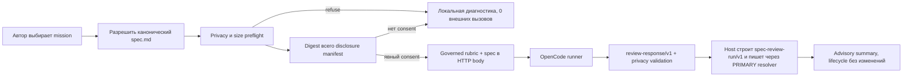

# План реализации: ручной ревьюер спецификаций Ox Alpha

**Ветка**: `codex/ox-alpha-spec-reviewer` | **Дата**: 2026-08-22 | **Спецификация**: [spec.md](./spec.md)  
**Ввод**: подтверждённый ручной opt-in режим для выбранного обезличенного `spec.md`.

## Резюме

Добавить отдельную provider-neutral команду `spec-kitty spec-review`, которая разрешает канонический `spec.md`, выполняет локальный privacy-preflight, показывает disclosure manifest, требует одноразовое подтверждение и только затем вызывает OpenCode через отдельный subprocess-runner. Недоверенный `review-response/v1` валидируется, а host строит append-only `spec-review-run/v1` на PRIMARY planning surface. Существующие `spec-kitty review` и `ProfileInvocationExecutor` не меняют семантику.

## Technical Context

Технический контекст реализации:

**Language/Version**: Python 3.11+  
**Primary Dependencies**: Typer, Pydantic/dataclasses и PyYAML в рамках уже закреплённых зависимостей; внешний `opencode` CLI как опциональная runtime-зависимость  
**Storage / Хранение**: YAML-файлы `kitty-specs/<mission>/reviews/spec-review-<run-id>.yaml`; credentials не хранятся  
**Testing / Тестирование**: ATDD-first, unit и contract tests с fake runner; opt-in live smoke только на синтетическом `spec.md`  
**Target Platform / Платформы**: Windows 10+, Linux, macOS  
**Project Type / Тип проекта**: Python CLI  
**Performance Goals / Производительность**: локальный preflight до 2 секунд; timeout внешнего вызова 10–600 секунд, default 180  
**Constraints / Ограничения**: максимум 256 KiB входа, 2 MiB ответа, 100 findings; shell не используется; model ID configurable  
**Scale/Scope / Масштаб**: один выбранный `spec.md` и один внешний запуск на команду

## Инженерное выравнивание

### Существующие границы

- `src/specify_cli/cli/commands/review/` реализует post-merge mission review и остаётся без изменений интерфейса; превращать `review` в command group нельзя без compatibility break.
- `ProfileInvocationExecutor` прямо документирован как синхронная governance-seam, которая не вызывает LLM; внешний запуск в неё не добавляется.
- `mission_runtime.artifacts` — единственная authority для placement. Каталог `reviews/` сейчас не классифицирован, хотя исторически используется как review trail.
- `packs/built-in/agent_profiles/reviewer-renata.agent.yaml` задаёт reviewer role/rubric, но не является transport runner.

### Выбранные решения

1. Новый top-level интерфейс: `spec-kitty spec-review --mission <handle> [--model <id>] [--confirm-digest <sha256>]`.
2. CLI orchestration отделена от доменного пакета `specify_cli.spec_review`; subprocess скрыт за typed runner protocol.
3. Prompt передаётся только в body локального loopback HTTP API OpenCode headless server; argv не содержит prompt, `shell=False`, server слушает только `127.0.0.1` и запускается с `--pure`. Все встроенные инструменты явно отключаются в message body; созданная session удаляется в `finally`; если удаление не подтверждено, запуск завершается локальным отказом. Raw stdout/stderr не пробрасываются и не сохраняются.
4. Добавляется `MissionArtifactKind.SPEC_REVIEW` в PRIMARY partition и filename-anchored classifier только для `reviews/spec-review-*.yaml`; legacy review trail остаётся неклассифицированным до отдельной migration decision. Выбор фиксируется ADR.
5. Storage получает filesystem path только через `resolve_artifact_surface(..., SPEC_REVIEW)` и commit target через canonical placement seam; запись выполняется atomically/exclusively с повторной containment и reparse/symlink проверкой.
6. Внешний `review-response/v1` содержит только findings. Доверенный `spec-review-run/v1` с provenance, закрытым status и summary полностью строит host; transport и requested route берутся из consent manifest, а непроверяемая фактическая модель фиксируется как `actual_model: unverified`.
7. Успешные и неуспешные внешние запуски не меняют mission lifecycle. До consent и при preflight refusal файл не создаётся; после фактического внешнего старта `completed`, `provider_error`, `timeout` и `invalid_output` сохраняются append-only. Ошибка записи возвращает `write_failed`/exit 7 без артефакта и без повторного внешнего вызова.
8. Auth полностью принадлежит OpenCode. Код не читает `auth.json`, env tokens или credential files и не логирует их пути.
9. Цена — launch gate, а не label: exact requested route допускается только при текущем локально доступном pricing snapshot с доказуемой нулевой стоимостью. Ненулевая, неизвестная, stale или нечитабельная цена блокирует запуск кодом `SPEC_REVIEW_MODEL_NOT_FREE`; ни fallback, ни передача prompt/spec не допускаются. Default model остаётся конфигурируемой строкой, но не является доказательством бесплатности.
10. Один подтверждённый запуск выполняет ровно одну внешнюю передачу. Автоматические retry, включая 429/rate-limit ответы, запрещены в v1.

## Charter check

- **Единая authority**: placement идёт через новый `SPEC_REVIEW`, schema — через один parser/model, subprocess — через один runner.
- **Архитектурное соответствие**: существующие review/gate и invocation boundaries не смешиваются с внешним transport.
- **ATDD-first**: первый кодовый WP начинает с acceptance tests consent, scope и advisory failure.
- **Переносимость**: argv-list, loopback HTTP body и fake runner исключают shell quoting и передачу prompt в argv.
- **Безопасность**: credential ownership, prompt redaction, size limits и sensitive-content refusal заданы до внешнего старта.
- **Качество**: Ruff, mypy, targeted tests и 90%+ coverage новых ветвей обязательны.
- **Git workflow**: работа остаётся на task-owned branch/worktrees; merge в upstream protected main выполняет оператор.
- **Code map gate**: `docs/codemap/` отсутствует; до первой product-code правки должны быть созданы и проверены `codemap.html`, `codemap.json`, `codemap.lock` с ответами «кто вызывает / что затрагивает / какие тесты покрывают».

Нарушений charter, требующих исключения, не выявлено.

## Поток выполнения



## Структура проекта

### Артефакты миссии

```text
kitty-specs/ox-alpha-spec-reviewer-01M0N82A/
├── spec.md
├── plan.md
├── research.md
├── data-model.md
├── quickstart.md
├── contracts/
│   ├── review-response-v1.schema.yaml
│   └── spec-review-run-v1.schema.yaml
└── tasks.md
```

### Планируемые изменения исходного кода

```text
src/
├── mission_runtime/
│   └── artifacts.py                    # SPEC_REVIEW placement authority
└── specify_cli/
    ├── cli/commands/
    │   ├── __init__.py                 # регистрация spec-review
    │   └── spec_review.py              # тонкий Typer adapter
    └── spec_review/
        ├── __init__.py
        ├── models.py                   # manifest/response/run/finding/status
        ├── preflight.py                # canonical path, versioned heuristic scanner
        ├── prompt.py                   # immutable manifest + bounded rubric
        ├── runner.py                   # protocol + OpenCode subprocess adapter
        ├── parser.py                   # strict review-response/v1 validation
        ├── service.py                  # use-case orchestration
        └── storage.py                  # canonical resolver + atomic exclusive writer

tests/
├── mission_runtime/
│   └── test_spec_review_artifact_placement.py
├── specify_cli/cli/
│   └── test_spec_review_command.py
└── specify_cli/spec_review/
    ├── test_preflight.py
    ├── test_prompt.py
    ├── test_runner.py
    ├── test_parser.py
    ├── test_service.py
    └── test_storage.py

docs/
├── adr/3.x/<date>-spec-review-is-primary-planning-evidence.md
├── codemap/codemap.html
├── codemap/codemap.json
└── codemap/codemap.lock
```

**Решение по структуре**: новый bounded context `spec_review` локализует external-review поведение. CLI остаётся тонким, а mission placement меняется только в canonical artifact seam.

## Карта implementation concerns

### IC-01 — Канонический вход и consent

- **Назначение**: не допустить неявную или чрезмерную внешнюю отправку.
- **Требования**: FR-001–FR-004, FR-011, NFR-001, NFR-002, NFR-007, C-005.
- **Поверхности**: `spec_review/preflight.py`, CLI adapter, tests.
- **Зависимости**: нет.
- **Риски**: TOCTOU между disclosure и запуском; digest consent покрывает spec, рубрику, schema, версионированный prompt template, model route и transport. После consent spec читается один раз в immutable buffer, все digest повторно сверяются.

### IC-02 — Модель и schema contract

- **Назначение**: обеспечить детерминированный structured output и лимиты.
- **Требования**: FR-004, FR-007, NFR-004.
- **Поверхности**: `models.py`, `prompt.py`, `parser.py`, contract schema.
- **Зависимости**: IC-01 задаёт вход.
- **Риски**: OpenCode может смешать diagnostics и output; adapter не раскрывает raw streams и принимает только единственный bounded JSON-документ, иначе `invalid_output`. Парсируемый `findings: []` валиден. Evidence — только проверенный диапазон строк; exact input spans от 32 символов в model-authored text запрещены.

### IC-03 — OpenCode transport

- **Назначение**: безопасно выполнить внешний процесс, не владея его credentials.
- **Требования**: FR-005, FR-006, FR-010, FR-013, FR-014, NFR-001, NFR-003, NFR-005, NFR-006, C-001–C-003.
- **Поверхности**: `runner.py`, runner tests.
- **Зависимости**: IC-02.
- **Риски**: timeout/process-tree cleanup на Windows; full/fragmented echo и invalid UTF-8; отсутствие live network в обычных tests. До реализации отдельно проверяется актуальный локальный `opencode run --help`, без model call. Runner не выполняет автоматические retry; 429/rate-limit классифицируется как `provider_error`.

### IC-04 — Review artifact authority

- **Назначение**: сохранить append-only provenance в правильной topology surface.
- **Требования**: FR-008, FR-009, FR-012, SC-003–SC-005.
- **Поверхности**: `mission_runtime/artifacts.py`, `mission_runtime/resolution.py`, `storage.py`, ADR, placement tests.
- **Зависимости**: IC-02.
- **Риски**: directory-level classifier молча захватит legacy files; требуется filename pattern. PRIMARY ownership, survival после consolidation, stale-copy semantics и atomic exclusive create проверяются topology matrix, включая symlink/reparse атаки.

### IC-05 — Оркестрация и operator UX

- **Назначение**: собрать preflight, consent, runner, parser и storage в advisory use case.
- **Требования**: FR-001–FR-014, SC-001–SC-007.
- **Поверхности**: `service.py`, `commands/spec_review.py`, command/service tests, quickstart.
- **Зависимости**: IC-01–IC-04.
- **Риски**: advisory относится только к mission lifecycle. Прямая команда связывает неинтерактивное согласие с `--confirm-digest <sha256>` и следует таблице exit codes из spec: preview/complete/cancel = 0, consent/input/provider/timeout/format/write failures = стабильные 2–7.

### IC-06 — Проверки и opt-in smoke

- **Назначение**: доказать privacy, portability и advisory semantics без зависимости CI от модели.
- **Требования**: FR-006, FR-009, FR-010, FR-012–FR-014, все NFR и SC.
- **Поверхности**: tests, markers, documentation, codemap.
- **Зависимости**: IC-01–IC-05.
- **Риски**: green fake tests не подтверждают реальную модель; live smoke фиксируется отдельно и никогда не передаёт реальную project spec.

## Последовательность реализации

1. Сгенерировать code map и зафиксировать архитектурный baseline до product-code изменений.
2. Добавить red acceptance/contract tests для consent, input scope, failure taxonomy и non-mutation.
3. Ввести раздельные response/run schemas, structured line evidence, domain models и parser с жёсткими лимитами.
4. Добавить preflight и TOCTOU hash recheck.
5. Добавить typed runner и исчерпывающие subprocess tests, включая Windows timeout cleanup.
6. Классифицировать только `reviews/spec-review-*.yaml` как PRIMARY `SPEC_REVIEW`, связать writer с resolver/placement seam, добавить ADR и topology/atomicity tests; artifact kind и storage routing остаются в одном последовательном WP.
7. Собрать service и CLI, сохранить append-only artifact, документировать operator UX.
8. Выполнить Ruff, mypy, targeted/full relevant tests и coverage gate.
9. Только после отдельного подтверждения внешней отправки выполнить live smoke на synthetic spec через Ox Alpha.

## Тестовая стратегия

- **Acceptance**: CLI без consent, несовпадающий `--confirm-digest`, CLI с fake success, provider timeout/error/429 без retry, invalid output, repeated/concurrent run.
- **Unit**: path containment, symlink escape, size boundaries, secret/PII marker detection, manifest-wide prompt-template digest, prompt composition, parser enums/limits, filename/run-id generation.
- **Contract**: локально подтверждённый argv OpenCode headless server, prompt только в loopback HTTP body, bind `127.0.0.1`, обязательное удаление session, no shell, process-tree timeout cleanup, stable diagnostic/exit codes, `review-response/v1` → `spec-review-run/v1` round trip.
- **Architecture**: `ProfileInvocationExecutor` по-прежнему не импортирует/не вызывает runner; `reviews/` всегда разрешается как PRIMARY через mission runtime.
- **Privacy teeth tests**: полный и фрагментированный sentinel в HTTP body и server stdout/stderr, invalid UTF-8, oversized body/stream, timeout и subprocess exception отсутствуют во всех выводах/errors/artifacts; каждый exception/error path имеет отдельную reversion-sensitive проверку.
- **Placement/atomicity**: single, coord, lanes, lanes-with-coord, backfilled и deleted-coord состояния проверяют реальный path и commit target; legacy `*.findings.yaml` не классифицируется; concurrent processes, занятый run ID и symlink/reparse directory не приводят к overwrite или escape.
- **Compatibility**: root help показывает `review` и `spec-review`; существующий `review` остаётся leaf с прежними flags/help/exit behavior, а fast-path/doctor не импортируют external-review stack.
- **Live smoke**: manual marker, synthetic input, explicit consent; ни один CI job не зависит от модели или бесплатного quota.

## Документация и совместимость

- Добавить краткую how-to секцию с prerequisites, disclosure example, запуском и чтением findings.
- Отметить OpenCode/Ox как optional integration; не рекламировать free/ZDR как контракт.
- `spec-kitty review` сохраняет текущую post-merge семантику; отдельный regression contract фиксирует прежние flags, help и exit behavior.
- Если появится публичный machine-readable CLI output, он получает отдельную versioned JSON schema; в v1 достаточно стабильного YAML artifact и human summary.

## Gates

- **До реализации**: baseline одобрен пользователем; Beads либо восстановлен project-local, либо blocker явно принят; code map создан.
- **До внешнего smoke**: отдельное подтверждение отправки synthetic spec; текущий model ID показан пользователю.
- **До PR**: Ruff, mypy, targeted tests, coverage новых ветвей ≥90%, full relevant suite, независимое review без unresolved severity 4–5.
- **До merge**: PR mergeable, CI green, diff соответствует миссии; merge выполняет уполномоченный оператор, deploy отсутствует.

## Complexity tracking

Исключения из charter не требуются. Новый artifact kind и ADR оправданы существующей single-authority placement архитектурой; запись напрямую в неклассифицированный `reviews/` была бы более рискованной и менее совместимой.
