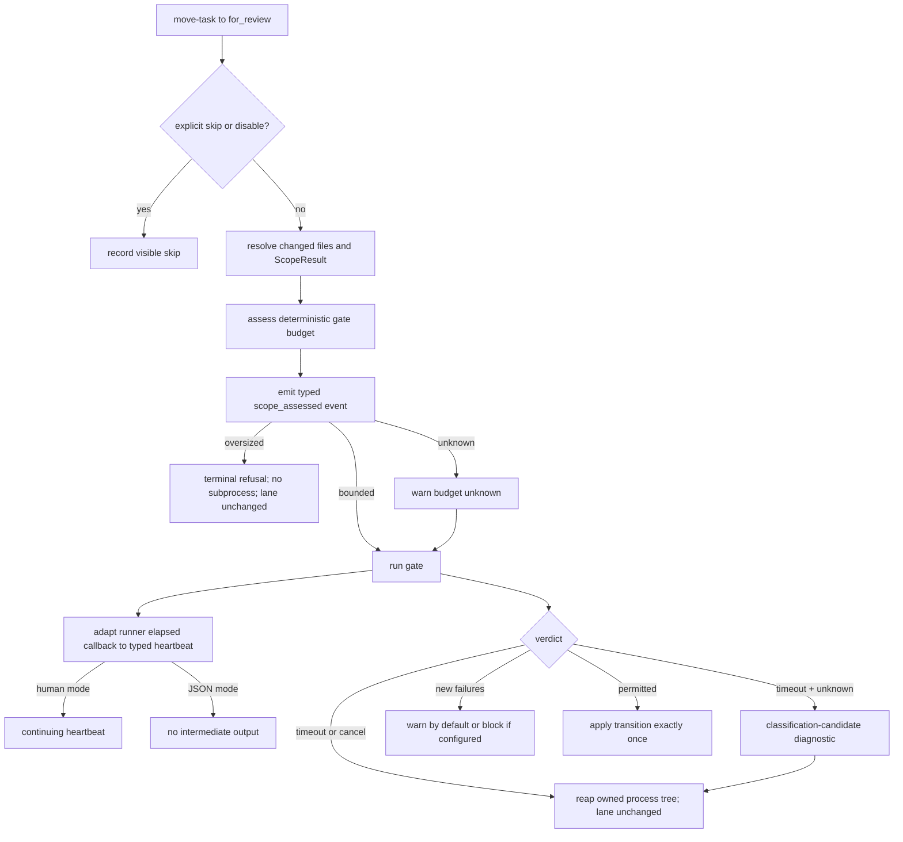

# Implementation Plan: Responsive Pre-Review Gate Operator Flow

**Branch**: `fix/pre-review-gate-operator-flow` | **Date**: 2026-08-23 | **Spec**: [`spec.md`](spec.md)
**Input**: Mission specification from `/kitty-specs/pre-review-gate-operator-flow-01M0Q86H/spec.md`
**Planning base**: `origin/main` at `d060cff9a`; current/planning/merge branch: `fix/pre-review-gate-operator-flow`
**Issue**: [#2573](https://github.com/Priivacy-ai/spec-kitty/issues/2573), milestone 3.2.6

## Summary

Finish the open operator-flow portion of #2573 without redesigning CI or review admission. The current checkout already has the explicit skip, canonical sync-disable controls, atomic transition ordering, warn-by-default regression policy, timeout/cancellation results, and process-tree cleanup. The implementation therefore concentrates on three demonstrated gaps:

1. adapt the runner's existing elapsed callback into a typed status observer carried through `TransitionGateContext` and the explicit-override path, so the public human-mode `move-task --to for_review` entry point receives both pre-launch scope assessment and continuing heartbeat events;
2. assess a resolved scope against deterministic, source-controlled transition-gate budget metadata before launching tests, refusing only scopes explicitly classified `oversized` and warning/running when classification is `unknown`;
3. enrich unknown-budget timeout results with a stable target-derived scope identity, targets, configured budget, observed elapsed time, unchanged-lane evidence, and reviewed-update guidance, then durably append observed candidates to `traces/approach.md` for Mission/sprint retrospective inspection.

The budget authority is a small production-owned policy surface in the pre-review subsystem. It does not read CI logs, mutate workflow YAML, estimate duration from runtime history, or learn classifications automatically. Initial production evidence marks the exact full-directory target `tests/architectural` oversized; narrower descendants and all other unclassified scopes remain `unknown` and retain today's timed execution behavior.

## Recorded Planning Decisions

| Decision | Resolution | Ramification |
|---|---|---|
| Budget authority | Explicit deterministic metadata on the canonical gate scope definition | Repeatable on clean machines; no CI-history store or timing estimator. |
| Unknown scope | Warn and run under the existing timeout | Compatibility is preserved; 3.2.6 does not introduce a fail-closed allowlist migration. |
| Unknown timeout | Emit a classification-candidate diagnostic; never auto-promote | A timeout becomes actionable evidence, not machine-dependent policy. |
| Retrospective | Inspect candidate entries in `traces/approach.md` and record an owner or no-action conclusion | The manual feedback loop is durable rather than left to terminal history. |
| Output framing | Human heartbeats only; one final JSON document | Existing automation parsers remain compatible. |

Decision records live in [`decisions/`](decisions/); the confirmed engineering alignment is `DM-01M0QEDK1S7WHSEQW6A4B9PG6N`.

## Technical Context

**Language/Version**: Python `>=3.11`; planning environment Python 3.11.15.
**Primary Dependencies**: Typer/Rich CLI surface, dataclasses and typing protocols, pytest/JUnit scope engine, existing gate registry and verdict aggregation.
**Storage**: Source-controlled Python metadata only. No runtime database, CI log import, timing cache, or new persisted operator state.
**Testing**: pytest 9.0.3; exact Typer public-entry tests, pure unit/contract tests, POSIX real-process integration, deterministic Windows termination tests.
**Target Platform**: macOS/Linux/Windows CLI; POSIX process groups and Windows `taskkill /T` retain their existing platform-specific implementations.
**Project Type**: Single Python CLI package under `src/specify_cli` with tests under `tests/`.
**Performance Goals**: start notice within 1 second; human heartbeat at least every 30 seconds; explicit oversized refusal within 2 seconds and before subprocess launch; skip paths launch no subprocess.
**Constraints**: one final JSON document; warn-by-default regression severity; no asynchronous lane or background job; no auto-learning; no CI workflow changes; no orphan-reaping promise after uncatchable parent death; release-ready finalization waits for upstream #3127.
**Scale/Scope**: One transition edge (`in_progress -> for_review`), one registered pre-review handler, one deterministic initial oversized rule, and the public command/test surfaces named below.

## Charter Check

*GATE: passed before research; re-checked after design.*

| Charter concern | Status | Evidence / treatment |
|---|---|---|
| Single canonical authority | Pass | Scope classification is owned by one `gate_budget` policy module; CLI, runner, and renderers consume its typed assessment rather than reclassifying targets. |
| Architectural alignment | Pass | Budget policy stays in `specify_cli.review`; transition orchestration remains in `tasks_move_task`; output rendering remains at the CLI boundary. |
| ATDD-first | Pass, implementation gate | Exact public-entry tests are written red-first for continuing heartbeats, oversized refusal, unknown-timeout diagnostics, JSON singularity, and unchanged lane state. |
| Test remediation and live evidence | Pass | Existing comments explicitly document the missing progress wire; replacement tests must assert the public entry rather than a lower-level callback alone. |
| Architectural gate discipline | Pass | Metadata has one concrete production rule and self-checks for exact matching, unknown fallback, and no runtime mutation; no mutable allowlist baseline is introduced. |
| Canonical sources | Pass | Existing `ScopeResult`, `ScopeSource`, `TransitionGateContext`, `GateVerdict`, aggregation, timeout, and environment authorities are extended rather than duplicated. |
| Git/workflow discipline | Pass | Work remains on `fix/pre-review-gate-operator-flow`; plan artifacts are mission-owned; implementation later publishes through a PR to `main`. |
| Retrospective cadence | Pass | Observed candidates are appended to `traces/approach.md`; Definition of Done requires inspection plus an owner/no-action conclusion or explicit no-candidate record. |
| Cross-platform behavior | Pass, implementation gate | POSIX real-process evidence plus Windows tree-termination contract coverage are required; no unsupported hard-kill promise is made. |
| Post-plan adversarial review | Complete | Architecture, scope/release, and evidence lenses reviewed the finished artifacts. Accepted corrections and the bounded baseline-progress rejection are recorded in coordination commit `784bdf3de` at `traces/design-decisions.md`. |

No charter violation requires a complexity exception.

## Architecture and Control Flow



### Component responsibilities

1. **`review/gate_budget.py` — deterministic authority**
   - defines `BudgetClassification`, `ScopeBudgetRule`, `ScopeIdentity`, and `ScopeBudgetAssessment`;
   - derives a preflight identity only from canonical UTF-8 JSON of the fixed `spec-kitty.pre-review-budget/v1` namespace plus normalized `ScopeResult.test_targets`, hashed with SHA-256 and prefixed `budget-v1:sha256:`; it does not reuse Python hashing or the post-run parse identity from `scope_source_identity()`;
   - applies exact source-controlled target-atom membership rules, initially any target set containing the exact `tests/architectural` directory atom;
   - returns `unknown` when no rule matches and exposes no write API.

2. **`review/pre_review_gate.py` — evaluation and verdict evidence**
   - assesses the derived or explicit scope before `_launch_scoped_process`;
   - emits one typed `scope_assessed` status before launch and returns a terminal `SCOPE_OVERSIZED`/`NOT_STARTED` verdict for an explicit oversized match;
   - carries the assessment on every verdict;
   - on an unknown-budget timeout, records configured budget separately from observer-measured monotonic elapsed time and marks the diagnostic as a classification candidate;
   - preserves the existing runner, cleanup, baseline-diff, and timeout/cancellation machinery.

3. **`review/gate_registry.py` — handler context wire**
   - adds an optional renderer-neutral `GateStatusObserver` to `TransitionGateContext`;
   - passes it unchanged to `evaluate_pre_review_gate`, whose engine emits `scope_assessed` and adapts the runner's float callback into `heartbeat` events;
   - does not render output or decide severity.

4. **`cli/commands/agent/tasks_move_task.py` — public orchestration and rendering**
   - constructs one Rich status observer only when `json_output` is false and passes it through both registry-bound and explicit-override evaluation paths;
   - renders `scope_assessed` before subprocess launch, then continuing elapsed `heartbeat` events, refusal guidance for oversized scopes, and candidate guidance on unknown timeout;
   - extends the existing `pre_review_gate` metadata object without emitting intermediate JSON;
   - treats `SCOPE_OVERSIZED` with timeout/cancellation as a terminal no-transition outcome;
   - preserves skip/disable precedence and warn/block policy.

5. **Retrospective surface**
   - runtime classification persistence is not added;
   - implementers/reviewers use the canonical `spec-kitty agent tracer-append --category approach` surface immediately when an operational (not synthetic fixture) candidate is observed, recording provenance and full diagnostic data in `traces/approach.md`;
   - a pre-accept `retrospective-handoff.md` inventories those durable entries or explicit absence; after merge the automatic retrospective terminus (or `spec-kitty retrospect create --mission <slug> --json`) consumes the handoff/tracer and records a proposed metadata follow-up owner, explicit no action, or explicit absence in canonical `retrospective.yaml`.

## Budget Classification Rules

- Classification happens after target resolution and before any test subprocess is launched.
- Normalization converts backslashes to POSIX separators, removes a leading `./`, removes redundant trailing slashes, preserves pytest node selectors, deduplicates, and sorts.
- The preflight scope identity is stable for the same normalized target tuple under a fixed budget-policy namespace. Existing `scope_source_identity()` remains solely the post-run baseline/head parse-comparability authority.
- Rules match exact normalized target atoms by membership. The initial rule matches `tests/architectural` alone or in a multi-target set, but does **not** prefix-match `tests/architectural/test_one_file.py`.
- A declared command that encodes a broad suite only inside `test_command()` remains unknown in 3.2.6; the classifier does not parse arbitrary command argv. Explicit overrides use the same target-only identity with an override path sentinel only for diagnostic labeling, not a second policy authority.
- `oversized` refuses immediately. `unknown` warns and runs. `bounded` is supported by the model and fixtures but no broad production inference is invented for this release.
- Runtime execution has no API capable of modifying the rules.

## Outcome and Precedence Matrix

| Condition | Gate runs? | Transition | Output |
|---|---:|---|---|
| `--skip-pre-review-gate` | No | Applied | Explicit skip reason; highest precedence |
| First truthy canonical disable env | No | Applied | Effective env name; explicit skip flag would already have won |
| Classified oversized | No | Not applied | Refusal plus bounded-scope and explicit-skip recovery |
| Unknown classification, completes | Yes | Existing verdict policy | Unknown-budget warning plus normal result |
| Unknown classification, times out | Yes | Not applied | Candidate diagnostic with identity, targets, configured budget, observed elapsed time, lane evidence, guidance |
| Bounded classification, times out | Yes | Not applied | Normal timeout evidence; not a classification candidate |
| New failures, default policy | Yes | Applied | Warning |
| New failures, configured block | Yes | Not applied | Blocking result |
| Catchable cancellation | Yes | Not applied | Canceled result after owned-tree cleanup |

## Project Structure

### Documentation (this mission)

```text
kitty-specs/pre-review-gate-operator-flow-01M0Q86H/
├── spec.md
├── plan.md
├── research.md
├── data-model.md
├── quickstart.md
├── contracts/
│   ├── pre-review-gate-output.md
│   └── scope-budget-policy.md
├── decisions/
└── checklists/requirements.md
```

### Source and tests

```text
src/specify_cli/review/
├── gate_budget.py                         # new deterministic metadata authority
├── gate_registry.py                       # typed status observer on shared context
├── pre_review_gate.py                     # preflight assessment + verdict evidence
├── scope_source.py                        # existing scope authority, consumed unchanged
└── verdict_aggregation.py                 # add oversized to terminal set

src/specify_cli/cli/commands/agent/
└── tasks_move_task.py                     # human heartbeat/refusal/JSON rendering

tests/review/
├── test_gate_budget.py                    # normalization, exact rules, immutability
├── test_pre_review_gate_engine.py         # pre-launch refusal and timeout evidence
├── test_pre_review_gate_integration.py    # derived and override scope paths
└── test_pre_review_gate_process_tree.py   # new POSIX/Windows cleanup evidence

tests/specify_cli/cli/commands/agent/
└── test_tasks_move_task_pre_review_gate_observability.py
                                            # exact public-entry outcomes and framing
```

**Structure decision**: keep policy, evaluation, and rendering in their current layers. A separate `gate_budget.py` prevents target-matching rules from becoming CLI conditionals or leaking into the CI topology model. No `.github/workflows` file changes.

## Implementation Strategy

### Phase 0 — Per-work-package red-first evidence

- Every implementation WP commits at least one failing-first acceptance test before its production commits, proves the test red on that WP's `planning_base_branch`, and proves it green on the final WP commit, as required by the charter.
- WP01 first commits policy-contract failures for exact-atom matching, pinned cross-process identity, unknown fallback, declared-command compatibility, and absence of mutation APIs.
- WP02 first commits engine/refusal failures before modifying the engine or verdict model.
- WP03 first commits exact public-entry failures—parameterized over registered-handler and explicit-override routes—before modifying registry or CLI surfaces. These tests must still be demonstrably red after approved WP02; if they are already green, they are not adequate ATDD evidence and must be strengthened before production edits.

### Phase 1 — Deterministic budget substrate

- Add immutable budget types and one classifier function in `gate_budget.py`.
- Integrate assessment into both injected `ScopeSource` and explicit override evaluation paths before launch.
- Add `SCOPE_OVERSIZED` to `GateOutcome`, `NOT_STARTED` to `HeadRunState`, and oversized to the aggregation terminal set.
- Carry assessment, configured budget, and observed elapsed time on `GateVerdict`; keep default values compatible with existing test constructors.

### Phase 2 — Progress and public rendering

- Add the optional typed observer to `TransitionGateContext` and delegate it through the registered handler.
- Pass the same observer into the existing explicit-override evaluation path; build it at the CLI boundary only for human mode.
- Render scope assessment before launch, start/unknown warning/heartbeat/final result without changing JSON framing.
- Extend the structured metadata schema with budget fields and candidate diagnostics.

### Phase 3 — Interruption, compatibility, and cross-platform verification

- Prove refusal is pre-launch using an untouched lowest-level launch spy and deterministic classifier-to-return time; prove timeout/cancellation preserve lane/event state.
- Re-run exact collision cases for skip plus blocking, skip plus both disables, and both disables without skip in human and JSON modes; re-prove the explicit daemon-management exception separately under each disable variable.
- Run real-process POSIX cleanup and deterministic Windows tree-termination contract tests; mark the deterministic Windows node `@pytest.mark.windows_ci` so the existing discovery job executes it, then record the actual job result (or evidence-backed absence of such a job) without editing CI.
- Produce a required FR-001–FR-010 traceability artifact with one row per scenario/precedence/race and exact pytest node ID, human assertion, structured assertion, launch assertion, and lane/event assertion; acceptance fails on a blank cell.
- Add a POSIX real-CLI abrupt-parent-death test: wait until head validation is running, send `SIGKILL` to the parent, independently read lane/event state, and assert no transition append without asserting orphan cleanup.

### Phase 4 — Pre-accept evidence and lifecycle handoffs

- Re-evaluate #2573 against the shipped behavior and retain async redesign as deferred.
- Audit that every operational unknown-budget timeout was appended immediately to `traces/approach.md`; create `retrospective-handoff.md` requiring the canonical post-merge retrospective to record follow-up owner, explicit no action, or explicit absence.
- Produce a release handoff with an executable resume point. Do not mark #2573 release-ready until #3127 is merged, the branch is rebased onto the resulting `main`, and trustworthy required checks are rerun; an unmet upstream gate is a recorded `waiting_upstream` release state, not an indefinitely open implementation WP and not permission to claim readiness.

## Parallel Work Analysis

### Dependency graph

```text
WP01 policy contract + authority
       ↓
WP02 engine/refusal contract + implementation
       ├───────────────────┐
       ↓                   ↓
WP03 public flow       WP04 interruption evidence
       └─────────┬─────────┘
                 ↓
WP05 pre-accept evidence + lifecycle handoffs
```

### Work distribution

- **Sequential foundation**: budget policy lands before engine/verdict integration; public wiring begins only after the engine types compile.
- **Parallel streams after engine**: public output (WP03) and isolated interruption evidence (WP04) proceed on distinct files.
- **Integration owner**: WP03 combines public output, both evaluation routes, JSON schema assertions, collision precedence, and lane integrity to avoid competing edits in `tasks_move_task.py` and its large observability test.
- **Reviewer separation**: implementation and review owners must be distinct per work package; exact package slicing is deferred to `/spec-kitty.tasks`.

## Test and Evidence Plan

| Requirement | Primary evidence |
|---|---|
| FR-001 / NFR-001 / NFR-002 | Exact Typer invocation with injected clock proves start ≤1 second, every heartbeat delta ≤30 seconds, and none after terminal output; JSON observes no intermediate document. Progress applies to the candidate-head leg launched by `move-task`; earlier baseline capture is out of scope. |
| FR-002 / FR-006 / NFR-003 | Public terminal outcomes plus real-process cleanup prove no transition/event mutation. |
| FR-003 / FR-004 / FR-007 | Parameterized public precedence tests prove skip, canonical env order, and no subprocess/implicit daemon. |
| FR-005 | Same regression fixture under default and configured blocking policy. |
| FR-008 | Existing clean and warning-path public tests remain compatible except additive metadata. |
| FR-009 / NFR-007 | Oversized exact atom in singleton and superset scopes returns within 2 controlled-clock seconds; launch spy remains untouched; descendant target stays unknown; both recovery choices present. |
| FR-010 / SC-009 | Unknown timeout includes classification, identity, targets, configured budget, observed elapsed time, candidate marker, guidance, and unchanged lane in human and one-document JSON; observed delivery candidates are appended to the approach tracer. |
| NFR-005 | POSIX process-tree integration and Windows `taskkill /T` contract unit test. |
| NFR-006 | Traceability matrix maps every scenario and race to named tests. |
| Abrupt parent death | POSIX subprocess drives the real CLI, confirms validation active, sends parent `SIGKILL`, then independently proves lane/event state unchanged; no orphan-cleanup claim. |

## Risks and Mitigations

| Risk | Consequence | Mitigation |
|---|---|---|
| Exact metadata rule becomes an accidental directory-prefix rule | Narrow architectural tests are refused unnecessarily | Exact tuple matching; explicit counter-test for a descendant file. |
| Generic gate registry loses backward compatibility | Existing handler tests/stubs fail | Optional callback with `None` default; verdict budget assessment has compatible default. |
| Human status events pollute JSON | Automation parsing breaks | Observer constructed only when `json_output` is false; assert one parsed JSON document. |
| Timeout is mistaken for proof of oversize | Machine-dependent policy drift | Candidate diagnostic only; no mutation/persistence API; retrospective/reviewed source change required. |
| New outcome bypasses terminal precedence | Lane transitions after refusal | Add it to the canonical terminal aggregation set and exact public lane/event assertions. |
| Partial #2573 work is reimplemented | Regression or scope growth | Verify landed behavior and modify only the missing callback, budget assessment, and diagnostic seams. |
| Process cleanup claim widens to hard parent kill | Unachievable acceptance contract | Keep catchable timeout/cancel evidence separate from abrupt-parent lane/event integrity; #2762 remains out of scope. |
| Upstream release root changes the base | Evidence is stale at finalization | Prepare independently, but gate release-ready status on #3127 merge, rebase, and required-check rerun. |

## Complexity Tracking

No charter violations or extra architectural layers require justification. The one new module isolates a canonical policy that would otherwise be duplicated between engine and CLI.

## Post-Design Charter Re-check

The design still passes the charter check: there is one budget authority, one verdict carrier, one typed status seam, one CLI renderer, no CI mutation, no runtime-learned state, explicit red-first public evidence, durable tracer-based retrospective input, and completed post-plan adversarial review before task generation.
