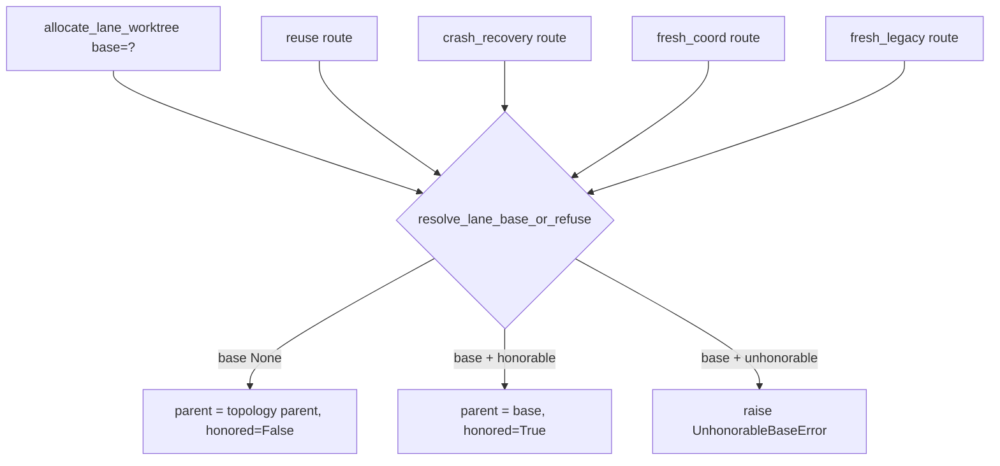

# Contract — `resolve_lane_base_or_refuse` (WP2, FR-001/002/003)

## Signature

```python
def resolve_lane_base_or_refuse(
    *,
    base: str | None,
    route: LaneAllocationRoute,         # FRESH_COORD | FRESH_LEGACY | REUSE | CRASH_RECOVERY (enum, not str)
    coordination_branch: str | None,
    mission_branch: str,
    wp_id: str,
    lane: ExecutionLane | None = None,  # for the dependency_lane refusal trigger
    planning_sha: str | None = None,    # for the detached_base refusal trigger
    repo_root: Path | None = None,      # for the detached_base git merge-base check
) -> LaneBaseDecision: ...
```

Single decision point folding M1's landed `_guard_base_honorable` (refusal path) and
`_resolve_lane_parent` (positive path) into one seam. Mirrors the write-side contract shape of
`resolve_write_target_or_degrade` (resolution first, caller-chosen fail policy, structured return).

> **Thin orchestrator, not an inline fold (post-plan squad, architect MED — S3776 ceiling).** The seam
> DELEGATES to M1's existing flat helpers — `_guard_base_honorable` (the four triggers) and
> `_resolve_lane_parent` (the positive chooser) — rather than inlining their bodies. `detached_base`
> already carries two nesting levels (planning_sha/repo_root → subprocess → returncode); inlining all four
> triggers + the chooser + the `base is None` short-circuit into one function would push past the
> complexity ceiling of 15. Keep the helpers flat and separately unit-tested (Sonar new-code coverage);
> the seam is the single *definition* and dispatch point, ≤15 asserted in review. "Single seam" = single
> definition, NOT single invocation — it is still called once per route (4 callsites).

## Behavioral contract

1. **`base is None`** → returns `LaneBaseDecision(parent_ref=<topology parent>, base_honored=False, ...)`.
   `parent_ref` is byte-identical to the pre-M8 value (`coordination_branch` if set, else `mission_branch`).
   No refusal, no guard. (NFR-001)
2. **`base` supplied on an unhonorable route** → raises `UnhonorableBaseError(route, wp_id, base)`. The
   four unhonorable triggers are M1's landed set:
   - `reuse` / `crash_recovery`: unconditional (an already-created lane cannot be re-parented).
   - `dependency_lane`: raises iff `lane.depends_on_lanes` non-empty (would re-import unrelated ancestry).
   - `detached_base`: raises iff `planning_sha` recorded AND `git merge-base base planning_sha` fails.
3. **`base` supplied on an honorable route** → returns
   `LaneBaseDecision(parent_ref=base, base_honored=True, ...)`. `base` fully REPLACES the topology parent.
4. The seam is the ONLY place any route computes a parent ref. All four routes in
   `allocate_lane_worktree` call it. **Anchor on symbols, not line numbers** (they drift): the routes are
   the reuse early-return (currently `~:321`), crash-recovery early-return (`~:368`), the `detached_base`
   pre-create guard (`~:398`), dependency_lane guard (`~:407`), fresh-coord create (`~:414`, inside
   `if coordination_branch is not None:`), and fresh-legacy create (`~:428`). `_resolve_lane_parent`
   currently lives at `~:247`. No inline parent-choice (`coordination_branch if … else mission_branch`, or
   any equivalent composition of `base`/`coordination_branch`/`mission_branch`) remains outside the seam.

## Routing (all four routes through one seam)



## Invariants pinned by tests (red-first)

- INV-0 (**the genuinely-red-on-main cell** — post-plan squad, debugger): the seam is the SOLE
  parent-computer — `_guard_base_honorable` and `_resolve_lane_parent` no longer exist as two separate
  decision points. This is red on today's `main` (both helpers exist independently), so it is M8's honest
  red-first anchor. INV-3 below is green-on-arrival (M1 already made `base` replace the coord parent), so
  it is a *standing* guard, not the red-first driver.
- INV-1: `base=None` on every route → parentage byte-identical to pre-M8 (NFR-001). One test per route.
- INV-2: `base=<ref>` on reuse/crash_recovery → `UnhonorableBaseError` with the route named (FR-003).
- INV-3 (standing #3571 guard): `base=<ref>` on fresh-coord AND fresh-legacy → lane descends from `<ref>`
  alone (US-1.1). Keep M1's green `test_explicit_base_replaces_coord_parent_on_no_dep_lane` as this guard.
- INV-4: dependency-lane with `base` supplied → `UnhonorableBaseError(dependency_lane)`; without → honored.
- INV-5: detached `base` (no common ancestor with `planning_sha`) → `UnhonorableBaseError(detached_base)`.
- INV-6 (regression-pin, re-anchored — post-plan squad, reviewer): the `--base` docstring on
  `allocate_lane_worktree` (currently `~:279-287`, NOT `:450-453` which is `_merge_recorded_planning_commit`)
  **already** says the base is "threaded as an EXPLICIT parameter (never smuggled through
  `lanes_manifest.mission_branch`)". Pin that it keeps saying so — M1 already retired the proxy; this
  guards against re-teaching it.
- INV-7 (atomicity — post-plan squad, architect LOW): after `UnhonorableBaseError` on ANY route, no lane
  worktree or branch exists (the seam call precedes `_create_lane_worktree`/`_ensure_mission_branch` on
  both create routes, preserving M1's shared-pre-create-point atomicity through the relocation). One
  red-first test per route asserting no half-created lane on refusal.
