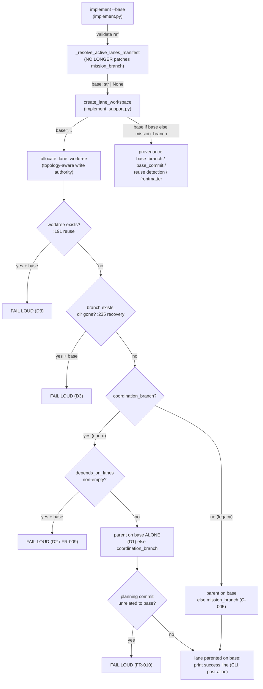

# Implementation Plan: Lane base honoring (M1, P0)

**Branch**: `rc3-lane-base-honoring-01M0GGRC` | **Date**: 2026-08-21 | **Spec**: [spec.md](./spec.md)
**Input**: Feature specification from `kitty-specs/rc3-lane-base-honoring-01M0GGRC/spec.md`
**Issue**: #3571 (P0) | **Merge target**: `main` | **Operator decisions**: D1/D2/D3 locked

## Summary

Thread an explicit `base: str | None = None` parameter from the `implement --base` seam,
through `create_lane_workspace`, into the topology-aware `allocate_lane_worktree`, so the
operator's `--base` binds the field the coord-topology (dominant) allocation path actually
reads — instead of being smuggled through `lanes_manifest.mission_branch`, which the coord
path never reads (root cause of #3571). Where the base cannot be honored cleanly, hard-error
with a typed exception rather than fabricating a success line. The genuine two-route
reconciliation (re-parenting coord-descended dependency tips / an existing coordination
branch) stays deferred to Mission M8 — M1 fails loud where M8 will reconcile.

## Technical Context

**Language/Version**: Python 3.11+
**Primary Dependencies**: stdlib `subprocess` (git plumbing), existing `specify_cli.lanes` package; no new third-party dependencies
**Storage**: git worktrees + branches (filesystem); WP frontmatter provenance (`base_branch`/`base_commit`)
**Testing**: pytest (`tests/specify_cli/lanes/`, `tests/lanes/`), `git_repo` fixtures; red-first through the real `implement --base` seam
**Target Platform**: Linux / macOS / Windows dev machines (git required)
**Project Type**: single (CLI tool)
**Performance Goals**: N/A — correctness point-fix; no hot path touched
**Constraints**: ruff + mypy --strict zero-new-issues; 0 regressions in `tests/lanes/` + `tests/specify_cli/lanes/`; typed fail-loud (not bare `RuntimeError`/`SystemExit`)
**Scale/Scope**: ~3 product files (`worktree_allocator.py`, `implement_support.py`, `implement.py`) + 1 orchestrator except-tuple (`orchestrator_api/commands.py`); ~2-3 new/extended test files

**Supply-chain security**: No dependency added, upgraded, or removed. The `supply_chain_security_check` plan step is N/A for this mission (recorded, not silently skipped).

## Constitution / Charter Check

*GATE: pass before Phase 0; re-check after design.*

- **ATDD-first / red-first (C-011, ADR 2026-07-17-1)** — AC-1 drives the real `implement --base`
  seam, RED on `upstream/main`, GREEN after; swap-the-product-file-back proof on the PR. ✅ planned.
- **Single canonical authority** — the fix centralizes base-routing in the one topology-aware
  write authority (`allocate_lane_worktree`); it removes a second, divergent source (the
  `mission_branch` smuggle), reducing split-brain. ✅
- **Small-diff + boy-scout locality** — minimal surface; the two-route unification is explicitly
  M8, not folded here. ✅
- **Terminology canon** — Mission/lane/coordination-branch usage matches `docs/context/`. ✅
- **No new suppressions** — typed exception, no `# noqa`/`# type: ignore`. ✅

No charter conflicts. Docker/SaaS untouched.

## Engineering Alignment (confirmed)

This is a bug-fix mission with operator-locked decisions (D1/D2/D3) and a post-spec-squad-hardened
requirement set. No architecture interrogation was required; the fix approach is determined by the
spec. The three plan-phase confirmation items named by the kick-off / squad are resolved below.

### Plan-phase confirmation items — RESOLVED

**1. Caller enumeration (C-001) — DONE (authoritative grep).**
`allocate_lane_worktree` has exactly **two** production callers:
- `src/specify_cli/lanes/implement_support.py:92` — `create_lane_workspace` (the `implement --base` path)
- `src/specify_cli/orchestrator_api/commands.py:903` — `_resolve_start_workspace` (orchestrator-api; passes `base=None`, inert)

`create_lane_workspace` additionally derives base **provenance** from `lanes_manifest.mission_branch`
at `implement_support.py:112` (reuse detection via `_has_commits_beyond_base`), `:117` (`base_branch`),
`:130` (`base_commit` via `_rev_parse`), `:138-139` (WP frontmatter), `:156-157` (`WorkspaceContext`),
`:174` (`LaneWorkspaceResult.mission_branch`). These must consume the threaded `base` when supplied so
provenance does not silently revert to `kitty/mission-<slug>` after the smuggle is dropped.

**2. FR-010 — detached base vs planning commit ⇒ FAIL LOUD (locked).**
When `<base>` shares no common ancestor with the recorded planning commit, `_merge_recorded_planning_commit`
would hit "refusing to merge unrelated histories". Decision: **hard-error with a typed, explanatory
message**; do NOT silently add `--allow-unrelated-histories` (that would fabricate a lineage the
operator did not ask for) and do NOT leak a raw `PlanningCommitMergeConflictError`. Consistent with the
D2/D3 fail-loud philosophy.

**3. C-004 — for_review gate measures against the ACTUAL honored base ⇒ IN-SCOPE M1 FIX (operator ruling
2026-08-21).** `for_review_gate.resolve_lane_base_ref` resolves the lane base as the coordination branch
via `resolve_placement_only(STATUS_STATE).ref` for its `rev-list <base>..HEAD` implementation-commit check.
After M1 honors `--base`, a base-alone lane descends from `<base>`, so measuring against coord is wrong for
exactly the lanes M1 ships.

**Operator principle (verbatim intent):** *the coordination branch is itself a perfectly valid `--base`
value; explicit-base and coord-as-base are not contradictory — this is about opening the mechanics so the
gate measures against whatever the lane was actually parented on.* So the fix is a **uniform SSOT**, not a
special-case: the WP's recorded `base_branch` provenance becomes the authoritative "ref the lane was
parented on," and the gate reads it.

**Mechanics (verified subtlety):** today `base_branch` frontmatter is recorded as
`lanes_manifest.mission_branch` = `mission_branch_name(...)` (`kitty/mission-<slug>-<mid8>`), which can
**differ** from the actual coord parent `coordination_branch` (from meta.json). The gate today correctly
uses the coord ref. So the fix must:
  (a) record the **actual honored parent** into `base_branch` frontmatter — `base` when `--base` supplied,
      else the topology parent the allocator used (`coordination_branch` for coord, `mission_branch` for
      legacy) — making provenance accurate; and
  (b) have `resolve_lane_base_ref` prefer that recorded honored base.
**No-regression pin:** for a default no-`--base` coord lane, the recorded base MUST equal
`coordination_branch`, so the gate measures against coord exactly as today (regression test #9). Coord is
the default value of the uniform base, not a branch of logic.

Binds new **FR-011**. Touches `for_review_gate.py` + the `base_branch` recording in `implement_support.py`.

## Design: the threaded-base data flow



**New typed exception** — `UnhonorableBaseError(route, wp_id, base)` in `worktree_allocator.py`,
**subclassing `StructuredError`** (`core/errors.py:23`, itself a `RuntimeError`), matching its siblings
`DependencyLaneMergeConflictError` / `PlanningCommitMergeConflictError`. `error_code="UNHONORABLE_BASE"`,
with `route`/`wp_id`/`base` surfaced in an overridden `to_dict()` (post-plan architect finding). Raised at
FL1–FL4. Caught at both seams:
- CLI: `implement.py` already wraps `create_lane_workspace` in `except Exception` → BLOCKED +
  `raise typer.Exit(1)`; ensure the message carries route/WP/base.
- Orchestrator: because `StructuredError` extends `RuntimeError`, the existing except-tuple arm
  (`orchestrator_api/commands.py`, `LaneNotFoundError, DirtyWorktreeError,
  DependencyLaneMergeConflictError, RuntimeError`) **already catches it** and `_fail` renders the
  `LANE_ALLOCATION_FAILED` envelope with the machine-readable `error_code`. We list `UnhonorableBaseError`
  explicitly in the tuple for **documentary parity** with its siblings (not because the catch depends on
  it). NFR-004's real goal — never a raw traceback — is met by the class choice, not the tuple edit
  (reconciled post-plan reviewer caution). The orchestrator passes `base=None` (inert), so its coverage
  test is necessarily mock-injected — acknowledged as a defensive, synthetic test.

**FR-010 is a PRE-CREATE guard (atomicity — post-plan architect HIGH).** The detached-base check MUST run
as `git merge-base <base> <planning_commit_sha>` (empty ⇒ no common ancestor) **before**
`_create_lane_worktree`, so the fail-loud raise leaves NOTHING created. Placing it inside
`_merge_recorded_planning_commit` (post-create) would leave a half-created worktree+branch; a retry then
hits FL1 (reuse) and wedges the operator. All four fail-loud sites raise **before** their block's side
effects (FL1 before `_validate_worktree_clean`/merges; FL2 before `git worktree prune`/re-attach; FL3
before `_ensure_branch_exists`/`_create_lane_worktree`; FL4 before `_create_lane_worktree`).

**Success line** — relocate `→ Using explicit base ref: <ref>` out of `_resolve_active_lanes_manifest`
(which runs before allocation) to AFTER a successful `create_lane_workspace` return in `implement.py`.
Precise anchor (post-plan implementer): the call spans ~1886–1895 and binds `workspace_path`/`branch_name`
at ~1896–1897 inside the `try`; insert the print at **~1897–1898** (after the result bindings, before
`_start_wp_implementation_status`) — NOT "post-1886", which lands mid-call. **Guard predicate** (post-plan
implementer): print only `if base is not None and not is_planning_lane(...)` (equivalently
`result.execution_mode != ExecutionMode.PLANNING_ARTIFACT`), reproducing all three of today's conditions —
base supplied, not a planning lane, allocation succeeded. Placed unconditionally it would fire on every run
(including `base=None` → `Using explicit base ref: None`) and on planning WPs that today emit only the
yellow "ignored" warning. It must never fire on the orchestrator path (silent) nor before a fail-loud raise.
**Do NOT feed `base` into the `mission_branch` field** that `_report_workspace_created` prints as
"Mission branch: <x>" (implement.py:~1650) — keep base provenance in `base_branch`/`base_commit` distinct,
or an honored-base run mislabels base as the mission branch (post-plan architect LOW).

## FR / AC → implementation map

| Requirement | Site | Test |
|---|---|---|
| FR-001/FR-002 (base alone, no-dep) | `allocate_lane_worktree` coord fresh-create :260-264 | AC-1 (seam-level) + allocator unit |
| FR-003 (explicit param) | `allocate_lane_worktree` + `create_lane_workspace` signatures | signature/threading unit |
| FR-004 (reuse/recovery fail-loud) | `:191`, `:235` early-returns | AC-3(a)(b) real-state |
| FR-005 (no fabricated success) | print relocation in `implement.py` | AC-4 both-directions |
| FR-006/C-005 (legacy unbroken) | legacy `else` :272-276 (`base if base else mission_branch`) | AC-2 (+ #1684 tests green) |
| FR-007 (repo-root warning) | `_resolve_active_lanes_manifest` planning-lane branch (unchanged) | Test 7 (NEW — planning-lane `--base` warning + no-effect) |
| FR-008 (docstring) | `worktree_allocator.py:450-453` | doc review |
| FR-009 (dep-lane + base fail-loud, D2) | coord fresh-create, `lane.depends_on_lanes` non-empty | AC-3(c) real-state |
| FR-010 (detached base fail-loud) | `_merge_recorded_planning_commit` unrelated-histories guard | NFR-003 detached-base fixture |
| NFR-004 (typed exc caught both seams) | `implement.py` + `orchestrator_api/commands.py` | orchestrator envelope test |
| NFR-005 (defaulted param) | `base: str \| None = None` | ~30 existing call sites stay green |
| FR-011 (for_review gate reads honored base) | `base_branch` recording (`implement_support.py`) + `resolve_lane_base_ref` (`for_review_gate.py`) | Test 9: --base lane gate measures vs base; default coord lane gate measures vs coord (no regression) |

## Test plan (red-first)

1. **AC-1 seam-level red-first** — new test drives base through `_resolve_active_lanes_manifest`
   → `create_lane_workspace` → allocator on a coord no-dep lane; asserts `--is-ancestor B lane` True,
   `--is-ancestor U lane` False. Symptom-RED on `upstream/main`, GREEN after. **Fixture fidelity gate**
   (post-plan reviewer): the fixture MUST assert it genuinely carries coordination topology (`meta.json`
   `coordination_branch` present so `_read_coordination_branch` returns non-None) and that the RED is
   *wrong-ancestry*, not *no-coordination-branch* — else a degraded-to-legacy fixture would honor
   `mission_branch=B` on `main` and go falsely GREEN. Companion allocator unit extends
   `test_worktree_allocator_coord.py`.
2. **AC-2 legacy** — legacy `--base` through the seam descends from the supplied ref; existing
   `test_legacy_topology_skips_sparse_checkout` + `test_issue_1684_cross_lane_base.py` stay GREEN.
3. **AC-3 real-state fail-loud** — (a) reuse (allocate, re-allocate with base), (b) crash-recovery
   (allocate, `rm -rf` worktree, re-allocate with base), (c) dep-lane + base; each asserts non-zero +
   typed `UnhonorableBaseError`; no mocking the allocator.
4. **AC-4 both-directions + silence** — success line PRESENT on honored no-dep path, ABSENT on an error
   path, AND ABSENT on `base=None` and planning-lane-with-base runs (the guard predicate), captured
   through the real entry.
5. **FR-010** — detached-base fixture (base with no common ancestor to the planning commit) asserts the
   typed fail-loud AND leaves **no residual worktree/branch** (pre-create guard); an immediate retry does
   NOT hit FL1 (post-plan architect atomicity AC).
6. **NFR-004** — orchestrator-api path returns the `LANE_ALLOCATION_FAILED` envelope with the
   `UNHONORABLE_BASE` `error_code` (mock-injected raise, since the orchestrator passes `base=None` — the
   test is defensive/synthetic and labeled as such).
7. **FR-007 (NEW — was untested)** — on a planning lane, `--base` emits the yellow "ignored" warning and
   has no allocation effect (post-plan reviewer: no existing test covers this branch adjacent to the edit).
8. **Regression rewrite (NEW — post-plan reviewer HIGH):** `tests/cli/commands/test_implement_base_flag.py::test_implement_base_flag_creates_workspace_from_ref`
   currently asserts `used_manifest.mission_branch == "main"` — it **pins the retired smuggle** and mocks
   `create_lane_workspace`. It WILL go red when the smuggle is dropped. Add it to the touched/rewrite
   inventory; convert it into a base-threading assertion; stop mocking `create_lane_workspace` for the
   honored-path claim. (This file lives in `tests/cli/commands/`, outside the `tests/lanes/` green-set the
   "0 regressions" claim originally scoped — the scope is widened accordingly.)

9. **FR-011 for_review gate honored-base (NEW — operator ruling)** — (a) a coord lane allocated with
   `--base B` then advanced to `for_review` is gated with `rev-list B..HEAD` (measures against the honored
   base, not coord); (b) **no-regression**: a default no-`--base` coord lane is still gated against
   `coordination_branch` (the recorded base equals coord). Both through the gate's real entry.

**Swap-the-product-file-back proof (C-003, procedural — post-plan reviewer):** to prove AC-1 red-first on
the PR: (1) with the fix applied and AC-1 green, `git stash` (or revert) the `worktree_allocator.py` +
`implement.py` + `implement_support.py` product diff only (keep the new test); (2) run AC-1 → capture the
symptom-red (wrong ancestry); (3) restore the product diff; (4) run AC-1 → capture green. Post both outputs.

New test files declare `pytestmark` and join the completeness baselines in-commit (marker-convention gate).

## Project Structure

### Documentation (this mission)
```
kitty-specs/rc3-lane-base-honoring-01M0GGRC/
├── spec.md              # committed, squad-hardened
├── plan.md              # this file
├── research.md          # Phase 0 — caller enumeration + decisions
├── evidence/            # live repro + squad findings
└── tasks/               # Phase 2 (/spec-kitty.tasks) — NOT created here
```

### Source Code (repository root — files touched)
```
src/specify_cli/
├── lanes/
│   ├── worktree_allocator.py     # thread `base`; 4 fail-loud sites; UnhonorableBaseError; success semantics; docstring
│   ├── implement_support.py      # thread `base` into create_lane_workspace; record ACTUAL honored parent in base_branch
│   └── for_review_gate.py        # FR-011: resolve_lane_base_ref prefers recorded honored base
├── cli/commands/
│   └── implement.py              # drop mission_branch smuggle; pass base down; relocate+guard success print
└── orchestrator_api/
    └── commands.py               # list UnhonorableBaseError in except-tuple (documentary; base=None inert)
tests/
├── specify_cli/lanes/test_worktree_allocator_coord.py   # extend (allocator unit companion)
├── lanes/test_issue_1684_cross_lane_base.py             # keep green (legacy)
├── cli/commands/test_implement_base_flag.py             # REWRITE: retire smuggle-assertion,
│                                                        #   assert base-threading, stop mocking
└── <new> seam-level red-first + fail-loud + detached-base + FR-007 planning-warning tests
```

## Risks & mitigations

Carried from spec §Risks (F1–F8). Load-bearing: **legacy-route base starvation (F2)** — mitigated by
routing base through the topology-aware allocator (C-005), pinned by AC-2. **Dependency ancestry
re-import (F4.1)** — resolved by FR-009 fail-loud, not silent composition. See spec for the full list.

## Out of scope (M8 / follow-ups)

Two-route unification (#3460/#3462/#3536) — re-parenting coord-descended dependency tips onto a fresh base;
twins #3122/#3029. *(C-004 for_review gate is now IN scope per the operator ruling — see confirmation item 3.)*
