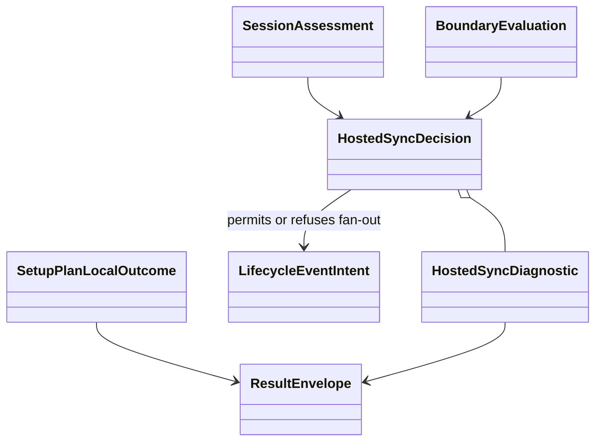

# Data Model: setup-plan local outcome and hosted-delivery evidence

All values are invocation-scoped and immutable after construction. No new persistent
schema is introduced.

## SessionAssessment

| Field | Type | Rules |
|---|---|---|
| `completed` | boolean | True only when canonical local session evaluation completed. |
| `usable_session` | boolean or null | Boolean when completed; null when assessment failed. |
| `reason` | stable local reason code | Contains no credential material. |

Invariant rules:

- `completed=true, usable_session=true`: session is readable and its refresh token is
  usable or not known expired.
- `completed=true, usable_session=false`: storage evaluation succeeded but no usable
  session exists; this is conclusively logged out.
- `completed=false, usable_session=null`: initialization, storage, decryption, parsing,
  materialization, or evaluation failed.

Assessment failure and logged out both refuse hosted effects but produce different
diagnostics. Failure is not an authentication state.

## BoundaryEvaluation

| Field | Type | Rules |
|---|---|---|
| `state` | `safe \| unsafe \| unknown` | Exception maps to `unknown`. |
| `reason` | stable reason code | Required when not safe. |
| `evidence` | sanitized mapping or null | Derived from preflight result; no raw exception/credential data. |

Known structural mismatches are `unsafe`. Failure to evaluate is `unknown`. Both are
insufficient permission for hosted effects.

## HostedSyncDiagnostic

| Field | Type | Rules |
|---|---|---|
| `code` | stable string | Auth, boundary, and route codes remain distinct. |
| `severity` | `warning` | Nonfatal to the local command. |
| `hosted_disposition` | `refused` | The affected hosted effect does not run. |
| `message` | string | Human-readable and free of secrets. |
| `details` | mapping or null | Sanitized structured evidence. |
| `remediation` | list of strings | Advice only; no automatic login or repair. |

Diagnostics are deduplicated by code and ordered authentication → structural → route.
Route refusal uses `SAAS_SYNC_ROUTE_UNAVAILABLE` and is derived only from the canonical
read-only routing resolver.

## HostedSyncDecision

| Field | Type | Rules |
|---|---|---|
| `requested` | boolean | False when SaaS is disabled. |
| `allow_effects` | boolean | True only when all required evidence is affirmatively safe. |
| `diagnostics` | tuple of diagnostics | Empty on disabled or fully allowed paths. |

Truth table:

| Requested | Auth | Boundary | Route | Allow |
|---|---|---|---|---|
| no | not evaluated | not evaluated | not evaluated | no effects attempted |
| yes | completed + usable | safe | available | yes |
| yes | completed + no usable session | any | any | no |
| yes | assessment failed | any | any | no |
| yes | completed + usable | unsafe/unknown | any | no |
| yes | completed + usable | safe | unavailable/unknown | no |

Route is available only when `resolve_checkout_sync_routing_readonly()` returns a value
with non-empty `project_uuid` and `effective_sync_enabled=true`. Null, resolver failure,
missing identity, unreadable policy, or denied consent is unavailable.

## LifecycleEventIntent

| Field | Type | Rules |
|---|---|---|
| `envelope` | existing event envelope | Persisted locally before hosted fan-out. |
| `log_path` | local path/context | Used for compatible adapter fan-out only. |

Transition:

```text
built → persisted_locally → offered_to_executor
                              ├─ allowed → hosted_fanout_attempted
                              └─ refused → terminal_local_only
```

No refused intent reaches a hosted adapter.

## SetupPlanLocalOutcome

| Field | Type | Rules |
|---|---|---|
| `payload` | mapping | Existing primary JSON fields for the local path. |
| `exit_code` | integer | Existing local exit; never derived from hosted diagnostics. |
| `render_kind` | success/scaffold/blocked/error | Mirrors existing local classification. |

The reporter produces one output document from `SetupPlanLocalOutcome` plus optional
diagnostics. It never mutates primary result fields.

## Relationships


