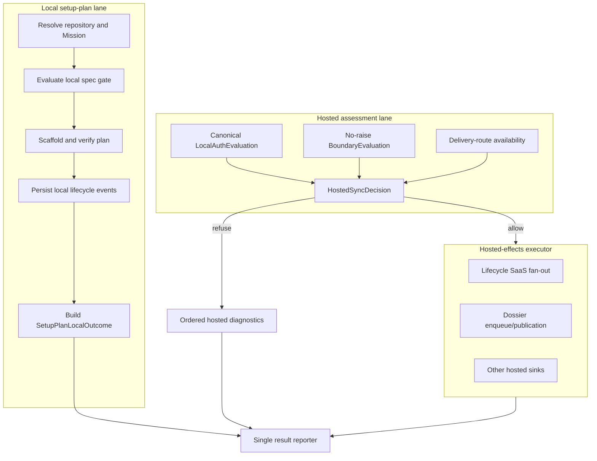

# Implementation Plan: Authoritative local setup-plan with safe hosted refusal

**Branch**: `fix/setup-plan-auth-diagnostics-nonfatal` | **Date**: 2026-08-23 | **Spec**: [spec.md](spec.md)
**Input**: Mission specification in `kitty-specs/setup-plan-auth-diagnostics-nonfatal-01M0QEAD/spec.md`

## Branch Contract

- **Current branch at planning**: `fix/setup-plan-auth-diagnostics-nonfatal`
- **Planning/base branch**: `fix/setup-plan-auth-diagnostics-nonfatal`
- **Final merge target**: `fix/setup-plan-auth-diagnostics-nonfatal`
- **Resolver result**: `branch_matches_target=true`

## Summary

Refactor `setup-plan` into two independent lanes with one explicit join. The local lane
resolves the Mission, enforces the spec gate, scaffolds and verifies the plan, records
local lifecycle history, commits local artifacts, and produces the authoritative
result. The hosted-assessment lane obtains a canonical tri-state authentication
evaluation, a no-raise structural boundary evaluation, and delivery-route availability.
One immutable `HostedSyncDecision` then allows or refuses every hosted effect. Refusal
adds structured warnings but cannot alter the local result or exit.

The change must fix information loss inside `TokenManager`, not compensate in readiness;
split lifecycle persistence from SaaS fan-out, not merely guard dossier sync; and freeze
the existing setup-plan outcome matrix before orchestration changes.

## Engineering Alignment

Confirmed by the user on 2026-08-23:

- Always complete eligible local verification.
- Refuse only unsafe hosted-sync side effects.
- Return structural problems as separate structured diagnostics.
- Let the local verification result remain authoritative.
- Treat unknown authentication differently from confirmed logged out.
- A refresh-capable session is authenticated even when its access token is expired.
- SaaS may remain disabled for the whole Mission workflow.
- No authority beyond issue #3621, the project charter, and the repository's accepted
  architecture decisions governs this change.

## Technical Context

**Language/Version**: Python 3.11+
**Primary Dependencies**: existing Typer, Rich, `specify_cli.auth`,
`specify_cli.readiness`, `specify_cli.status`, and `specify_cli.sync`; no new package
**Storage**: encrypted file-only session storage; local Mission Markdown/JSONL; existing
project-scoped hosted-sync store; no schema or migration
**Testing**: pytest, Typer `CliRunner`, real isolated encrypted storage fixtures,
side-effect spies, architectural AST gate, and targeted regression suites
**Target Platform**: Linux, macOS, Windows 10+
**Project Type**: single Python CLI package
**Performance Goals**: no auth network I/O; preserve the existing coherent structural
preflight budget of at most 100 ms; typical CLI remains below charter limits
**Constraints**: no general token-expiry UX, no `--require-sync`, no queue migration,
no credential disclosure, no weakening of hosted-only commands, one JSON document
**Scale/Scope**: four cohesive implementation concerns, fifteen functional
requirements, and targeted auth/status/sync/setup-plan test surfaces

## Charter Check

| Charter gate | Application | Result |
|---|---|---|
| Single canonical authority | `TokenManager` owns authentication truth; `run_preflight` remains the structural detector; one command adapter composes them. | Pass |
| Architectural alignment | Encrypted file-only auth, project-store isolation, and hosted egress refusal remain unchanged. | Pass |
| ATDD-first | Every implementation WP begins with a failing acceptance or contract test committed before production changes. | Pass |
| Bug-class closure | A non-vacuous architectural gate proves no setup-plan hosted sink bypasses the decision seam. | Pass |
| Locality and proportional cleanup | Each WP owns one bounded subsystem; setup-plan god-surface cleanup is limited to extractions required by this architecture. | Pass |
| Credentials | Diagnostics contain state and reason codes only, never session contents. | Pass |
| Terminology | Mission terminology and explicit delivery-routing language are used throughout. | Pass |
| Release honesty | Open P0 issue #3127 remains a named acceptance/release gate and is not green-washed. | Pass |

Post-design re-check: no charter exception is required. The design replaces duplicate
authority and hidden fan-out with explicit seams while retaining all existing sync
refusal and project-store protections.

## Architecture



### Architectural invariants

1. `SetupPlanLocalOutcome` and its exit code are produced without depending on hosted
   eligibility.
2. Before `HostedEffectsExecutor` receives an allowing decision, no setup-plan path may
   open or write an offline queue, body-upload queue, dossier publication, daemon
   publication, dashboard synchronization, or direct hosted transport.
3. Local lifecycle persistence never imports or invokes hosted adapters.
4. `UNKNOWN` is fail-closed for hosted effects but nonfatal to local verification.
5. Queue scope answers where delivery can go, never whether a session is authenticated.
6. `sync now` and other hosted-only commands retain their existing preflight behavior.

## Component Design

### 1. Canonical local authentication evaluation

Add a typed evaluation in `src/specify_cli/auth/token_manager.py`:

```python
class LocalAuthState(StrEnum):
    AUTHENTICATED = "authenticated"
    LOGGED_OUT = "logged_out"
    UNKNOWN = "unknown"

@dataclass(frozen=True, slots=True)
class LocalAuthEvaluation:
    state: LocalAuthState
    reason: str
```

`TokenManager` retains a typed load/materialization outcome so an absent session and an
unreadable session are distinguishable. A readable session with a non-expired—or
not-known-expired—refresh token is authenticated. Storage initialization, decryption,
parsing, hot-summary materialization, or evaluation failure is unknown. No network or
refresh occurs.

Keep `is_authenticated: bool` as the compatibility projection
`evaluation.state is AUTHENTICATED`. `readiness.auth.probe_auth_status()` projects the
typed authority into its contextual `AuthStatus` values and consults Teamspace detection
only after a conclusive `LOGGED_OUT` result.

### 2. Setup-plan hosted assessment and decision

Create a command-adapter module adjacent to `mission_setup_plan.py`. It owns immutable:

- `HostedSyncDiagnostic(code, severity, hosted_disposition, message, details)`;
- `BoundaryEvaluation(state, reason, evidence)`;
- `HostedSyncDecision(requested, allow_effects, diagnostics)`.

The boundary adapter calls canonical `run_preflight(repo_root, require_auth=False)` and
converts both returned unsafe results and unexpected exceptions into
`SAAS_SYNC_BOUNDARY_UNSAFE`. It does not change `run_preflight` or catch failures for
hosted-only callers.

Decision order is deterministic: authentication, structural boundary, delivery route.
SaaS disabled returns a non-requested/no-diagnostic decision without invoking probes.
Only authenticated + structurally safe + routable may allow hosted effects.

### 3. Local lifecycle persistence and hosted fan-out

Refactor `src/specify_cli/status/lifecycle_events.py` into explicit operations:

```python
persist_lifecycle_event_local(...) -> EventEnvelope | None
fanout_lifecycle_event_hosted(envelope, *, log_path) -> None
```

Existing `append_lifecycle_event()` remains backward compatible by composing both
operations for unaffected callers. Add a supported artifact-phase local-only path for
`setup-plan`. It persists JSONL and returns the envelope without invoking registered
SaaS adapters. Hosted fan-out is later submitted as an intent to the command's single
executor.

### 4. Setup-plan orchestration and reporting

Replace the two early exit-2 guards in `mission_setup_plan.py` with evidence collection.
Structural collection occurs only after repository-root resolution. Local helpers return
or contribute to one typed `SetupPlanLocalOutcome`; a single reporter attaches hosted
diagnostics and emits JSON or human output once.

All lifecycle fan-out, dossier enqueue/publication, and discovered hosted sinks must
pass through the decision executor. Local phase JSONL, file writes, documentation
wiring, and safe commits remain unconditional when their local workflow stage is
eligible.

## Local Outcome Compatibility Matrix

The implementation must first capture the exact current payload from the pre-change
entry point. The following classifications and exits are binding; tests must additionally
freeze every existing primary field for each row.

| Local condition | Required primary semantics | Exit |
|---|---|---:|
| Substantive complete plan | `result=success`, `phase_complete=true` | 0 |
| Newly created pristine scaffold | `result=success`, `phase_complete=false`, `scaffold_only=true` | 0 |
| Populated but insufficient plan | `result=blocked`, `phase_complete=false`, existing `blocked_reason` | 0 |
| Committed pristine/insufficient plan | `result=blocked`, `phase_complete=false`, existing `blocked_reason` | 0 |
| Non-substantive or uncommitted spec | `result=blocked`, `phase_complete=false`, `error_code=SPEC_NOT_SUBSTANTIVE_OR_UNCOMMITTED` | 0 |
| Missing spec | Existing `SPEC_FILE_MISSING` payload | 1 |
| Template configuration error | `result=error`, `phase_complete=false`, `error_code=TEMPLATE_CONFIGURATION_ERROR` | 1 |
| Missing template or generic local exception | Existing error payload | 1 |
| Project/context/git resolution failure | Existing payload and exit | unchanged |

For authenticated, logged-out, auth-unknown, boundary-unsafe, and
boundary-evaluation-exception variants, primary fields and exit are identical to the
baseline. Only the additive `warnings` collection may differ. Errors before repository
root resolution cannot fabricate structural evidence.

## Diagnostic Contract

| Condition | Code | Command severity | Hosted disposition |
|---|---|---|---|
| Confirmed logged out | `SAAS_SYNC_UNAUTHENTICATED` | warning | refused |
| Auth evaluation unknown | `SAAS_SYNC_AUTH_UNKNOWN` | warning | refused |
| Structural unsafe or evaluation failed | `SAAS_SYNC_BOUNDARY_UNSAFE` | warning | refused |
| Authenticated but no delivery route | routing-specific stable code chosen from existing vocabulary | warning | refused/skipped |

Diagnostics contain sanitized reasons and structured evidence, never exception dumps or
credential material. Multiple conditions remain independent and deduplicated.

## Phase 0: Research Decisions

Research is consolidated in [research.md](research.md):

1. Preserve auth load truth in `TokenManager`; readiness cannot reconstruct swallowed
   storage failures.
2. Add a setup-plan-only no-raise adapter rather than weaken canonical preflight.
3. Split local lifecycle persistence from adapter fan-out while retaining the old
   composed API for other callers.
4. Centralize the hosted-effect decision and command result reporter.
5. Prove the original production chain with real isolated encrypted storage, not a
   Boolean fake.
6. Treat issue #3127 as release-closeout coordination only.

## Phase 1: Design and Contracts

- [data-model.md](data-model.md) defines invocation-scoped values and transitions.
- [contracts/setup-plan-result-envelope.md](contracts/setup-plan-result-envelope.md)
  freezes primary results, warnings, exits, and the hosted-effect boundary.
- [quickstart.md](quickstart.md) defines red-first and verification commands.

## Project Structure

### Mission documentation

```text
kitty-specs/setup-plan-auth-diagnostics-nonfatal-01M0QEAD/
├── spec.md
├── plan.md
├── research.md
├── data-model.md
├── quickstart.md
├── contracts/
│   └── setup-plan-result-envelope.md
├── tasks.md
└── tasks/
    ├── WP01-canonical-auth-evaluation.md
    ├── WP02-hosted-assessment-decision.md
    ├── WP03-lifecycle-persistence-fanout-split.md
    └── WP04-setup-plan-orchestration-compatibility.md
```

### Source and tests

```text
src/specify_cli/
├── auth/token_manager.py
├── readiness/auth.py
├── status/lifecycle_events.py
└── cli/commands/agent/
    ├── setup_plan_hosted.py        # new command adapter
    └── mission_setup_plan.py

tests/
├── auth/test_token_manager.py
├── readiness/test_auth_probe.py
├── status/test_lifecycle_events.py
├── runtime/test_setup_plan_sync_evidence.py
├── architectural/test_setup_plan_hosted_effect_gate.py
└── specify_cli/cli/commands/agent/
    ├── test_setup_plan_hosted.py
    ├── test_mission_setup_plan_phases.py
    ├── test_setup_plan_read_surface.py
    └── test_issue_3425_setup_plan_legacy_layout_silent_capture.py
```

**Structure Decision**: Preserve domain ownership: auth owns session truth, sync
preflight owns structural detection, status owns local event persistence, and the
setup-plan adapter owns composition. The command orchestrator consumes these seams and
does not duplicate them.

## Implementation Concern Map

### IC-01 — Canonical authentication truth

- **Purpose**: Preserve authenticated/logged-out/unknown at the earliest authority.
- **Relevant requirements**: FR-002–FR-006.
- **Affected surfaces**: `auth/token_manager.py`, `readiness/auth.py`, corresponding tests.
- **Sequencing/depends-on**: none.
- **Risks**: changing Boolean callers or accidentally invoking refresh/network.

### IC-02 — Hosted assessment and decision

- **Purpose**: Convert independent evidence into one fail-closed hosted permission.
- **Relevant requirements**: FR-007, FR-008, FR-012.
- **Affected surfaces**: new command-adapter module and focused tests.
- **Sequencing/depends-on**: IC-01 for the typed auth value.
- **Risks**: treating route availability as auth or leaking raw exceptions.

### IC-03 — Lifecycle side-effect separation

- **Purpose**: Guarantee local event persistence without implicit SaaS queue writes.
- **Relevant requirements**: FR-009, FR-010.
- **Affected surfaces**: `status/lifecycle_events.py` and lifecycle tests.
- **Sequencing/depends-on**: none; may proceed in parallel with IC-01/IC-02.
- **Risks**: duplicate events, accidental behavior changes for existing callers.

### IC-04 — Setup-plan orchestration and compatibility

- **Purpose**: Join the two lanes, guard all hosted effects, and render one result.
- **Relevant requirements**: FR-001, FR-005–FR-015.
- **Affected surfaces**: setup-plan command, runtime/read-surface/architecture tests,
  logged-out Teamspace operations documentation.
- **Sequencing/depends-on**: IC-01, IC-02, IC-03.
- **Risks**: missed return/raise path, unguarded hidden fan-out, changed legacy exit.

## Verification Strategy

- Commit at least one failing acceptance test before production changes in every WP.
- Use real isolated encrypted storage for the refresh-capable/no-scope and unreadable
  storage regressions; make queue-scope readers fail if invoked.
- Table-test all decision combinations and prove structural exceptions do not escape.
- Test local-only lifecycle persistence separately from hosted fan-out composition.
- Cross the local-outcome compatibility matrix with hosted-readiness variants.
- Add a non-vacuous architectural gate with a synthetic violating fixture proving that
  a new setup-plan hosted sink outside the executor fails detection.
- Run targeted auth, readiness, status, sync, setup-plan, architectural, Ruff, and mypy
  gates. Do not green-wash known P0 issue #3127.

## Rollout and Closeout

1. Land auth and lifecycle foundations in independent lanes.
2. Land hosted decision after auth evaluation is available.
3. Integrate setup-plan only after all three foundations are approved.
4. Run targeted mission acceptance on the integrated branch.
5. Verify GitHub issue #3127 is resolved and mainline CI permits release before declaring
   release readiness. This is not a code-lane dependency.

## Complexity Tracking

No charter violation or justified complexity exception is required. Four WPs are used
because they are distinct authority and ownership boundaries, not to increase layering.
