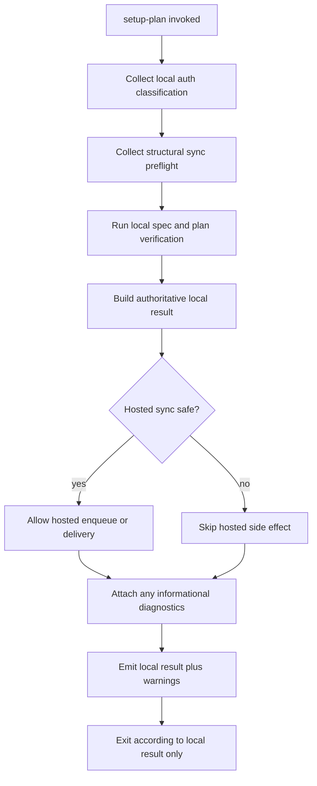

# Implementation Plan: Nonfatal setup-plan auth diagnostics

**Branch**: `fix/setup-plan-auth-diagnostics-nonfatal` | **Date**: 2026-08-23 | **Spec**: [spec.md](spec.md)  
**Input**: Feature specification in `kitty-specs/setup-plan-auth-diagnostics-nonfatal-01M0QEAD/spec.md`

## Summary

Refactor `setup-plan` so local plan verification always completes and alone determines the command result. Reuse the existing local readiness auth authority to distinguish authenticated, logged-out, and unknown states; retain sync-boundary preflight as the hosted-delivery safety authority; project either authority's non-ready result into structured diagnostics; and suppress only hosted enqueue/delivery when those diagnostics make it unsafe. Queue scope remains routing metadata and is removed from auth classification.

## Engineering Alignment

Confirmed by the user on 2026-08-23:

- Use the existing Python CLI and dependencies; add no package.
- Resolve auth from local session authority only and perform no SaaS request.
- Treat a refresh-capable local session as authenticated even if its access token is expired.
- Distinguish `unknown` auth from both logged-out states.
- Always finish local verification; its result and exit status are authoritative.
- Refuse only unsafe hosted-sync enqueue/delivery and report auth and structural conditions as separate diagnostics.
- Preserve all structural boundary detection and fail-closed hosted-delivery behavior.
- Start implementation with rejecting acceptance tests covering the full result matrix.

## Technical Context

**Language/Version**: Python 3.11+  
**Primary Dependencies**: Typer, Rich, existing `specify_cli.auth`, `specify_cli.readiness`, and `specify_cli.sync` modules; no new dependency  
**Storage**: Existing encrypted local auth session, daemon-owner record, routed project sync store, mission Markdown/JSONL files, and git commits; no schema change  
**Testing**: pytest, Typer `CliRunner`, monkeypatch-based unit tests, and setup-plan integration/regression tests  
**Target Platform**: Linux, macOS, and Windows 10+ CLI environments  
**Project Type**: Single Python CLI package  
**Performance Goals**: Preserve the coherent-host sync preflight budget of at most 100 ms; auth classification remains local and performs no network I/O  
**Constraints**: Local verification must run under every auth/boundary state; no generic token-expiry UX; no `--require-sync`; no queue migration; unsafe hosted side effects remain fail-closed; structured output remains JSON-parseable  
**Scale/Scope**: One CLI entry point and its result emitters, one existing auth-readiness seam, one sync-preflight projection, focused command/readiness/sync tests, and one CLI result contract

## Charter Check

*GATE: passed before Phase 0 and re-checked after Phase 1 design.*

| Charter principle | Plan evidence | Gate |
|---|---|---|
| Single authority per invariant | `probe_auth_status`/`TokenManager.is_authenticated` owns local auth; `run_preflight` owns structural hosted safety; queue scope is never an auth signal. | Pass |
| Architectural boundaries | Local artifact verification and lifecycle persistence stay independent from hosted enqueue/delivery. The existing sync preflight is reused, not bypassed. | Pass |
| Domain language | The model names auth classification, local verification outcome, hosted-sync diagnostic, and hosted-side-effect decision explicitly. | Pass |
| ATDD-first | The first implementation change is a rejecting CLI matrix proving exit/result/warning behavior and absence of unsafe hosted writes. | Pass |
| Cross-platform behavior | Existing `pathlib`-based session and preflight surfaces are reused; no platform-specific storage or path logic is added. | Pass |
| Dependency discipline | No dependency, package boundary, lockfile, or external contract-package change is required. | Pass |
| Mission traceability | GitHub issue #3621, Decision Moments, contract, and the three required tracer files are linked to implementation concerns. | Pass |

Post-design re-check: the design preserves the sync detector's refusal authority, narrows suppression to hosted side effects, adds no new architectural layer, and contains no charter exception.

## Control Flow



Local lifecycle events and git/artifact operations remain on the local path. Only operations that enqueue or deliver hosted data are conditional on hosted safety.

## Implementation Concern Map

| ID | Concern | Primary locations | Verification |
|---|---|---|---|
| IC-01 | Canonical tri-state auth classification | `src/specify_cli/readiness/auth.py`, `src/specify_cli/readiness/coordinator.py` | Auth probe tests prove authenticated, logged-out, and unknown are distinct; refresh-capable sessions count as authenticated. |
| IC-02 | Nonfatal hosted-sync diagnostic projection | `src/specify_cli/cli/commands/agent/mission_setup_plan.py`, `src/specify_cli/sync/preflight.py` | JSON and human output tests prove stable codes and structural details without changing the local outcome. |
| IC-03 | Local/hosted orchestration separation | `src/specify_cli/cli/commands/agent/mission_setup_plan.py` and dossier-sync call seam | Spies prove local verification/events/commit continue while unsafe hosted enqueue/delivery does not execute. |
| IC-04 | Regression and acceptance matrix | `tests/runtime/test_setup_plan_sync_evidence.py`, `tests/specify_cli/cli/commands/agent/test_mission_setup_plan_phases.py`, `tests/readiness/test_auth_probe.py`, `tests/sync/test_credential_scope_signal.py` | Red-first cases cover auth × completeness, structural failures × completeness, output mode parity, and coherent-path compatibility. |

## Phase 0: Research Decisions

Research is recorded in [research.md](research.md). All planning unknowns are resolved:

1. Reuse the readiness subsystem's `AuthStatus`; correct its exception classification rather than introducing another enum.
2. Keep `run_preflight` read-only and authoritative for structural safety, but consume its result as a hosted-side-effect decision in `setup-plan`.
3. Add a `warnings` collection to setup-plan result envelopes; use distinct auth codes and a typed structural diagnostic containing the existing preflight detail.
4. Thread diagnostics through local early-result paths so spec/plan failures remain primary and cannot be masked.

## Phase 1: Design and Contracts

The domain model is in [data-model.md](data-model.md), the machine/human behavior is frozen in [contracts/setup-plan-result-envelope.md](contracts/setup-plan-result-envelope.md), and focused verification instructions are in [quickstart.md](quickstart.md).

Implementation sequencing:

1. Add rejecting acceptance tests for complete/incomplete local outcomes under authenticated, logged-out, unknown, and structurally unsafe states.
2. Tighten the existing auth probe so failures to evaluate `TokenManager.is_authenticated` produce `AuthStatus.UNKNOWN`; preserve both logged-out variants for existing readiness consumers.
3. Replace `_enforce_saas_sync_auth_refusal` and `_enforce_saas_sync_boundary_preflight` in `setup-plan` with read-only diagnostic collection. Do not change `sync now` or other fail-closed hosted commands.
4. Carry an immutable hosted-sync decision and warning tuple through every local verification result emitter, including spec-gate and incomplete-plan paths.
5. Gate `_trigger_dossier_sync` and any other setup-plan hosted enqueue/delivery seam on the decision. Preserve local phase events, file writes, documentation wiring, and safe commits.
6. Update existing tests and load-bearing comments that currently encode exit-2 refusal, then run focused and broader regression suites.

## Project Structure

### Documentation for this mission

```text
kitty-specs/setup-plan-auth-diagnostics-nonfatal-01M0QEAD/
├── plan.md
├── research.md
├── data-model.md
├── quickstart.md
├── contracts/
│   └── setup-plan-result-envelope.md
├── traces/
│   ├── tooling-friction.md
│   ├── approach.md
│   └── design-decisions.md
└── tasks.md                  # Created only by /spec-kitty.tasks
```

### Source and tests

```text
src/specify_cli/
├── readiness/
│   ├── auth.py
│   └── coordinator.py
├── sync/
│   └── preflight.py
└── cli/commands/agent/
    └── mission_setup_plan.py

tests/
├── readiness/
│   └── test_auth_probe.py
├── runtime/
│   └── test_setup_plan_sync_evidence.py
├── sync/
│   └── test_credential_scope_signal.py
└── specify_cli/cli/commands/agent/
    ├── test_mission_setup_plan_phases.py
    └── test_setup_plan_read_surface.py
```

**Structure Decision**: Keep the change inside the existing single-package CLI layout. The readiness package owns auth classification, the sync package owns structural detection, and the setup-plan adapter composes those independent verdicts into command behavior.

## Verification Strategy

- Rejecting-first acceptance tests must fail for the current exit-2 guards before production changes begin.
- Unit tests pin `AUTHENTICATED`, the two logged-out states, and `UNKNOWN`, including exception and refresh-capable-session paths.
- Command tests pin JSON `warnings`, human warning parity, a maximum of one auth warning, and unchanged local result/exit classification.
- Structural fixtures cover all six owner mismatch fields, orphan records, unreadable owner records, project-store diagnostics, and any active legacy-row detector output.
- Side-effect spies prove that unsafe states skip dossier/hosted queue work while preserving local artifact writes, lifecycle events, documentation wiring, and commit behavior.
- Existing setup-plan read-surface tests and coherent hosted-sync tests remain green.

## Complexity Tracking

No charter violations or justified complexity exceptions are required.
