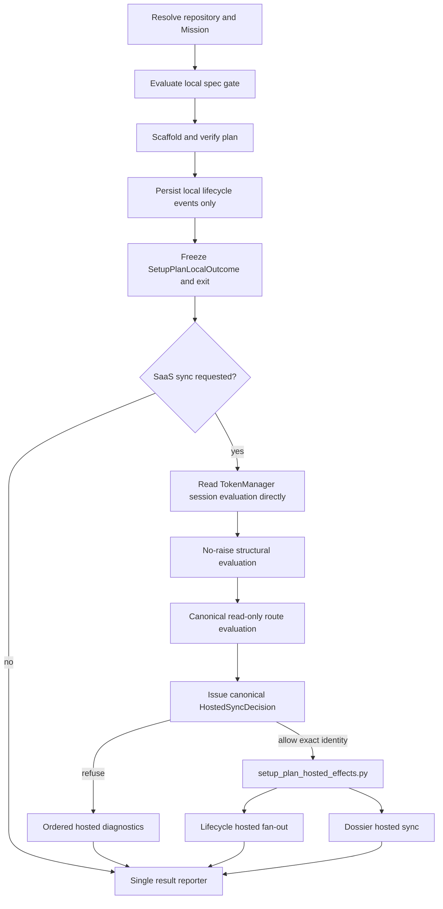

# Implementation Plan: Authoritative local setup-plan with isolated hosted effects

**Branch**: `fix/setup-plan-auth-diagnostics-nonfatal` | **Date**: 2026-08-23 | **Spec**: [spec.md](spec.md)
**Input**: Mission specification in `kitty-specs/setup-plan-auth-diagnostics-nonfatal-01M0QEAD/spec.md`

## Branch Contract

- **Current branch at planning**: `fix/setup-plan-auth-diagnostics-nonfatal`
- **Planning/base branch**: `fix/setup-plan-auth-diagnostics-nonfatal`
- **Final merge target**: `fix/setup-plan-auth-diagnostics-nonfatal`
- **Resolver result**: `branch_matches_target=true`

## Summary

Refactor `setup-plan` into a strictly ordered local-first pipeline. The command resolves
the Mission, enforces the spec gate, scaffolds and verifies the plan, records local
lifecycle history, commits eligible local artifacts, and freezes one authoritative
`SetupPlanLocalOutcome`. Only then, and only when SaaS sync is requested, does it acquire
canonical session-evaluation evidence directly from `TokenManager`, evaluate the
structural boundary and read-only route, and issue one immutable `HostedSyncDecision`.

A dedicated `setup_plan_hosted_effects.py` module is the sole physical owner of
setup-plan hosted sink imports. It accepts inert intents and executes them only after an
exact-identity check of the canonical allowing decision. Refusal adds structured
warnings but cannot alter the already-frozen local payload or exit.

The change fixes information loss inside `TokenManager`, while keeping authentication
Boolean after successful evaluation. It does not make readiness a setup-plan auth
authority and does not introduce a tri-state authentication subsystem. It also splits
local lifecycle persistence from SaaS fan-out, isolates physical hosted effects by
module ownership, and freezes the existing setup-plan outcome matrix before hosted work.

## Engineering Alignment

Confirmed by the user on 2026-08-23:

- Always complete eligible local verification.
- Refuse only unsafe hosted-sync side effects.
- Return structural problems as separate structured diagnostics.
- Let the local verification result remain authoritative.
- Treat a failed authentication assessment differently from confirmed logged out;
  assessment failure is not a third authentication state.
- A refresh-capable session is authenticated even when its access token is expired.
- SaaS may remain disabled for the whole Mission workflow.
- No authority beyond issue #3621, the project charter, and the repository's accepted
  architecture decisions governs this change.

## Technical Context

**Language/Version**: Python 3.11+
**Primary Dependencies**: existing Typer, Rich, `specify_cli.auth`,
`specify_cli.readiness`, `specify_cli.status`, and `specify_cli.sync`; no new package
**Storage**: encrypted file-only session storage; local Mission Markdown/JSONL; existing
project-scoped hosted-sync store; no schema or migration
**Testing**: pytest, Typer `CliRunner`, real isolated encrypted storage fixtures,
side-effect spies, structural module-edge/dominance gate, and targeted regression suites
**Target Platform**: Linux, macOS, Windows 10+
**Project Type**: single Python CLI package
**Performance Goals**: no auth network I/O; preserve the existing coherent structural
preflight budget of at most 100 ms; typical CLI remains below charter limits
**Constraints**: no general token-expiry UX, no `--require-sync`, no queue migration,
no credential disclosure, no weakening of hosted-only commands, one JSON document
**Scale/Scope**: four cohesive implementation concerns, fifteen functional
requirements, and targeted auth/status/sync/setup-plan test surfaces

## Charter Check

| Charter gate | Application | Result |
|---|---|---|
| Single canonical authority | `TokenManager` owns session evaluation; `setup-plan` reads it directly, `run_preflight` remains the structural detector, one decision composer issues permission, and one executor module owns physical hosted sinks. | Pass |
| Architectural alignment | Encrypted file-only auth, project-store isolation, and hosted egress refusal remain unchanged. | Pass |
| ATDD-first | Every implementation WP begins with a failing acceptance or contract test committed before production changes. | Pass |
| Bug-class closure | A non-vacuous architectural gate enforces forbidden import/name edges outside the sole hosted-effects module and proves canonical decision validation dominates every sink inside it. | Pass |
| Locality and proportional cleanup | Each WP owns one bounded subsystem; setup-plan god-surface cleanup is limited to extractions required by this architecture. | Pass |
| Credentials | Diagnostics contain state and reason codes only, never session contents. | Pass |
| Terminology | Mission terminology and explicit delivery-routing language are used throughout. | Pass |
| Release honesty | Open P0 issue #3127 receives a terminal acceptance verdict and remains a release-readiness blocker while unresolved. | Pass |

Post-design re-check: no charter exception is required. The design replaces duplicate
authority and hidden fan-out with explicit seams while retaining all existing sync
refusal and project-store protections.

## Architecture



### Architectural invariants

1. `SetupPlanLocalOutcome` and its exit code are complete and frozen before any hosted
   evidence is acquired.
2. Before `execute_setup_plan_hosted_effects()` receives the exact issued allowing
   decision, no setup-plan path may open or write an offline queue, body-upload queue,
   dossier publication, daemon publication, dashboard synchronization, or direct hosted
   transport.
3. Local lifecycle persistence never imports or invokes hosted adapters.
4. Session evaluation has two dimensions: evaluation completed/failed, then (only when
   completed) authenticated/logged out. Evaluation failure is fail-closed for hosted
   effects but is not persisted or exposed as a third authentication state.
5. Queue scope answers where delivery can go, never whether a session is authenticated.
6. Only `setup_plan_hosted_effects.py` may import or name physical setup-plan hosted
   sinks; `mission_setup_plan.py` may call only its narrow executor with inert intents.
7. `sync now` and other hosted-only commands retain their existing preflight behavior.

## Component Design

### 1. Canonical local session evaluation

Add a typed assessment result in `src/specify_cli/auth/token_manager.py`:

```python
@dataclass(frozen=True, slots=True)
class SessionAssessment:
    completed: bool
    usable_session: bool | None
    reason: str
```

`TokenManager` retains typed evaluation evidence so an absent session and an unreadable
session are distinguishable. This is not a three-state auth model. First,
`completed` says whether evaluation succeeded. Only when it did, `usable_session` is the
Boolean authentication verdict: a readable session with a non-expired—or
not-known-expired—refresh token is authenticated, while conclusive absence/expiry is
logged out. When evaluation fails, no authentication verdict exists. Storage
initialization, decryption, parsing, hot-summary materialization, or evaluation failure
therefore remains failure provenance. No network or refresh occurs.

Keep `is_authenticated: bool` as the compatibility projection
`assessment.completed and assessment.usable_session is True`. Existing readiness may
contextualize the same evidence for its own consumers, but `setup-plan` must not route
hosted authority through `readiness.auth.probe_auth_status()`. Its command adapter reads
`TokenManager.session_assessment` directly, so Teamspace discovery or another readiness
projection cannot distort session evidence. No new auth state machine or public
tri-state auth contract is introduced.

### 2. Setup-plan hosted assessment and decision

Create a command-adapter module adjacent to `mission_setup_plan.py`. It owns immutable:

- `HostedSyncDiagnostic(code, severity, hosted_disposition, message, details)`;
- `BoundaryEvaluation(state, reason, evidence)`;
- `HostedSyncDecision(requested, allow_effects, diagnostics)`.

The boundary adapter calls canonical `run_preflight(repo_root, require_auth=False)` and
converts both returned unsafe results and unexpected exceptions into
`SAAS_SYNC_BOUNDARY_UNSAFE`. It does not change `run_preflight` or catch failures for
hosted-only callers.

The adapter consumes `TokenManager.session_assessment` directly through a narrow,
no-raise acquisition function. It validates the returned runtime shape and converts an
unexpected manager, property, or evaluation failure to assessment-failed evidence. It
does not consult readiness or queue scope. Route evidence is always collected when SaaS
is requested through
`resolve_checkout_sync_routing_readonly(repo_root)`. Route permission is affirmative only
when the resolver returns a value with a non-empty `project_uuid` and
`effective_sync_enabled is True`; `None`, exceptions, consent denial, unusable project
configuration, or missing identity produce `SAAS_SYNC_ROUTE_UNAVAILABLE`.

Decision order is deterministic: session assessment, structural boundary, delivery route.
SaaS disabled returns a non-requested/no-diagnostic decision without invoking probes.
Only a completed assessment with a usable session + structurally safe + routable may
allow hosted effects.

### 3. Local lifecycle persistence and hosted fan-out

Refactor `src/specify_cli/status/lifecycle_events.py` into explicit operations:

```python
persist_lifecycle_event_local(...) -> EventEnvelope | None
fanout_lifecycle_event_hosted(envelope, *, log_path) -> None
```

Existing `append_lifecycle_event()` remains backward compatible by composing both
operations for unaffected callers. Add a supported artifact-phase local-only path for
`setup-plan`. It persists JSONL and returns the envelope without invoking registered
SaaS adapters. Hosted fan-out is later submitted as an intent to the command's single
executor.

### 4. Setup-plan orchestration, hosted-effects boundary, and reporting

Replace the two early exit-2 guards in `mission_setup_plan.py`. Every context-established
success, blocked, or error path first returns or contributes to one typed
`SetupPlanLocalOutcome`. The sole finalization seam receives that complete local value,
then acquires hosted evidence, issues the decision, offers inert intents to the hosted
executor, and finally reports JSON or human output once. Pre-root context/git failures
retain their existing behavior and do not fabricate hosted evidence.

Create `setup_plan_hosted_effects.py` as the sole physical hosted-effect boundary. It
owns the imports and calls for lifecycle fan-out and dossier hosted sync. Its public
executor and private sink adapter each perform a terminal exact-identity check through
`is_canonical_hosted_sync_decision()`. `mission_setup_plan.py` imports only that executor
and passes inert lifecycle/dossier intents. Local phase JSONL, file writes,
documentation wiring, and safe commits remain unconditional whenever their local stage
is eligible.

## Local Outcome Compatibility Matrix

The implementation must first capture the exact current payload from the pre-change
entry point. The following classifications and exits are binding; tests must additionally
freeze every existing primary field for each row.

| Local condition | Required primary semantics | Exit |
|---|---|---:|
| Substantive complete plan | `result=success`, `phase_complete=true` | 0 |
| Newly created pristine scaffold | `result=success`, `phase_complete=false`, `scaffold_only=true` | 0 |
| Populated but insufficient plan | `result=blocked`, `phase_complete=false`, existing `blocked_reason` | 0 |
| Committed pristine/insufficient plan | `result=blocked`, `phase_complete=false`, existing `blocked_reason` | 0 |
| Non-substantive or uncommitted spec | `result=blocked`, `phase_complete=false`, `error_code=SPEC_NOT_SUBSTANTIVE_OR_UNCOMMITTED` | 0 |
| Missing spec | Existing `SPEC_FILE_MISSING` payload | 1 |
| Template configuration error | `result=error`, `phase_complete=false`, `error_code=TEMPLATE_CONFIGURATION_ERROR` | 1 |
| Missing template or generic local exception | Existing error payload | 1 |
| Project/context/git resolution failure | Existing payload and exit | unchanged |

For usable-session, logged-out, auth-assessment-failed, boundary-unsafe, and
boundary-evaluation-exception variants, primary fields and exit are identical to the
baseline. Only the additive `warnings` collection may differ. Errors before repository
root resolution cannot fabricate structural evidence.

## Diagnostic Contract

| Condition | Code | Command severity | Hosted disposition |
|---|---|---|---|
| Confirmed logged out | `SAAS_SYNC_UNAUTHENTICATED` | warning | refused |
| Auth assessment failed | `SAAS_SYNC_AUTH_UNKNOWN` | warning | refused |
| Structural unsafe or evaluation failed | `SAAS_SYNC_BOUNDARY_UNSAFE` | warning | refused |
| Usable session but route is unavailable or cannot be evaluated | `SAAS_SYNC_ROUTE_UNAVAILABLE` | warning | refused |

Diagnostics contain sanitized reasons and structured evidence, never exception dumps or
credential material. Multiple conditions remain independent and deduplicated.

## Phase 0: Research Decisions

Research is consolidated in [research.md](research.md):

1. Preserve session-assessment provenance in `TokenManager`; readiness cannot
   reconstruct swallowed storage failures.
2. Add a setup-plan-only no-raise adapter rather than weaken canonical preflight.
3. Split local lifecycle persistence from adapter fan-out while retaining the old
   composed API for other callers.
4. Centralize the hosted-effect decision and command result reporter.
5. Prove the original production chain with real isolated encrypted storage, not a
   Boolean fake.
6. Record issue #3127 terminally at acceptance; unresolved status blocks only release
   readiness, not Mission completion.

## Phase 1: Design and Contracts

- [data-model.md](data-model.md) defines invocation-scoped values and transitions.
- [contracts/setup-plan-result-envelope.md](contracts/setup-plan-result-envelope.md)
  freezes primary results, warnings, exits, and the hosted-effect boundary.
- [quickstart.md](quickstart.md) defines red-first and verification commands.

## Project Structure

### Mission documentation

```text
kitty-specs/setup-plan-auth-diagnostics-nonfatal-01M0QEAD/
├── spec.md
├── plan.md
├── research.md
├── data-model.md
├── quickstart.md
├── contracts/
│   └── setup-plan-result-envelope.md
├── tasks.md
└── tasks/
    ├── WP01-canonical-auth-evaluation.md
    ├── WP02-hosted-assessment-decision.md
    ├── WP03-lifecycle-persistence-fanout-split.md
    └── WP04-setup-plan-orchestration-compatibility.md
```

### Source and tests

```text
src/specify_cli/
├── auth/token_manager.py
├── readiness/auth.py
├── status/lifecycle_events.py
└── cli/commands/agent/
    ├── setup_plan_hosted.py        # evidence, diagnostics, decision authority
    ├── setup_plan_hosted_effects.py # sole physical hosted sink boundary
    └── mission_setup_plan.py

tests/
├── auth/test_token_manager.py
├── readiness/test_auth_probe.py
├── status/test_lifecycle_events.py
├── runtime/test_setup_plan_sync_evidence.py
├── architectural/test_setup_plan_hosted_effect_gate.py
└── specify_cli/cli/commands/agent/
    ├── test_setup_plan_hosted.py
    ├── test_mission_setup_plan_phases.py
    ├── test_setup_plan_read_surface.py
    └── test_issue_3425_setup_plan_legacy_layout_silent_capture.py
```

**Structure Decision**: Preserve domain ownership: auth owns session truth, sync
preflight owns structural detection, status owns local event persistence,
`setup_plan_hosted.py` owns decision composition, and `setup_plan_hosted_effects.py`
alone owns physical setup-plan hosted sinks. The command orchestrator sequences these
seams after freezing local truth and does not duplicate or import their effects.

## Implementation Concern Map

### IC-01 — Canonical session evaluation evidence

- **Purpose**: Preserve evaluation success/failure separately from the Boolean
  authenticated/logged-out verdict at the earliest authority.
- **Relevant requirements**: FR-002–FR-006.
- **Affected surfaces**: `auth/token_manager.py`, compatibility projection in
  `readiness/auth.py`, corresponding tests.
- **Sequencing/depends-on**: none.
- **Risks**: changing Boolean callers or accidentally invoking refresh/network.

### IC-02 — Hosted assessment and decision

- **Purpose**: Convert independent evidence into one fail-closed hosted permission.
- **Relevant requirements**: FR-007, FR-008, FR-012.
- **Affected surfaces**: new command-adapter module and focused tests.
- **Sequencing/depends-on**: IC-01 for typed session-assessment evidence.
- **Risks**: treating route availability as auth or leaking raw exceptions.

### IC-03 — Lifecycle side-effect separation

- **Purpose**: Guarantee local event persistence without implicit SaaS queue writes.
- **Relevant requirements**: FR-009, FR-010.
- **Affected surfaces**: `status/lifecycle_events.py` and lifecycle tests.
- **Sequencing/depends-on**: none; may proceed in parallel with IC-01/IC-02.
- **Risks**: duplicate events, accidental behavior changes for existing callers.

### IC-04 — Local-first orchestration and isolated hosted execution

- **Purpose**: Freeze the local result first, then guard all physical hosted effects
  behind one dedicated module and render one result.
- **Relevant requirements**: FR-001, FR-005–FR-015.
- **Affected surfaces**: setup-plan command, runtime/read-surface/architecture tests,
  logged-out Teamspace operations documentation.
- **Sequencing/depends-on**: IC-01, IC-02, IC-03.
- **Risks**: missed return/raise path, hosted assessment before freeze, forbidden sink
  import outside the boundary, forged decision identity, changed legacy exit.

## Verification Strategy

- Commit at least one failing acceptance test before production changes in every WP.
- Use real isolated encrypted storage for the refresh-capable/no-scope and unreadable
  storage regressions; make queue-scope readers fail if invoked.
- Table-test all decision combinations and prove structural exceptions do not escape.
- Test local-only lifecycle persistence separately from hosted fan-out composition.
- Cross the local-outcome compatibility matrix with hosted-readiness variants.
- Add a non-vacuous architectural gate with synthetic forbidden import/name mutations
  proving that any setup-plan hosted sink outside `setup_plan_hosted_effects.py` fails;
  also prove terminal canonical-decision validation dominates sinks inside the module.
- Run targeted auth, readiness, status, sync, setup-plan, architectural, Ruff, and mypy
  gates. Do not green-wash known P0 issue #3127.

## Rollout and Closeout

1. Land auth and lifecycle foundations in independent work packages.
2. Land hosted decision after session evaluation evidence is available.
3. Integrate the local-first finalization seam and the dedicated hosted-effects boundary
   only after all three foundations are approved.
4. Run targeted mission acceptance on the integrated branch.
5. Record GitHub issue #3127 as fixed or deferred-with-followup at Mission acceptance.
   If unresolved, prohibit release-readiness declaration until it and mainline CI permit
   release. This is not a code-lane or Mission-completion dependency.

## Complexity Tracking

No charter violation or justified complexity exception is required. Four WPs are used
because they are distinct authority and ownership boundaries, not to increase layering.
