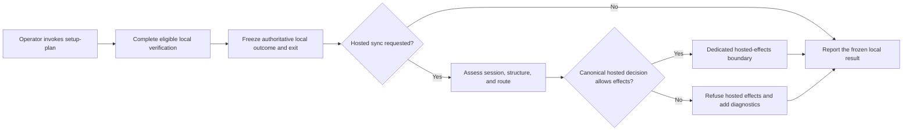

# Mission Specification: Authoritative local setup-plan with isolated hosted effects

**Mission Branch**: `fix/setup-plan-auth-diagnostics-nonfatal`  
**Created**: 2026-08-23  
**Status**: Accepted — implementation complete; WP01–WP04 merged to `fix/setup-plan-auth-diagnostics-nonfatal`
**Input**: [GitHub issue #3621](https://github.com/Priivacy-ai/spec-kitty/issues/3621)

## Context and Intent

`setup-plan` verifies local Mission artifacts, but today it can refuse that local work
because authentication, synchronization routing, or structural hosted-sync safety is
not ready. Those signals answer whether hosted delivery is permissible; they do not
determine whether a local specification or plan is complete.

This Mission makes the local verification result authoritative and fixes the ordering:
eligible local verification finishes and its outcome is frozen before any hosted
readiness assessment or hosted side effect is attempted. Hosted-readiness checks still
fail closed for hosted delivery, but they become separate, structured diagnostics that
cannot replace or prevent the frozen local result.

Authentication remains a Boolean fact only when evaluation succeeds: a usable session
means authenticated and no usable session means logged out. Evaluation itself can fail;
that failure is separate operational evidence, not a third authentication state. Queue
scope remains delivery-routing metadata and is never treated as proof of login.

The prose requirements and acceptance scenarios below are authoritative; the diagram
only illustrates their separation.

## User Scenarios & Testing *(mandatory)*

### User Story 1 - Always obtain the local verification result (Priority: P1)

An operator runs `setup-plan` while hosted synchronization is unavailable or unsafe.
The command still resolves and verifies the local Mission, and that local result alone
determines the command's primary status and process exit.

**Why this priority**: The reported defect prevents the planning workflow itself even
though the requested verification is local.

**Independent Test**: Run `setup-plan` over each established local outcome while
hosted readiness is refused; compare the primary result fields and exit code with the
same invocation under safe hosted conditions.

**Acceptance Scenarios**:

1. **Given** a substantive complete plan and any authentication or boundary state,
   **When** `setup-plan` runs, **Then** it reports the established complete local result
   and exits 0.
2. **Given** a pristine scaffold, an insufficient plan, or a non-substantive spec,
   **When** hosted delivery is refused, **Then** the established local classification,
   reason, and exit remain unchanged.
3. **Given** a missing spec, template configuration error, or other local command error,
   **When** hosted readiness also has a diagnostic, **Then** the local error remains the
   primary result and controls the exit.
4. **Given** repository and Mission context have been established, **When** any eligible
   success, blocked, or error outcome is reached, **Then** that complete local payload
   and exit are frozen before hosted evidence is acquired.

---

### User Story 2 - Receive truthful hosted-auth diagnostics (Priority: P1)

An operator either has a usable canonical session or is conclusively logged out. The
attempt to determine that fact can also fail because encrypted session material could
not be read or evaluated. `setup-plan` reports those outcomes truthfully and never turns
an assessment failure—or queue-routing metadata—into an authentication state.

**Why this priority**: Collapsing an unreadable credential store into “logged out” gives
incorrect remediation and hides the actual operational failure.

**Independent Test**: Exercise the supported local session authority with a usable
session, an absent session, and an unreadable session store; verify usable-session,
logged-out, and assessment-failed outcomes without network or queue-scope access.

**Acceptance Scenarios**:

1. **Given** an encrypted session with a usable refresh token and an expired access
   token, **When** no queue scope exists, **Then** `setup-plan` treats the operator as
   authenticated and emits no unauthenticated warning.
2. **Given** the session store is read successfully and contains no usable session,
   **When** SaaS sync is enabled, **Then** local verification completes and exactly one
   `SAAS_SYNC_UNAUTHENTICATED` warning is reported.
3. **Given** session storage, decryption, parsing, or session evaluation fails, **When**
   SaaS sync is enabled, **Then** local verification completes and exactly one
   `SAAS_SYNC_AUTH_UNKNOWN` warning is reported, never an unauthenticated warning.
4. **Given** SaaS sync is disabled, **When** `setup-plan` runs, **Then** it does not
   evaluate or report hosted authentication readiness.

---

### User Story 3 - Refuse every unsafe hosted effect (Priority: P1)

An operator runs `setup-plan` on a host whose synchronization boundary is incoherent or
cannot be evaluated. Local files, verification, commits, and lifecycle history proceed;
all hosted enqueue, upload, publication, and delivery effects are refused.

**Why this priority**: A nonfatal command diagnostic must not weaken the structural
safety boundary or permit a hidden outbox write.

**Independent Test**: Cause the structural assessment to return unsafe and to raise an
unexpected exception; in both cases verify that local lifecycle history and the local
result exist while every hosted sink records zero calls.

**Acceptance Scenarios**:

1. **Given** a daemon-owner mismatch, orphan/unreadable owner record, legacy unsafe row,
   or incoherent project store, **When** `setup-plan` runs, **Then** hosted effects are
   refused, `SAAS_SYNC_BOUNDARY_UNSAFE` is reported, and local verification completes.
2. **Given** structural assessment itself raises, **When** `setup-plan` runs, **Then**
   the failure is converted to `SAAS_SYNC_BOUNDARY_UNSAFE`, hosted effects remain
   refused, and local verification completes.
3. **Given** hosted effects are refused, **When** phase events are recorded, **Then**
   local lifecycle JSONL is persisted but no offline queue, body-upload queue, dossier
   publication, daemon publication, dashboard sync, or direct hosted delivery occurs.
4. **Given** authentication and structural problems coexist, **When** results are
   reported, **Then** both diagnostics remain separate in deterministic order.

---

### User Story 4 - Preserve automation and operator contracts (Priority: P2)

Automation receives one parseable result envelope, while interactive operators receive
the same warning severity and primary local result in human-readable form.

**Why this priority**: The corrected safety model must remain scriptable and must not
introduce multiple JSON documents or ambiguous exits.

**Independent Test**: Cross the local-outcome matrix with authentication and structural
states in JSON and representative human-output cases.

**Acceptance Scenarios**:

1. **Given** one or more hosted-delivery problems, **When** JSON output is requested,
   **Then** exactly one JSON document contains the unchanged local result plus an ordered
   `warnings` collection.
2. **Given** the same invocation in human mode, **When** it completes, **Then** warnings
   are visibly nonfatal and the normal local result is still rendered.
3. **Given** a local-only sibling Mission command governed by the logged-out Teamspace
   policy, **When** its policy is compared with `setup-plan`, **Then** both distinguish
   local command completion from hosted-delivery readiness.

### Edge Cases

- The encrypted session is absent versus unreadable; these must not collapse.
- The access token is expired while the refresh token remains usable.
- Hot-path session summary loading succeeds but materialization later fails.
- Queue scope is absent, unreadable, or its reader raises; authentication does not
  consult it.
- The repository root cannot be resolved, so structural evidence is not yet available.
- Structural assessment returns a known unsafe result or raises before returning.
- Authentication, boundary, and delivery-route problems coexist.
- The plan is complete, newly scaffolded, insufficient, committed-but-pristine, or
  blocked by the spec gate.
- The spec is missing, template configuration is invalid, or a generic local exception
  occurs.
- SaaS sync is disabled for the invocation.

## Requirements *(mandatory)*

### Functional Requirements

| ID | Title | User Story | Priority | Status |
|----|-------|------------|----------|--------|
| FR-001 | Local verification completes first | As an operator, I want eligible local verification to finish and freeze its outcome before hosted readiness is assessed so planning is not blocked or reclassified by an unrelated delivery condition. | High | Approved |
| FR-002 | Canonical session evaluation evidence | As an operator, I want the supported local session authority to distinguish successful evaluation from evaluation failure and, only after success, report authenticated versus logged out so diagnostics remain truthful without inventing a third auth state. | High | Approved |
| FR-003 | Authentication excludes queue scope | As a maintainer, I want queue scope excluded from authentication classification so routing metadata cannot become a second auth authority. | High | Approved |
| FR-004 | Refresh-capable sessions remain authenticated | As a logged-in operator, I want a usable refresh token to establish local authentication even when the access token is expired. | High | Approved |
| FR-005 | Logged-out warning is nonfatal | As a logged-out operator, I want one `SAAS_SYNC_UNAUTHENTICATED` warning while local verification continues. | High | Approved |
| FR-006 | Assessment failure is distinct | As an operator whose session cannot be evaluated, I want `SAAS_SYNC_AUTH_UNKNOWN` as an assessment-failure diagnostic, never a false logged-out diagnosis. | High | Approved |
| FR-007 | Structural assessment cannot preempt local work | As an operator, I want known unsafe results and unexpected assessment failures converted to hosted diagnostics while local verification continues. | High | Approved |
| FR-008 | One post-verification hosted decision | As a maintainer, I want session evaluation, structural safety, canonical read-only routing, and the SaaS flag composed once after the local outcome is frozen so all hosted effects share one decision. | High | Approved |
| FR-009 | Local lifecycle history is unconditional | As an operator, I want local phase history persisted even when hosted delivery is refused. | High | Approved |
| FR-010 | Every hosted effect crosses one boundary | As a security maintainer, I want one dedicated executor module to own all setup-plan hosted sink imports and refuse every enqueue, upload, publication, and delivery effect unless the exact canonical decision allows it. | High | Approved |
| FR-011 | Local result controls status and exit | As an automation caller, I want the local outcome alone to determine primary result fields and process exit. | High | Approved |
| FR-012 | Structured diagnostics remain separate | As an automation caller, I want stable, ordered diagnostics attached to one result envelope without replacing the local outcome. | High | Approved |
| FR-013 | Human output has warning parity | As an interactive operator, I want human output to communicate the same nonfatal conditions and still render the local result. | Medium | Approved |
| FR-014 | Existing local-result matrix is preserved | As a maintainer, I want every established complete, scaffold, blocked, and error outcome retained under every hosted-readiness state. | High | Approved |
| FR-015 | Named sibling policy parity | As a maintainer, I want `agent mission create` and `setup-plan` documented consistently with the logged-out Teamspace local-command policy. | Medium | Approved |

### Non-Functional Requirements

| ID | Title | Requirement | Category | Priority | Status |
|----|-------|-------------|----------|----------|--------|
| NFR-001 | Full outcome-matrix fidelity | 100% of covered auth/boundary variants preserve the baseline local result fields and exit code. | Reliability | High | Approved |
| NFR-002 | Zero false auth warnings | Every supported usable-session fixture emits zero `SAAS_SYNC_UNAUTHENTICATED` warnings. | Correctness | High | Approved |
| NFR-003 | Diagnostic deduplication | Each diagnostic code occurs at most once per invocation; ordering is authentication, structural, then routing. | Interoperability | High | Approved |
| NFR-004 | One structured document | 100% of JSON-mode cases emit exactly one parseable JSON document. | Interoperability | High | Approved |
| NFR-005 | Zero denied hosted calls | Every refused-decision test records zero calls to all enumerated hosted sinks while proving local lifecycle persistence occurred; an architectural gate enforces that no setup-plan module outside the dedicated boundary can import or name those sinks. | Data integrity | High | Approved |
| NFR-006 | No-raise local assessment | 100% of injected auth and structural evaluation failures return a local outcome plus a structured warning rather than an assessment-derived command exit. | Reliability | High | Approved |
| NFR-007 | Performance compatibility | Local auth assessment performs no network I/O and coherent structural assessment stays within the existing 100 ms budget. | Performance | Medium | Approved |
| NFR-008 | Read-surface compatibility | Targeted setup-plan read-surface, branch, metadata, template, and documentation-wiring regressions report zero new failures. | Compatibility | High | Approved |

### Constraints

| ID | Title | Constraint | Category | Priority | Status |
|----|-------|------------|----------|----------|--------|
| C-001 | No general token-expiry UX | This Mission does not add general access-token expiry warnings or re-login workflows. | Scope | High | Approved |
| C-002 | No network auth probe | Authentication classification is entirely local and performs no refresh or SaaS request. | Security | High | Approved |
| C-003 | No strict-sync option | This Mission does not add `--require-sync` or another mode that makes hosted readiness control local verification. | Scope | Medium | Approved |
| C-004 | Queue scope remains routing metadata | Queue scope is not redefined, migrated, or consulted as authentication evidence. | Domain integrity | High | Approved |
| C-005 | Hosted-only commands remain strict | `sync now` and other hosted-only entry points retain their existing refusal and preflight severity. | Compatibility | High | Approved |
| C-006 | Missing affirmative evidence never authorizes hosted effects | Failed auth assessment or unknown boundary/route evidence is insufficient permission for hosted delivery. | Data integrity | High | Approved |
| C-007 | No credential disclosure | Diagnostics contain no tokens, session contents, encryption details, or other credential material. | Security | High | Approved |
| C-008 | No sync-store migration | Queue placement, project-store layout, consent, and delivery-route semantics are unchanged. | Scope | High | Approved |
| C-009 | Release dependency remains external | Mission acceptance must record issue #3127 as fixed or deferred-with-followup; an unresolved #3127 blocks release-readiness declaration but is not an implementation-lane or Mission-completion dependency. | Coordination | High | Approved |
| C-010 | Canonical routing authority | Hosted route availability is read only through `resolve_checkout_sync_routing_readonly()` and is affirmative only when it returns routing with a non-empty project UUID and `effective_sync_enabled=true`. | Domain integrity | High | Approved |

### Key Entities

- **Session Evaluation Evidence**: Invocation-local evidence with two separate facts:
  whether local evaluation completed and, only if it did, the Boolean authenticated
  verdict derived from usable-session presence. Evaluation failure is an operational
  diagnostic, not an authentication state.
- **Local Verification Outcome**: The authoritative result, phase-completeness data,
  local error or blocked reason, and process exit produced by setup-plan's local work.
- **Hosted-Delivery Diagnostic**: Stable-coded warning describing why a hosted effect
  was refused; command severity and hosted disposition remain distinct.
- **Hosted-Delivery Decision**: Invocation-local permission issued only after the local
  outcome is frozen. It may allow hosted effects only when every required signal is
  affirmatively safe, and value-equivalent reconstructions do not carry authority.
- **Hosted-Effects Boundary**: The sole setup-plan module permitted to import and invoke
  physical hosted sinks. It revalidates the exact canonical decision immediately before
  effects and accepts only inert local intents from the command orchestrator.
- **Lifecycle Event Intent**: A locally persisted event envelope that may be offered to
  hosted fan-out only after the hosted-delivery decision allows it.

## Success Criteria *(mandatory)*

### Measurable Outcomes

- **SC-001**: Every row of the established local-outcome matrix returns identical
  primary fields and exit code across usable-session, logged-out, auth-assessment-failed,
  boundary-unsafe, and boundary-exception variants.
- **SC-002**: A real encrypted refresh-capable session without queue scope produces
  zero false unauthenticated warnings through the real setup-plan entry point.
- **SC-003**: A real unreadable encrypted-session fixture produces exactly one
  `SAAS_SYNC_AUTH_UNKNOWN` warning and zero unauthenticated warnings.
- **SC-004**: All known structural classes and an injected structural exception refuse
  hosted effects while returning the independently computed local result.
- **SC-005**: Every refused-decision acceptance test writes local lifecycle history and
  records zero hosted sink calls.
- **SC-006**: JSON and human outputs preserve local-result authority and communicate
  matching warning severity.
- **SC-007**: Targeted auth, lifecycle, sync-boundary, setup-plan read-surface, and
  architectural gates pass with no new failures.
- **SC-008**: Mission acceptance records issue #3127 with a terminal fixed or
  deferred-with-followup verdict; release readiness is not declared while #3127 remains
  unresolved.
