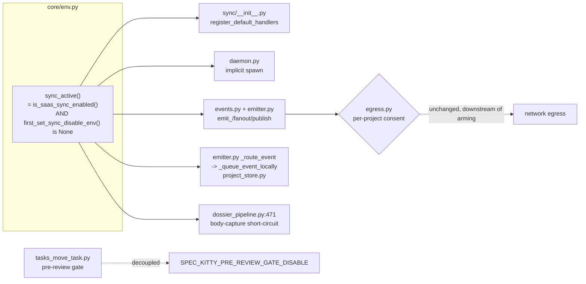

# Implementation Plan: Sync Deactivated By Default

**Branch**: `spike/3799-sync-deactivation-3798-accept-hermetic` | **Date**: 2026-08-29 | **Spec**: [spec.md](./spec.md)
**Input**: Feature specification from `kitty-specs/sync-deactivate-by-default-01M16M1P/spec.md`

## Summary

Make the legacy local-sync surface **inactive by default** ahead of the SaaS redesign, reusing the existing environment toggles. The technical spine is a **single canonical arming predicate `sync_active()`** in `src/specify_cli/core/saas_sync_config.py` (see BINDING corrections — an import cycle rules out `env.py`) that **replaces** the scattered `is_saas_sync_enabled()` / disable-var checks at the daemon, emission, registration, local-capture, and body-capture sites. `sync_active()` is machine-level *arming* and is strictly upstream of — never a replacement for — the per-project egress *consent* gate (`sync/egress.py`). Two folded fixes ride along: #3470 (the body-outbox `RuntimeError` traceback, re-keyed onto sync-inactive so it fires on a bare install) and #2801 (the pre-review regression gate is cleanly cut off the shared sync toggles onto its own dedicated env). The test surface is deactivated via module-level `skipif` (not the quarantine marker), the suite conftest is de-masked so the default-off path is actually exercised, and a file-count census plus updated arch guards lock the new contract in.

## Technical Context

**Language/Version**: Python 3.11+
**Primary Dependencies**: typer, rich (CLI); pytest, pytest-xdist, mypy, ruff (dev). No new runtime dependency is added or removed by this mission.
**Storage**: N/A (sync-enabled state is environment-only — no config/meta field — confirming no migration is required).
**Testing**: pytest (markers: `fast`/`integration`/`unit`/`git_repo` lanes; xdist `--dist loadfile`; real-port/daemon serial `-n0`).
**Target Platform**: Linux/macOS dev + CI (Python CLI).
**Project Type**: single (Python package `src/specify_cli/` + `src/runtime/` + `src/doctrine/`).
**Performance Goals**: default path adds **0** daemon processes and **0** network egress; no measurable import-time regression.
**Constraints**: reuse only `SPEC_KITTY_SYNC_DISABLE` / `SPEC_KITTY_SYNC_MINIMAL_IMPORT` / `SPEC_KITTY_ENABLE_SAAS_SYNC` (no new *sync* flag); complexity ceiling 15 (ruff C901 / Sonar S3776); no net-new `# noqa` / `# type: ignore`; new branches/helpers need focused tests in the same WP.
**Scale/Scope**: ~15 code sites gated through one seam; ~200+ sync-coupled test files gated via bulk edit; ~10 docs updated.

## Constitution / Charter Check

*GATE: Must pass before Phase 0 research. Re-check after Phase 1 design.*

- **DIR-034 test-first / ATDD-first**: every WP lands a red acceptance/unit test first, then code. The seam and each gated site get a focused test. **PASS (planned).**
- **DIR-043 close-defect-class-by-construction**: the single `sync_active()` seam closes the "some sites gated, some not" defect class (the current asymmetry where `SYNC_DISABLE` doesn't stop registration). **PASS.**
- **DIR-044 canonical-sources-and-unification**: one predicate replaces scattered checks — unification, not a parallel gate. **PASS.**
- **DIR-024 locality-of-change / DIR-025 boy-scout**: gating is local per site; the bulk-edit test marker is mechanical and mapped. **PASS.**
- **DIR-037 living-documentation**: FR-017/FR-018 update docs + CHANGELOG + doctor advisory in-mission. **PASS (planned).**
- **DIR-035 bulk-edit-occurrence-classification**: `change_mode: bulk_edit`; `occurrence_map.yaml` produced this phase. **PASS.**
- **DIR-030 test-and-typecheck-quality-gate**: ruff + mypy clean, complexity ≤15. **PASS (planned).**
- **C-007 (spec) arming≠consent**: seam must not touch `egress.py` consent semantics. Encoded as a design constraint + a guard test. **PASS.**
- **Terminology Canon**: "Mission" not "feature"; no `feature*` aliases introduced. **PASS.**

No charter violations. No Complexity Tracking entries required.

## Architecture

### The seam



**Key decisions** (full rationale in `research.md`):
1. **Single predicate, replace not stack.** `sync_active()` replaces `is_saas_sync_enabled()` at `daemon.py:1154/1131`, `events.py:109/182`, and gates the currently-ungated registration (`sync/__init__.py:455/458`) and local-capture (`emitter.py:2648`). Prevents the precedence drift the post-spec architect lens flagged (some sites "disable-wins", others not).
2. **Arming ≠ consent (C-007).** `sync_active()` sits *above* `egress.py` consent (`egress.py:55-70`). When armed, egress still defers to per-project consent. The seam never weakens or bypasses consent.
3. **#3470 keyed on inactive, before enqueue (FR-007/FR-008).** Short-circuit `trigger_feature_dossier_sync_if_enabled` (`dossier_pipeline.py:471`) on `not sync_active()`. Keyed on inactive (not the disable vars, which never fire on a bare install). It is a gated early-return, NOT a `try/except` widen — so when active a real `_require_project_destination` violation (`body_queue.py:106`) still surfaces. `_require_project_destination` itself is untouched (C-003).
4. **#2801 clean-cut (FR-009).** `tasks_move_task.py:993` reads only a new `SPEC_KITTY_PRE_REVIEW_GATE_DISABLE`; drops `first_set_sync_disable_env()`. This is the ONLY behavioral non-daemon consumer of the sync toggles besides the (redundant) daemon skip, so the cut is safe. Tests rewritten.
5. **Test de-masking (FR-010).** `tests/conftest.py:223` `setdefault ENABLE_SAAS_SYNC=1` + `:427` autouse currently force the whole suite opt-in ON — which would make every `skipif` inert. Invert to default-off; add `sync_enabled` / `sync_disabled` fixtures; add ONE CI job that runs `tests/sync/` with the opt-in set, keeping the existing lane markers so the collection-completeness gate still selects the files.

### Blast-radius verified (post-spec squad)
- `first_set_sync_disable_env()` / `SYNC_DISABLE_ENV_VARS` behavioral consumers in `src/`: only `daemon.py:1131` and `tasks_move_task.py:993`. Name-only enumerators (`secret_redaction.py:36`, migration `m_3_2_8:135`, isolation fixtures) do not gate behavior → clean-cut safe.
- Emission entrypoints beyond the 4 named hooks: merge, doctor, dashboard, next, finalize, retrospective, init, tracker — all reach the emitter; gating the seam + registration + local-capture covers them.

## Project Structure

### Documentation (this mission)

```
kitty-specs/sync-deactivate-by-default-01M16M1P/
├── plan.md              # This file
├── research.md          # Phase 0 — seam decision + adversarial evidence
├── data-model.md        # Phase 1 — arming state machine + toggle truth table
├── quickstart.md        # Phase 1 — how to verify default-off / opt-in
├── contracts/           # Phase 1 — sync_active, pre-review-gate-env, no-op-emission contracts
├── occurrence_map.yaml  # Bulk-edit classification (DIR-035)
└── tasks.md             # Phase 2 (/spec-kitty.tasks — NOT created here)
```

### Source Code (repository root)

```
src/specify_cli/
├── core/
│   ├── env.py                 # first_set_sync_disable_env() (consumed by seam)
│   └── saas_sync_config.py    # sync_active() — NEW canonical seam + is_saas_sync_enabled()
├── sync/
│   ├── __init__.py            # register_default_handlers — gate on seam
│   ├── daemon.py              # implicit spawn — route through seam (replace)
│   ├── events.py              # emit_/publish — route through seam (replace)
│   ├── emitter.py             # _route_event/_queue_event_locally — gate local-capture
│   ├── project_store.py       # locked-store warning origin (silenced via seam)
│   ├── dossier_pipeline.py    # :471 body-capture short-circuit (#3470)
│   └── egress.py              # per-project consent — UNCHANGED (C-007)
└── cli/commands/agent/
    └── tasks_move_task.py     # pre-review gate — clean-cut onto own env (#2801)

tests/
├── sync/, specify_cli/sync/               # skipif-gated (bulk)
├── delivery/, status/, dossier/, stress/  # scattered coupled clusters — gated
├── cli/commands/test_sync_*.py            # gated
├── review/test_pre_review_gate_*.py       # REWRITTEN to new env
├── integration/test_offline_queue_overflow.py
├── architectural/                         # census + guards updated to no-op contract
└── conftest.py                            # de-masked; sync_enabled/sync_disabled fixtures
```

**Structure Decision**: single Python package; all changes are localized to `core/env.py` (the seam), the `sync/` package sites, one CLI command, the test tree, docs, and CI config. No new package or module boundary is introduced.

## Parallel Work Analysis

### Dependency Graph

```
WP01 sync_active() seam + #2801 clean-cut (FR-002, FR-009, C-007, C-008)   [FOUNDATION — blocks all]
        │
        ├── WP02 gate registration + daemon + all emission + local-capture (FR-003/004/005/006, FR-015)
        │        └── WP03 #3470 body-capture short-circuit + anti-swallow (FR-007/008, C-003)
        │
        └── WP04 conftest de-mask + fixtures + CI opt-in job (FR-010)   [blocks all test WPs]
                 ├── WP05 skipif-gate tests/sync + specify_cli/sync + scattered clusters + #2809 (FR-011/012)
                 ├── WP06 file-count census (FR-013)
                 └── WP07 arch guards + PR#3570 goldens to no-op contract (FR-014)
        │
        └── WP08 docs + CHANGELOG + doctor advisory (FR-017/018)   [after code settles]
```

### Work Distribution
- **Sequential (foundation)**: WP01 must land first — it introduces `sync_active()` and the #2801 cut that everything keys on. It is the hard prerequisite the operator flagged.
- **Then two streams**: the **code stream** (WP02→WP03) and the **test stream** (WP04→{WP05,WP06,WP07}) can proceed largely in parallel after WP01, but both edit-heavy streams touch overlapping files (`sync/*`), so serialize WP02→WP03. WP04 gates the test WPs.
- **Docs (WP08)** lands last, once behavior is settled.
- **Agent assignment**: all WPs `python-pedro`, `code_change`. WP05 is the bulk-edit marker rollout — occurrence-map-driven.

### Coordination Points
- After WP01: verify `sync_active()` truth table (unit) before gating sites.
- After WP04: verify the suite default-off actually skips one sync module before the full bulk rollout in WP05.
- Bulk-edit gate (DIR-035): WP05 diff must comply with `occurrence_map.yaml`.

## Complexity Tracking

*No Constitution violations — table intentionally empty.*

## Risks

| Risk | Mitigation |
|------|------------|
| Gating registration couples ~19 co-gate tests to the conftest env | WP04 fixtures exercise both paths; late-bind seam (C-006) preserved. |
| Silencing #3470 could swallow real errors when active | FR-008 + SC-005 anti-swallow test; gated early-return, not try/except. |
| Bulk skipif rollout hides un-skipping / deletion | FR-013 file-count census fails on both. |
| PR#3570 goldens (`test_sync_cli_safe`) assume sync CLI shape | WP07 updates goldens to the deactivated no-op contract, not skip. |
| Missing an emission entrypoint leaves residual noise | Single seam + local-capture gate covers all emitter paths; NFR-001 spies assert seam-not-reached across 9 surfaces. |

---

## Post-plan squad corrections (BINDING — authoritative over the sketch above)

3-lens post-plan squad (implementability / test-concreteness / coverage-CI) verified the design against current code. These corrections are binding for `/spec-kitty.tasks`:

### Seam mechanics
1. **`sync_active()` lives in `core/saas_sync_config.py`, not `core/env.py`** — real import cycle (`saas_sync_config` imports `is_truthy` from `env`). (contract updated.)
2. **Emission seam is `emitter._emit` (top, after envelope construction), returning the envelope** — NOT `_route_event`. The direct `get_emitter().emit_*()` path (`init.py:151`, merge, etc.) flows `_emit → _capture_to_journal (~2280) / missing-uuid branch (~2308) → _queue_event_locally (2651)`, all of which bypass `_route_event`. Gate at `_emit` so all paths are covered; return the constructed envelope so `tests/contract/test_event_envelope.py` + siblings (`test_machine_facing_canonical_fields`, `test_handoff_fixtures`, `test_identity_contract_matrix`) stay green while enqueue/persist/warn are skipped.
3. **Registration gate is CALL-TIME** (guard the body of `register_default_handlers`), not import-time — preserves the late-bind seam (C-006); tests re-call it after toggling env.
4. Confirmed sites: `first_set_sync_disable_env()` core/env.py:73; `is_saas_sync_enabled()` saas_sync_config.py:37; events.py:109/182 are machine-arming (real egress refusal is in `SyncRuntime.publish_event`, so `sync_active()` is strictly stricter — INV-2 holds); pre-review gate `tasks_move_task.py:993` (sole use, import :120) → clean removal.

### Test recipes (chicken-and-egg — capture baselines in WP01)
5. **Freeze in WP01, before any skipif or conftest flip:** (a) the `--collect-only` non-skipped node-ID baseline for `tests/sync` + `tests/specify_cli/sync` (NFR-004 — today's HEAD *is* the opt-in baseline because conftest forces the flag ON; once WP05 lands it's gone); (b) the FR-013 census as a **frozen sorted SET of skipif-carrying file paths** (not a count — a rename would mask a deletion); `live_set == FROZEN_SET` reds on both deletion and un-skip. Reuse the shapes in `test_ci_collection_completeness.py` / `_gate_coverage.py` and `test_sync_env_census.py`.
6. **SC-001/NFR-001 spies reuse** `test_emitter_observability.py:135/157/224/252` (`monkeypatch.setattr(emitter,"_queue_event_locally",_boom)`) and `test_dossier_pipeline.py:203-468` (`assert_not_called`). Assert-not-called on `_queue_event_locally`, `register_default_handlers`, `trigger_feature_dossier_sync_if_enabled`, and the (to-be-named) implicit daemon-spawn fn at daemon.py:1131/1154 (no existing spy — name it in the WP).
7. **SC-005 anti-swallow** uses the LEGACY fixture at `test_body_integration.py:46-65`; `_require_project_destination` is `body_queue.py:104`. Assert the error surfaces via `DossierSyncResult.errors`/log (the function is contractually "never raises"), NOT a raised exception.

### Conftest de-masking (FR-010) — 98-file blast radius
8. **Collection-time opt-in is a CI-job ENV var, not a fixture** (fixtures run too late for collection-time `skipif` — the #3213 lesson behind conftest:223). Add `env: SPEC_KITTY_ENABLE_SAAS_SYNC: "1"` to the existing `fast-tests-sync` step (`.github/workflows/ci-quality.yml:1135`, job ~:1108); a new opt-in job needs `github.event_name=='push'` in its `if` to count toward the completeness gate.
9. **~60 NON-sync files** read the flag but rely on the autouse (`conftest.py:427`) and get NO skipif — they must move onto a new `sync_enabled` fixture (call-time) or they silently change/red when the default flips: clusters auth(4), readiness(2), saas(2), cli/commands(11), specify_cli/cli/commands/agent(10)+/commands(5), architectural(3), docs(2), integration/e2e(2 each). 20 of these use the `sync_module.` late-bind co-gate (C-006) and must keep working via the fixture.

### Arch guards (FR-014) — two FIGHT default-off
10. `test_saas_sync_gate_selection_invariance.py::test_flag_is_set_at_collection_time (:45)` asserts the enable flag `=="1"` collection-wide → **rewrite to the default-unset contract**.
11. `test_sync_writer_census.py (:804 census-cannot-grow)` — `sync_active()` is a new decision/grant path → update the census. `test_sync_env_census.py` — add the new `SPEC_KITTY_PRE_REVIEW_GATE_DISABLE` literal to the frozen set. `test_sync_cli_safe.py` golden self-pins enable=1 (stays green) → **add an inactive-path arm** per FR-014. `test_egress_consent_boundary` / `test_sync_no_early_bind` / `test_sync_two_authority` are neutral.

### Docs (FR-017) — additions the glob missed
12. Add: `docs/api/skills/spk-run-implement-review.md:44-45` (documents `SPEC_KITTY_SYNC_DISABLE` as the pre-review-gate disable — #2801 makes it wrong → `SPEC_KITTY_PRE_REVIEW_GATE_DISABLE`); `docs/plans/code-quality/sync-env-census.md` (companion to the env-census guard); the egress-consent ADR (filename lacks "sync" so the `*sync*` glob misses it).

### WP dependency-graph correction
13. Add edges **WP05→WP02** and **WP07→WP02** (skipif rollout and arch-guard updates both validate WP02's gating). WP01 remains the sole unblocker; WP02→WP03 serialize (shared `sync/*` files).
