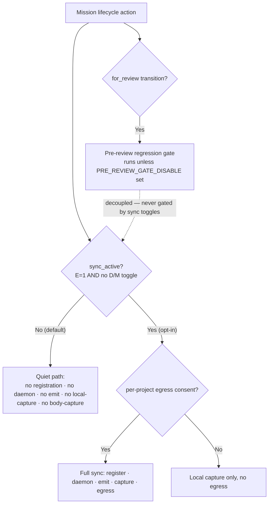

# Mission Specification: Sync Deactivated By Default

**Mission Branch**: `spike/3799-sync-deactivation-3798-accept-hermetic`
**Created**: 2026-08-29
**Status**: Draft (post-spec squad folded)
**Input**: Issue #3799 (P1, milestone 3.2.6, epic #3801) — deactivate the sync module and its tests by default ahead of the SaaS redesign, reusing the existing toggles. Grounded by a 5-lens research squad and a 3-lens post-spec adversarial squad (`scratchpad/grounding-brief-3798-3799.md`, `scratchpad/postspec-CONSOLIDATED.md`).

## Purpose

The legacy local-sync surface (`src/specify_cli/sync/`, the sync daemon, the emitter, the offline/body-outbox queue, history-import) is slated for **replacement** by the SaaS redesign. Its ongoing cost — a bug backlog, CI/test friction, and local-dev noise (stray daemons, `project sync store is locked` warnings, and body-outbox tracebacks) — is no longer worth carrying on a module about to be superseded. This mission makes **deactivation the default/clean state** so a bare install is quiet, while leaving the surface intact and re-enablable for anyone who opts in.

## User Scenarios & Testing *(mandatory)*

### User Story 1 - A bare install runs quietly (Priority: P1)

A developer or CI job runs spec-kitty on a fresh install and has **not** opted into SaaS sync. Every mission lifecycle action they take completes cleanly — no background daemon is started, no events are emitted, and no traceback, `RuntimeError`, or `project sync store is locked` / `Event routing failed` warning is printed to their terminal or logs.

**Why this priority**: This is the mission's core outcome — the operator decision that motivated #3799. Everything else exists to make this outcome safe and durable.

**Independent Test**: On a checkout with no `SPEC_KITTY_ENABLE_SAAS_SYNC`, run `create`, `mark-status`, `move-task`, `issue-verdict`, `accept`, `implement`; assert exit success, and — via spies on the arming seam — that the daemon-spawn and event-enqueue code paths are **never reached** (not merely that no traceback text appears).

**Acceptance Scenarios**:

1. **Given** a bare install with no sync opt-in, **When** the developer runs `mark-status`, `move-task`, or `issue-verdict` on a LEGACY-layout repo, **Then** the command succeeds and prints **no** body-outbox `RuntimeError` traceback (the #3470 defect is gone on the *default* path, where no disable var is set).
2. **Given** a bare install, **When** the developer runs `mission create` (or any action that emits), **Then** no `project sync store is locked` / `Event routing failed` warning is printed — the emitter's local-capture path is inactive.
3. **Given** a bare install, **When** the developer runs any of `create` / `accept` / `implement` / `merge` / `doctor` / `next`, **Then** no sync daemon process is spawned and no events are enqueued.

---

### User Story 2 - The pre-review regression gate survives deactivation (Priority: P1)

A developer moves a work package to `for_review` on a bare install. The pre-review regression gate that guards that transition **still runs** — deactivating sync must not silently switch it off, because it currently rides the same environment toggles.

**Why this priority**: The load-bearing safety invariant (#2801). Deactivating sync via the shared toggles would otherwise silently disable a correctness gate on every install.

**Independent Test**: On a bare install (sync inactive), run `move-task --to for_review` with a deliberately failing gate condition; assert the transition is **blocked** by the gate. Separately, set only `SPEC_KITTY_PRE_REVIEW_GATE_DISABLE` and assert the gate — and *only* the gate — is skipped; assert the sync toggles have no effect on the gate either way.

**Acceptance Scenarios**:

1. **Given** sync is inactive by default, **When** a WP with a failing gate condition is moved to `for_review`, **Then** the pre-review regression gate **blocks** the transition (it is not disabled as a side effect of sync deactivation).
2. **Given** a developer sets `SPEC_KITTY_PRE_REVIEW_GATE_DISABLE`, **When** they move a WP to `for_review`, **Then** the gate is skipped; and setting/unsetting the sync toggles changes nothing about the gate.

---

### User Story 3 - The sync test suite does not red on the default path (Priority: P2)

A contributor runs the test suite on a clean checkout without opting into sync. The sync-specific tests are **skipped, not failed**, and CI's collection-completeness gate stays green because every sync test file is still selected by a push-path job.

**Why this priority**: Contributor friction and false red-main signals are a primary cost cited in #3799. Quarantine must respect the repo's completeness-gate conventions or it trades one red for another.

**Independent Test**: With the suite's default-off posture (conftest de-masked), run over `tests/sync/`; assert `skipped` (not `failed`). Run the CI collection-completeness gate; assert green. Run the quarantine-visibility job; assert it re-runs none of the deactivated tests. Run the file-count census; assert it matches.

**Acceptance Scenarios**:

1. **Given** no sync opt-in (suite default-off), **When** the sync test suites are collected, **Then** they are skipped at module level with zero failures.
2. **Given** the sync tests are gated off, **When** the CI collection-completeness gate runs, **Then** it stays green (every sync test file is still selected by a push job) and the checked-in file-count census matches (so deletion **and** silent un-skipping both fail).
3. **Given** `SPEC_KITTY_ENABLE_SAAS_SYNC=1`, **When** the sync suites are collected, **Then** the set of selected non-skipped node-IDs matches the pre-mission baseline (opt-in parity, no net coverage loss).

---

### Edge Cases

- **Conflicting toggles**: precedence is `sync_active = ENABLE_SAAS_SYNC AND NOT (SYNC_DISABLE OR SYNC_MINIMAL_IMPORT)`. Any disable/minimal-import toggle **wins** (fail-safe toward quiet), even with the opt-in set. See the truth table under Requirements.
- **Pre-existing running daemon**: deactivation prevents *implicit* daemon spawn but does not kill a daemon left running by a prior opted-in session; documented (doctor advisory + orphan-cleanup hint), not in scope to terminate.
- **LEGACY-layout host**: the body-outbox capture path must be silent on the default (sync-inactive) path regardless of layout mode — this is exactly where #3470 fired.
- **Sync active + genuine destination violation**: when `SPEC_KITTY_ENABLE_SAAS_SYNC=1`, a real `_require_project_destination` violation must still **surface** — the #3470 fix must not become a blanket swallow that hides real errors when sync is on.
- **Late-bind seam**: gating must preserve the `sync_module.<name>` late-bind seam so the existing monkeypatch co-gate tests stay valid.

## Requirements *(mandatory)*

### Functional Requirements

| ID | Title | User Story | Priority | Status |
|----|-------|------------|----------|--------|
| FR-001 | Sync inactive by default (opt-in-to-enable) | As a developer, I want sync inactive unless I set `SPEC_KITTY_ENABLE_SAAS_SYNC=1`, so a bare install does nothing sync-related. | High | Open |
| FR-002 | Single canonical `sync_active()` seam | As a maintainer, I want one arming predicate `sync_active() = is_saas_sync_enabled() AND no sync-disable/minimal-import toggle set` that **replaces** the scattered `is_saas_sync_enabled()` checks (daemon, emission), so precedence is consistent and disable-wins is structural. | High | Open |
| FR-003 | Gate handler registration on the seam | As a maintainer, I want event-handler registration keyed on `sync_active()` (closing the asymmetry where `SPEC_KITTY_SYNC_DISABLE` alone does not stop registration), so no fan-out handlers register on the default path. | High | Open |
| FR-004 | No implicit daemon spawn when inactive | As a developer, I want no sync daemon spawned when inactive; scope this as verify-and-canonicalize through the seam (spawn is already rollout-gated). | High | Open |
| FR-005 | All emission/fanout entrypoints no-op when inactive | As a developer, I want **every** `emit_*` / fanout / daemon-publish entrypoint to no-op when inactive — not just the 4 named hooks, but also merge, doctor, dashboard, next, finalize, retrospective, init, and tracker emission — so no events are produced anywhere. | High | Open |
| FR-006 | Silence the emitter local-capture path | As a developer, I want the emitter's local-capture path (`_route_event` → `_queue_event_locally` → project store) gated on `sync_active()`, so the `project sync store is locked` / `Event routing failed` warning is silent when inactive. (This path is deliberately not SaaS-consent-gated — #1072 — so it needs its own arming gate.) | High | Open |
| FR-007 | Silence the #3470 body-outbox traceback | As a developer, I want the dossier body-capture short-circuited **before enqueue** when `not sync_active()` — keyed on sync-inactive, NOT on the disable vars alone (those never fire on a bare install) — so no body-outbox `RuntimeError` traceback prints. | High | Open |
| FR-008 | Anti-swallow: real errors surface when active | As a maintainer, I want the #3470 fix to be a gated short-circuit, not a broad `try/except`, so that when `SPEC_KITTY_ENABLE_SAAS_SYNC=1` a genuine `_require_project_destination` violation still surfaces. | High | Open |
| FR-009 | Decouple the pre-review gate (#2801 clean-cut) | As a maintainer, I want the pre-review gate to read only `SPEC_KITTY_PRE_REVIEW_GATE_DISABLE` and stop honoring the sync toggles entirely, and its tests (`tests/review/test_pre_review_gate_*.py`) rewritten to the new env, so deactivating sync never disables the gate. | High | Open |
| FR-010 | Skip sync tests on the default path + de-mask conftest | As a contributor, I want the sync test modules gated with module-level `skipif` on the opt-in, AND the conftest force-opt-in removed/inverted (`tests/conftest.py:223` setdefault + `:427` autouse) with `sync_enabled`/`sync_disabled` fixtures and one CI opt-in job, so the tests actually skip on the default path while both paths remain exercisable. | High | Open |
| FR-011 | Extend gating to scattered sync-coupled tests | As a maintainer, I want the gating extended beyond `tests/sync/` + `tests/specify_cli/sync/` to the coupled clusters (`tests/delivery/`, `tests/cli/commands/test_sync_*`, `tests/status/` fanout, `tests/dossier/test_snapshot_emit.py`, `tests/stress/test_concurrent_emits.py`, `tests/integration/test_offline_queue_overflow.py`), so none of them red on the default path. | High | Open |
| FR-012 | Fold #2809's two named tests | As a maintainer, I want `test_daemon_sync_disable_env.py::test_sync_disable_env_skips_daemon_spawn` and `test_strict_json_stdout.py::test_mission_create_json_strict_when_sync_skips_ingress` folded into the gating so they stop redding on the default path. | Medium | Open |
| FR-013 | Sync test file-count census | As a maintainer, I want a checked-in census of the gated sync-test files so that both silent deletion and silent un-skipping fail a test — closing the "deleted test = 0 failures = green" loophole. | Medium | Open |
| FR-014 | Update meta arch guards + PR#3570 goldens to the default-off contract | As a maintainer, I want `test_sync_env_census`, `test_sync_writer_census`, `test_saas_sync_gate_selection_invariance`, `test_egress_consent_boundary`, and the PR#3570 goldens (`test_sync_cli_safe`, `test_sync_no_early_bind`, `test_sync_two_authority`) updated to assert the deactivated/no-op contract — updated, not skipped. | Medium | Open |
| FR-015 | Opt-in restores full sync behavior | As a sync user, I want `SPEC_KITTY_ENABLE_SAAS_SYNC=1` to restore the full prior behavior (registration, daemon, emission, local-capture, tests), so opting in is a complete, lossless re-enable. | High | Open |
| FR-016 | No new sync flag | As the operator, I want deactivation to ride only `SPEC_KITTY_SYNC_DISABLE` / `SPEC_KITTY_SYNC_MINIMAL_IMPORT` / `SPEC_KITTY_ENABLE_SAAS_SYNC`; no new sync flag. (The pre-review gate's own env is a separate, non-sync flag introduced by FR-009.) | High | Open |
| FR-017 | Living-documentation updates | As a user, I want the docs that describe sync/daemon as running by default updated for the new default-off posture (`docs/api/environment-variables.md`, `docs/api/cli-commands.md`, `docs/operations/sync-daemon-orphan-cleanup.md`, `sync-drain.md`, `manual-test-plan.md`, `docs/development/reference/known-friction-points.md`, `isolated-dev-environments.md`, `testing-flakiness.md`, relevant `docs/adr/3.x/*sync*`). | Medium | Open |
| FR-018 | CHANGELOG breaking-change note + doctor advisory | As an existing sync user, I want a CHANGELOG breaking-change note and a `doctor` advisory (with an orphaned-daemon cleanup hint) explaining sync is now opt-in, so the silent behavior change is discoverable. | Medium | Open |

### Toggle precedence (truth table)

`E` = `SPEC_KITTY_ENABLE_SAAS_SYNC`, `D` = `SPEC_KITTY_SYNC_DISABLE`, `M` = `SPEC_KITTY_SYNC_MINIMAL_IMPORT`. `sync_active = E AND NOT (D OR M)`.

| E | D | M | sync_active | Note |
|---|---|---|-------------|------|
| 0 | 0 | 0 | **inactive** | the bare-install default |
| 1 | 0 | 0 | **active** | explicit opt-in |
| 1 | 1 | 0 | **inactive** | disable wins |
| 1 | 0 | 1 | **inactive** | minimal-import treated as force-off for arming |
| 1 | 1 | 1 | **inactive** | disable wins |
| 0 | * | * | **inactive** | no opt-in |

### Non-Functional Requirements

| ID | Title | Requirement | Category | Priority | Status |
|----|-------|-------------|----------|----------|--------|
| NFR-001 | Zero traceback/warning noise | On a bare install, tracebacks + stderr `ERROR` frames + `sync store is locked`/`Event routing failed` warnings across the verified surfaces (`create`, `mark-status`, `move-task`, `issue-verdict`, `accept`, `implement`, `merge`, `doctor`, `next`) = **0**, verified by seam-not-reached spies. | Reliability | High | Open |
| NFR-002 | No background process / no egress by default | On the default path: **0** sync daemon processes started by the install and **0** network egress calls. | Performance | High | Open |
| NFR-003 | CI completeness gate stays green + census enforced | 100% of gated sync test files remain selected by a push-path CI job; the quarantine-visibility job re-runs **0** deactivated tests; the file-count census matches exactly. | Maintainability | High | Open |
| NFR-004 | Opt-in coverage parity (collection diff) | With `SPEC_KITTY_ENABLE_SAAS_SYNC=1`, `pytest … --collect-only` selects the same non-skipped node-IDs as the pre-mission baseline (diff = **0**), proving no previously-green test is newly skipped — verified without a second full execution. | Reliability | Medium | Open |

### Constraints

| ID | Title | Constraint | Category | Priority | Status |
|----|-------|------------|----------|----------|--------|
| C-001 | Reuse existing sync toggles only | Deactivation rides only `SPEC_KITTY_SYNC_DISABLE` / `SPEC_KITTY_SYNC_MINIMAL_IMPORT` / `SPEC_KITTY_ENABLE_SAAS_SYNC`; no new *sync* flag (operator constraint). | Technical | High | Open |
| C-002 | Deactivate, do not delete | No sync code or tests may be deleted; deactivation/quarantine only. | Technical | High | Open |
| C-003 | Preserve the destination invariant | `_require_project_destination` must not be weakened; #3470 is fixed at the caller (gated short-circuit before enqueue), never by relaxing the invariant or swallowing the error. | Technical | High | Open |
| C-004 | Never weaken the pre-review gate | The #2801 decoupling must keep the pre-review gate fully functional by default; skippable only via its own dedicated env. | Technical | High | Open |
| C-005 | Redesign work is out of scope | The SaaS redesign itself, adapter/god-module consolidation (#3568), and event-store unification (#3549 / #3278 / #3329 roots) are out of scope. | Business | High | Open |
| C-006 | Preserve the late-bind seam | The `sync_module.<name>` late-bind seam must be preserved so the monkeypatch co-gate tests stay valid. | Technical | Medium | Open |
| C-007 | Arming is not consent | `sync_active()` is machine-level arming; it must **not** replace or bypass the per-project egress consent gate (`sync/egress.py`). Arming off ⇒ nothing runs; arming on still defers to consent for egress. | Technical | High | Open |
| C-008 | Replace, don't stack, gates | `sync_active()` must replace the existing scattered `is_saas_sync_enabled()` checks at the daemon/emission sites, not be layered on top, to avoid inconsistent precedence. | Technical | Medium | Open |

## Domain Language *(canonical terms)*

- **Sync active / inactive** — the runtime arming state from `sync_active()`. Canonical phrasing: "sync is **inactive by default**", "**opt-in-to-enable**". Avoid "sync removed/deleted".
- **Arming vs consent** — `sync_active()` is machine arming; per-project egress consent (`sync/egress.py`) is a separate downstream gate. Never conflate.
- **Opt-in gate** — `SPEC_KITTY_ENABLE_SAAS_SYNC=1`. `SPEC_KITTY_SYNC_DISABLE` / `SPEC_KITTY_SYNC_MINIMAL_IMPORT` are force-off toggles (disable wins).
- **Pre-review gate** — the regression check on the `for_review` transition; a correctness gate distinct from sync, with its own `SPEC_KITTY_PRE_REVIEW_GATE_DISABLE` env (#2801).
- **Quiet** — no daemon, no emitted events, no local-capture warnings, no tracebacks/`ERROR` frames on the default path.

## Activation flow *(product intent)*

## Success Criteria *(mandatory)*

### Measurable Outcomes

- **SC-001**: On a bare install, running `create → mark-status → move-task → issue-verdict → accept → implement → merge → doctor → next` produces **0** tracebacks and **0** `sync store is locked`/`Event routing failed` warnings, verified by spies proving the daemon-spawn and event-enqueue seams are **not reached** (not by absence of log text).
- **SC-002**: On a bare install, moving a WP with a failing gate condition to `for_review` is **blocked** by the pre-review gate; the gate is skipped **only** when `SPEC_KITTY_PRE_REVIEW_GATE_DISABLE` is set; the sync toggles have **no** effect on the gate.
- **SC-003**: With the de-masked suite default, a run over `tests/sync/` reports **skipped, 0 failures**; the CI collection-completeness gate and quarantine-visibility job stay green (0 deactivated tests re-run); the file-count census matches exactly (deletion and un-skip both fail).
- **SC-004**: With `SPEC_KITTY_ENABLE_SAAS_SYNC=1`, `--collect-only` selects the same non-skipped node-IDs as the pre-mission baseline (diff = 0) — opt-in parity.
- **SC-005**: With `SPEC_KITTY_ENABLE_SAAS_SYNC=1`, a genuine `_require_project_destination` violation still surfaces as an error (anti-swallow guard) — the #3470 fix did not hide real failures.

## Assumptions

- **Opt-in-to-enable** confirmed (operator). SaaS network egress + daemon publish are *already* default-off via `is_saas_sync_enabled()`; this mission extends the same default to registration, daemon spawn, **all** emission entrypoints, the emitter local-capture path, and the body-capture path — via a single `sync_active()` seam that **replaces** the scattered checks.
- **Clean cut** for #2801 confirmed (operator): gate reads only its dedicated env; its tests are rewritten.
- **Verified quiet surface** is the four issue-named actions plus `create`, `implement`, and (from squad findings) `merge`/`doctor`/`next`.
- On conflicting toggles, **disable/minimal-import wins** (fail-safe toward quiet).
- **No migration** is needed — sync-enabled state is env-only, no config/meta field (confirms C-001 is clean) — but a CHANGELOG breaking-change note + doctor advisory are required for existing opted-in users.
- The test-marker rollout spans `tests/sync/` (187) + `tests/specify_cli/sync/` (7) **plus** the scattered coupled clusters — a **bulk edit** (`change_mode: bulk_edit`); an occurrence map is produced during plan per DIRECTIVE_035.

## Dependencies

- **#2801** (decouple pre-review gate) — hard prerequisite folded in; lands first so the gate is never collaterally disabled.
- **#3470** (silence body-outbox traceback) — load-bearing correctness item.
- **#2809** (two CI reds) — folds into test-gating.
- Coordinates with the merged Wave-4 sync degod (PR #3570) test surface — its goldens/arch guards are updated here (FR-014), not fought.

## Out of Scope

- The SaaS redesign / replacement sync system.
- Sync adapter/god-module consolidation (#3568).
- Event-store unification and the deep durability fixes behind #3549 / #3278 / #3329.
- Deleting any sync code or tests; killing already-running daemons from prior sessions.
