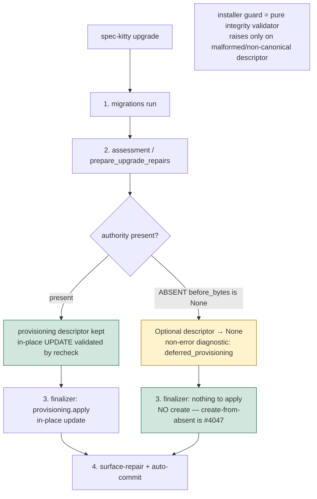

# Mission Specification: Upgrade No-Migrations Provisioning Fix + `upgrade()` Tidy-First

**Mission Branch**: `issue-1931-ci-rework-test-remainders`
**Created**: 2026-09-08
**Status**: Draft (revised post-spec adversarial squad)
**Input**: Mission A of a 2-mission split of the CI-rework remainders (parent epic #1931). Scoped to issue #4032. Locked operator decisions: non-fatal provisioning + re-evaluate (true create-from-absent deferred to #4047); tidy-first decomposition of `upgrade()` precedes the functional fix.

## Context

Reinstating GitHub CI (#3995) ran the `tests/upgrade` suite to completion for the first time and surfaced ~40 pre-existing failures. Almost all share one root: when a project's `.kittify/config.yaml` authority is absent at assessment time (fresh / no-migrations / legacy under-provisioned), managed-skill provisioning produces the message `"Managed skill provisioning requires an existing authority"`.

**Seam reality (corrected by the post-spec architecture review):** the guard's `ValueError` at `installer.py:428` is **already caught** by `assess_project_skills` (`installer.py:665-668`) and converted to an `error`-severity `Diagnostic("skill_assessment_failed", "managed_skills", ...)` with `complete=False`. That error diagnostic poisons `PreparedUpgradeRepairs.complete` (`assessment.py:65`), lands in `activation_errors`, and drives a failed outcome (`finalize.py:59-62`). It is **not** an escaping exception. Therefore "make the guard not raise" targets the wrong layer.

**Two provisioning authorities (load-bearing):** the installer guard only governs `installation.project_skills.prepared.provisioning`. The finalizer applies a *different*, non-Optional raw descriptor — `PreparedUpgradeRepairs.provisioning`, built directly from `prepare_mission_type_activations(root)` (`assessment.py:120`) and applied at `_finalizer_step_provision` → `prepared.provisioning.apply()` (`upgrade.py:1035`). Today the guard's error diagnostic short-circuits the pipeline *before* that apply runs. The moment the guard is made benign, the preflight passes and the raw `.apply()` reaches a `"create"` effect for the absent authority (`assessment.py:100`) — which **is** the #4047 create-from-absent behavior C-001 defers. A guard-only skip therefore *unblocks the very thing being deferred*.

`upgrade` is a **repair** tool. The fix makes absent-authority provisioning a **non-fatal, deferred no-op decided at the assessment/compiler layer** (an Optional descriptor nulled when no authority exists), surfaced as a **non-error diagnostic**, with the installer guard reduced to a pure integrity validator — and re-evaluates each failing test rather than assuming it is stale. Because the `upgrade()` entry is a ~345-line function carrying `# noqa: C901`, the mission **first** decomposes it (tidy-first, behavior-preserving) so the fix lands on a testable, un-suppressed surface.

## User Scenarios & Testing *(mandatory)*

### User Story 1 - `upgrade` stops failing on a config-absent (legacy / no-migrations) project (Priority: P1)

A maintainer or CI runs `spec-kitty upgrade` on a project whose `.kittify/config.yaml` authority is absent (legacy project predating the config authority, or a no-migrations checkout). Today the outcome is `failed` with `"Managed skill provisioning requires an existing authority"`.

**Why this priority**: This is the user-facing regression and the reason #4032 is P1 — `upgrade` is the repair tool and must not fail closed on exactly the projects it exists to heal. The config-absent shape is a legitimate, supported project state, not an impossible fixture.

**Independent Test**: Drive the real `upgrade()` entry point against a project with **no `config.yaml`** (the canonical KEPT legacy fixture); assert exit code 0 and a single pinned outcome (see S1), with provisioning recorded as *deferred* (not created) and no `error`-severity provisioning diagnostic.

**Acceptance Scenarios**:

1. **Given** a project with no `.kittify/config.yaml` and no pending migrations, **When** `spec-kitty upgrade` runs, **Then** it exits 0 with outcome `up_to_date` (the single expected outcome for this fixture — not "up_to_date *or* auto-commit"), and emits no `error`-severity provisioning diagnostic.
2. **Given** that project, **When** assessment finds no authority, **Then** the provisioning descriptor is nulled at the assessment layer and the condition is surfaced as a **non-error** diagnostic on a dedicated channel (JSON `deferred_provisioning`/`skipped` key + human-mode `Note:` line) — `complete` is not poisoned and the outcome is not flipped to `failed`.
3. **Given** that project, **When** the finalizer runs, **Then** the authority file is **not** created (create-from-absent remains #4047); provisioning is deferred, not completed.
4. **Given** a project where step-1 migrations ran but the authority is still absent afterward, **When** `upgrade` continues to assessment, **Then** the same non-fatal deferral applies (the guard bites regardless of whether migrations ran).

---

### User Story 2 - Behavior for a properly init-ed project is unchanged (Priority: P1)

A maintainer runs `spec-kitty upgrade` on a project that `spec-kitty init` created (authority present, possibly missing only the `mission_type_activations` key).

**Why this priority**: The fix must be narrow. The in-place, inode-preserving UPDATE path (validated by `_recheck_skill_provisioning`, `installer.py:445-473`) must be preserved exactly — this is the behavior-preservation guarantee.

**Independent Test**: The behavior-preservation oracle (`test_upgrade_char_net.py`, re-pinned to a **real init-ed** fixture) exercises the real provisioning *apply* path and stays green with its churn/warnings re-derived for the init-ed project.

**Acceptance Scenarios**:

1. **Given** a real init-ed project missing only the activation key, **When** `upgrade` runs, **Then** provisioning validates and applies the in-place update, and the emitted outcome is unchanged vs pre-mission behavior.
2. **Given** the re-pinned oracle, **When** the suite runs, **Then** it still exercises the apply path (not the skip path) and remains green.

---

### User Story 3 - The `upgrade()` entry point is decomposed and un-suppressed (Priority: P1, tidy-first enabler)

A developer maintaining the upgrade command needs the entry point to be small, testable sub-functions rather than a single ~345-line function hidden behind a complexity suppression.

**Why this priority**: Charter Standing Order #2 (tidy-first): this behavior-preserving decomposition is a **distinct step that precedes** the functional change and makes the fix land on a testable surface. It resolves `test_no_stray_noqa_c901_marker`.

**Independent Test**: `ruff check` passes with `# noqa: C901` removed from `upgrade()`; `test_no_stray_noqa_c901_marker` passes; pre-existing passing upgrade behavior tests stay green.

**Acceptance Scenarios**:

1. **Given** `upgrade()` at `cli/commands/upgrade.py:1421` with `# noqa: C901`, **When** it is decomposed into named sub-functions, **Then** each passes Ruff C901 (≤15) with no suppression and `test_no_stray_noqa_c901_marker` passes.
2. **Given** the decomposition, **When** it is done, **Then** the `repair_preflight` `with` span (the `ExitStack` / `_RECHECKED_PROJECT`+`_COMMAND_PARENTS` ContextVars / `_PROJECT_SKILL_LOCK` RLock, `finalize.py:59-64`, `installer.py:476-480`) stays one atomic extracted unit spanning provision+surface — not split into functions that open/close their own contexts.

---

### User Story 4 - The `tests/upgrade` suite is green for the right reasons (Priority: P2)

A test-suite owner needs every previously-failing upgrade test re-evaluated against intended behavior — kept, redesigned, re-pinned-with-evidence, or deleted — so the suite is trustworthy scaffold, not friction (epic #1931).

**Why this priority**: Depends on US1–US3; it is the quality gate proving the fix is real and the suite coherent, and it pays down the duplicate-knowledge debt the mission touches.

**Independent Test**: Every test in the frozen Group A list (named by nodeid in tasks) is green; each addressed test carries a recorded disposition; the de-duplicated fixture builder is in use.

**Acceptance Scenarios**:

1. **Given** the config-absent `metadata.yaml`-only fixtures in `test_upgrade_integration.py`/`test_upgrade_idempotency.py`, **When** the fix lands, **Then** they pass **unchanged** (KEPT as legitimate legacy-heal witnesses), still driving the `before_bytes is None` path.
2. **Given** `test_failed_run_exit_code_equals_outcome_exit_code` (`test_upgrade_integration.py:179-201`), which monkeypatches the `upgrade.py:517` activation backfill **and** runs on a config-absent fixture, **When** redesigned, **Then** it separately asserts (a) the forced activation error in `errors` and (b) the guard/skip diagnostic in the dedicated non-`errors` channel — a contract redesign, explicitly not a fixture swap.
3. **Given** a fixture proven genuinely unreachable by real `init` or any historical version, **When** re-pinned, **Then** the re-pin cites the specific code (or documented absence) proving unreachability and preserves assertion strength; otherwise the test is deleted, not re-pinned.
4. **Given** the project-shape fixture triplicated across `test_upgrade_char_net.py`, `test_upgrade_integration.py`, `test_upgrade_idempotency.py`, **When** consolidated, **Then** one shared realistic-fixture builder (backed by the real `init` path) with an explicit absent-authority variant replaces the three hand-maintained copies.

### Edge Cases

- **Present-but-degenerate authority** (`config.yaml` exists but is empty/corrupt → `before_bytes == b""`, not `None`): this is NOT the "absent" path and is **out of scope** (healing it is a follow-up consideration, tracked alongside #4047). It must still never produce a fatal hard-error, but completing its provisioning is not in scope.
- **`.kittify/` parent absent** (`write.absent_parents` truthy): the deferral must suppress the raw descriptor's parent-create effects too — nulling at the assessment layer handles this; a guard-only clause would not (effects are eagerly computed at `assessment.py:165`).
- **Auto-commit-disabled human mode**: the `left uncommitted` / surface-repair reporting branch (`finalize.py:66`, gated on `not outcome.activation_errors`) stays reachable only because the absent case is a non-error diagnostic.

## Requirements *(mandatory)*

### Functional Requirements

| ID | Title | User Story | Priority | Status |
|----|-------|------------|----------|--------|
| FR-001 | Non-fatal completion on absent authority | As a maintainer/CI, I want `upgrade` to exit 0 with a clean no-op outcome when `config.yaml` is absent so the repair tool does not fail closed on the projects it exists to heal. | High | Open |
| FR-002 | Defer decided at the assessment/compiler layer | As a maintainer, I want the "no authority ⇒ skip provisioning" decision made by nulling an Optional provisioning descriptor at the single assessment/compiler authority (not a guard clause alone), so guard, recheck, effects, and finalizer consume one decision and the finalizer's raw `.apply()` does NOT create the authority. | High | Open |
| FR-003 | Non-error diagnostic on a dedicated channel | As an operator, I want the absent-authority deferral surfaced as a non-`error` diagnostic on a dedicated channel (JSON `deferred_provisioning`/`skipped` key + human-mode `Note:` line) so the unhealed state is observable without poisoning `complete` or breaking `warnings==[]` assertions. | High | Open |
| FR-004 | Installer guard → pure integrity validator | As a maintainer, I want `_prepare_skill_provisioning` to raise only on a genuinely malformed/non-canonical descriptor (integrity), not on the benign "nothing to provision" case (policy). | High | Open |
| FR-005 | Decompose `upgrade()` + drop `# noqa: C901` | As a maintainer, I want the ~345-line `upgrade()` split into testable sub-functions with the suppression removed so `test_no_stray_noqa_c901_marker` passes — preserving the `repair_preflight` `with` span as one atomic unit. | High | Open |
| FR-006 | Preserve the apply path via a re-pinned oracle | As a maintainer, I want `test_upgrade_char_net.py` re-pinned to a real init-ed fixture (re-deriving churn/warnings) so it keeps exercising the real provisioning APPLY path and stays green — rather than silently becoming a test of the skip path. | High | Open |
| FR-007 | Guard-aligned test for the config-absent path | As a test owner, I want a test that drives the `config.yaml`-absent composition through the real `upgrade()`/`prepare_upgrade_repairs` and asserts non-fatal skip + deferred (not completed) provisioning + the diagnostic channel, so the headline bug is covered by construction. | High | Open |
| FR-008 | Keep legitimate legacy fixtures; re-pin only the unreachable | As a test owner, I want the config-absent `metadata.yaml`-only tests KEPT (passing via the fix), with re-pin reserved for genuinely unreachable shapes — each re-pin citing proof of unreachability and preserving assertion strength (else delete). | High | Open |
| FR-009 | Redesign the two-subsystem monkeypatch test | As a test owner, I want `test_failed_run_exit_code_equals_outcome_exit_code` redesigned to separately assert the forced activation-backfill error (`errors`) and the guard/skip diagnostic (dedicated channel), recognizing they are two subsystems — a contract redesign, not a fixture swap. | Medium | Open |
| FR-010 | Consolidate the triplicated project fixture | As a test owner, I want the project-shape scaffold (triplicated across three upgrade test files) consolidated into one shared builder backed by real `init`, with an explicit absent-authority variant (#1931 duplicate-knowledge paydown). | Medium | Open |
| FR-011 | Red-first repro of the exact signal | As a reviewer, I want each root fix to carry a RED-first repro reproducing the exact `"Managed skill provisioning requires an existing authority"` signal via the config-absent guard path through the pre-existing `upgrade()` entry — ideally adopting a pre-existing failing test as the witness, not a synthetic on the wrong subsystem. | High | Open |
| FR-012 | Traceability to #4032 | As the operator, I want every addressed item and every disposition'd test mapped to #4032 in the issue matrix. | Medium | Open |

### Non-Functional Requirements

| ID | Title | Requirement | Category | Priority | Status |
|----|-------|-------------|----------|----------|--------|
| NFR-001 | Upgrade reliability | `spec-kitty upgrade` exits 0 on the no-migrations path for both absent-authority and present-authority projects; every test in the frozen Group A list is green. | Reliability | High | Open |
| NFR-002 | Maintainability / complexity | Every sub-function extracted from `upgrade()` passes Ruff `C901` (≤ 15) with no `# noqa` / `# type: ignore` / per-file-ignore added; mypy clean. | Maintainability | High | Open |
| NFR-003 | Behavior preservation (init-ed projects) | For an already-init-ed project, the emitted outcome and the in-place provisioning write path are unchanged; the re-pinned oracle proves it by exercising the apply path. | Reliability | High | Open |

### Constraints

| ID | Title | Constraint | Category | Priority | Status |
|----|-------|------------|----------|----------|--------|
| C-001 | Non-fatal defer + re-evaluate only — NO create-from-absent | True create-from-absent (authority creation + `_recheck_skill_provisioning` create-transition validation) is OUT of scope → #4047. The fix MUST ensure the finalizer's raw `prepared.provisioning.apply()` does not create the authority when absent. | Technical | High | Open |
| C-002 | No suppression to pass gates | New/changed code passes ruff + mypy with zero added blanket suppressions. | Technical | High | Open |
| C-003 | Scope limited to #4032 | #4017, #4022, #4015, and the flaky wall-clock/NFR gates belong to Mission B. | Technical | High | Open |
| C-004 | Tidy-first sequencing | The `upgrade()` decomposition is a distinct, behavior-preserving WP/commit preceding the functional fix; it preserves the `repair_preflight` `with` span. | Process | High | Open |
| C-005 | Canonical sources + terminology | Use canonical templates/skills/CLI; honor the terminology canon (Mission, not Feature). | Technical | Medium | Open |
| C-006 | Present-but-degenerate authority out of scope | `before_bytes == b""` (empty/corrupt `config.yaml`) is not the "absent" path; it must not hard-error, but healing it is a follow-up, not this mission. | Technical | Medium | Open |

### Key Entities

- **Config authority** (`.kittify/config.yaml`, or a `charter:`-pointed `charter.yaml` for migrated projects): presence/absence drives `write.before_bytes is None`.
- **Assessment provisioning descriptor** (`PreparedUpgradeRepairs.provisioning`, `assessment.py:48,120`): the raw, non-Optional descriptor the finalizer applies (`upgrade.py:1035`) — the seam to make Optional/null.
- **Installer guard** (`_prepare_skill_provisioning`, `installer.py:416-442`): to be reduced to a pure integrity validator.
- **Recheck** (`_recheck_skill_provisioning`, `installer.py:445-473`): in-place-only validation — the reason create-from-absent is the larger #4047.
- **Diagnostic / completeness** (`Diagnostic(...)`, `PreparedUpgradeRepairs.complete`, `assessment.py:65,171`; `activation_errors`, `finalize.py:59-62`): the channel whose severity must become non-error for the absent case.

## Success Criteria *(mandatory)*

### Measurable Outcomes

- **SC-001**: `spec-kitty upgrade` on a `config.yaml`-absent no-migrations project exits 0 with the single pinned `up_to_date` outcome (no `"requires an existing authority"` error) in 100% of runs.
- **SC-002**: Every test in the **frozen Group A list** (the ~40 failing with `"requires an existing authority"` through the provisioning path, enumerated by nodeid in tasks) is green — an objective, diff-checkable criterion, not an attribution argument.
- **SC-003**: At least one KEPT test drives the `before_bytes is None` path through the real `upgrade()` to exit 0 (US1 S1–S3) — the bug is covered by construction, not avoided.
- **SC-004**: A test asserts the non-error deferral diagnostic is emitted on the dedicated channel on the absent-authority path.
- **SC-005**: `test_no_stray_noqa_c901_marker` is green and `ruff check` reports no C901 suppression on `upgrade()`; each extracted sub-function is ≤15 complexity.
- **SC-006**: The re-pinned oracle (`test_upgrade_char_net.py`) stays green AND still exercises the real provisioning apply path (NFR-003 behavior preservation holds for init-ed projects).
- **SC-007**: 100% of addressed failing tests carry a recorded disposition (kept / redesigned / re-pinned-with-evidence / deleted), traceable to #4032.

## Assumptions

- A faithfully `init`-ed project always writes `config.yaml` (`init.py:1215`); the config-absent path represents legacy/under-provisioned projects, which `upgrade` is expected to tolerate — so config-absent fixtures are KEPT, not re-pinned.
- Non-fatal defer is an acceptable interim: provisioning is *deferred*, not completed, for absent-authority projects, surfaced observably (FR-003). If that leaves real projects persistently unhealed, #4047 (create-from-absent) is pulled forward (noted on that issue).
- Group B of the original failures (`tests/upgrade/preview_support/test_public_witnesses.py`) is a separate, pre-declared WP13 preview-disclosure gap and is NOT in scope.
