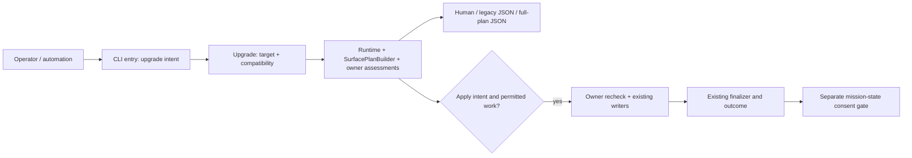

# Implementation Plan: Upgrade Preview Reliability and Mission Corpus Health

**Branch**: `codex/upgrade-preview-mission-health` | **Date**: 2026-09-06
**Spec**: [spec.md](spec.md) | **Audience**: agentic-framework-core-team
**Status**: Authored for independent post-plan review. Implementation and verification remain pending.

## Summary

Make assessment read-only from process entry, validate the requested target
through the existing authority, and expose owner-produced physical effects.
Preserve strict legacy JSON and introduce `upgrade --plan-json`, an explicit
preview-only full plan. Independently recover the four corpus failures without
losing identity, event history, verdicts, or separate repair consent.

The operator confirmed the issue acceptance brief, discovery waiver and use of
established architecture/defaults. Engineering alignment is the approved spec;
no new technology interview is needed. Local consolidation targets
`codex/upgrade-preview-mission-health`; publication PR targets `main`.
Parent supplied root plan_file from setup-plan although feature_dir pointed at
coord. Author only root planning artifacts. Parent owns branch-context checks,
phase advancement, commits and tasks. Do not rerun setup-plan or infer its
branch_matches_target field from this document.

## Technical Context

**Language/Version**: Python >=3.11, as declared in pyproject.toml.
**Primary Dependencies**: Existing Typer/Click, Rich, packaging.version, YAML,
jsonschema and pytest; no production dependency changes.
**Storage**: Existing files, JSON/YAML manifests, Git and mission event JSONL.
No database or persistent plan store.
**Testing**: Public source CLI subprocess red/green, strict JSON Schema,
independent lstat snapshots, installed-wheel witness, targeted owner tests and
existing architecture gates; see contracts/acceptance.md.
**Target Platform**: Existing Linux, macOS and Windows CLI support.
**Project Type**: Existing Python CLI. Changes stay in specify_cli, three named
charter.activation owner files for pure provisioning preparation, and narrowly
scoped repository corpus data/test gates.
**Performance Goals**: Preserve charter's typical CLI <2s budget. Measure
cold/warm same-version planning p50/p95 and baseline cost; do not hide an
over-budget baseline or add flaky per-test timing assertions. Scan/render once
per distinct owner/root and deduplicate shared paths.
**Constraints**: Zero preview writes/network/persistence; ownership recheck;
SaaS sync disabled; no global test assets; no release/version bump.
**Scale/Scope**: Configured tool surfaces, selected worktrees, four original
corpus failures and a full corpus audit. Historical 608/304/225 counts are
observations, not acceptance constants.

Supply-chain: no dependency addition/upgrade/removal, new registry, lifecycle
script or Node tooling. Use existing locked build/test dependencies for an
isolated wheel witness. Directive 051/dependency-hygiene does not authorize
resync or global installation.

## Charter Check

| Gate | Design disposition |
| --- | --- |
| Single authority, 001/031/044 | SurfacePlanBuilder retains inventory; owners retain rendering/writes; one upgrade composer, no CLI path catalog. |
| Context and decisions, 003/032 | Separate compatibility, target validity, completeness and execution outcomes; freeze translations in contracts. |
| ATDD, 041/043 | Existing-entry-point red evidence, oracle mutation controls and non-vacuous architecture gate. |
| Preservation | Exact ownership, ambiguous custom-content preservation, raw-event hashes and original mission identity. |
| Locality/tidy-first | Refactor touched owned methods before behavior changes; no generic transaction framework or governance rewrite. |
| Layering | CLI -> upgrade -> existing owners; shared operation values import no owners/CLI. Finalizer never imports CLI. |
| Traceability | Requirement/evidence map below; parent owns lifecycle, issue matrix and independent review. |

Loaded Alphonso and plan action first with sync off. Applied design/review
specialization, no production implementation, planner handoff, directives
001/003/031/032/041/043/044, development-bdd and show-me. Plan bootstrap returned
235 references/selected governance text, but structured directives/tactics were
empty. Use explicit charter/profile sources and disclose this limitation.
[#3908](https://github.com/Priivacy-ai/spec-kitty/issues/3908) tracks compact
governance degradation. For
[#3909](https://github.com/Priivacy-ai/spec-kitty/issues/3909), read the full
canonical software-dev plan prompt rather than treating a composition placeholder
as an actionable/completed phase. Exact CLI friction belongs only in the external
ledger. No activation/config repair is part of this mission.

Post-design check: no known design-level charter violation; acceptance and
architecture checks remain planned. Independent post-plan review is pending.
The REASONS Approach/Structure are elaborated here; parent owns any canvas sync.

## Architecture and Decisions

Context: operator/automation invokes one CLI against project/worktree and
machine assets. Existing providers/installers mediate writes. Corpus recovery
is a separate maintainer operation.

Diagram description: a component view inside the CLI. Preview reads assessments
and exits through rendering; apply alone crosses ownership recheck to writers.
Text contracts remain authoritative.



### D1: Intent precedes startup effects

Add immutable UpgradeIntent in `upgrade/intent.py`. Parse from real Click
subcommand option definitions in parse-only mode without callbacks or
side-effecting defaults. Root and command use the same interpretation, not
separate hand-written argv scanners. Invalid values/conflicts fail without
bootstrap. Preserve completion/help/version/next and ordinary non-upgrade paths.

For upgrade, defer root ensure calls until apply has validated target/schema.
Preview/guidance skips readiness/nag/bootstrap mutations but keeps non-mutating
safety gates. Include --plan-json in early machine-output detection.
Standalone hidden agent operations retain their existing semantics. Reject
hidden-option combinations with effective preview/guidance before dispatch,
including implicit --project --json and explicit/default guidance; do not base
purity on explicit preview switches alone. Exact envelope precedence is in
contracts/upgrade-cli.md, including the default actual --json too-new legacy
planner exception (process 5) and new --plan-json full-envelope precedence.
Use a no-network compatibility provider and non-persisting cache view in preview:
no shown-at/preferences/version writes, cache mkdir, locks or implicit installs.
CI=1, --no-nag and SaaS sync=0 are not substitutes for this boundary.

### D2: Extend existing owner assessment, not inventories

Keep SurfacePlanBuilder, registry expansion, provider-owned instances and
SurfaceStatusService. Add stdlib-only immutable values in
`tool_surface/operations.py` and a separate assessment/apply protocol for
upgrade-capable providers. Existing doctor/init repair surfaces delegate to
the same owner selection/render/compare logic when changed.

Each owner assesses exact effects and opaque in-process prepared data; its
existing writer applies after rechecking inputs. No write/delete preview
simulation, generic virtual filesystem, serialized replay token or transaction
engine. contracts/owner-operations.md freezes this small seam.

Include runtime package merge, command/skill refresh, retired managed cleanup,
stamps, manifests/refcounts, profile pruning, native config, orientation/rules/
hooks, applicable staged bundle output, retained backups, parent directories,
modes and managed link conversion. Do not auto-install advisory plugin output.
Full-agent installation must report the complete bundle, not only missing IDs.
Global skill writes reached from project installation delegate to the runtime
owner and are deduplicated, not implemented/reported a second time.

### D3: Compose phases; preserve finalizer authority

Add `upgrade/assessment.py`. Reuse VersionDetector, MigrationRegistry and the
target validator. Extract stamp calculations into pure upgrade helpers; retain
activation target/key/serialization authority in charter.activation. IC-07 owns
a narrow preparation seam in compiler.py, pack_manager.py and charter_yaml_io.py:
resolve the existing pointer-aware target, preserve absent-vs-empty semantics,
validate and render the owned section without writing. Return lower-layer
prepared bytes/projected activation values and source observations; no import of
specify_cli.tool_surface into charter. Existing charter writers consume the same
prepared output after recheck. Upgrade wraps that output as PhysicalEffect;
it does not duplicate YAML policy. CLI stays wiring/rendering.
Finalizer retains activation ->
surface repair -> generated churn commit -> independently consented mission
repair, including success gates, worktree failures, dirty baseline/manual review
and outcome-derived apply exit.

Assessment orders global preparation, migrations/metadata, provisioning,
manifest normalization and surface effects. Supply concrete projected config/
manifests and package source selections to dependent owners as immutable
inputs; do not build a generic filesystem overlay. Preserve explicitly empty
mission_type_activations. Normalization must not manufacture ownership.

Historical migrations with unknown effects or unpredictable input changes
mark dependent phases incomplete, with real migration IDs and explicit
diagnostics. Never claim a complete no-change plan. Existing migration apply
can still run under existing consent; reassess actual post-migration state
before repair. An incomplete preview does not authorize destructive repair.
Same-version fixtures have no exemption: exact complete effects are required.

### D4: Target validity and compatibility are independent

Extend the existing `upgrade/runner.py` validator for malformed input; retain
PEP 440 lower/equal/higher semantics. Do not impose target <= installed:
higher target is not a promise that this CLI ships future migrations.
Unknown current version retains migration-from-0.0.0 handling; malformed known
metadata is diagnosed rather than fabricated.

For invalid target with no stronger blocker, strict legacy projection is
BLOCK_INCOMPATIBLE_FLAGS / case none / semantic code 2, preserving project
state. Preserve independent corrupt/too-new/stale decisions and include the
target reason alongside them. Full JSON exposes both axes. Exact messages,
precedence and process codes are frozen in contracts/upgrade-cli.md.

### D5: Preservation and honest partial failure

Keep manifest/path proof, shared owners, observed hashes, modes and link types.
Unknown ownership means preserve/warn, never adopt arbitrary content by hashing
it. Edited managed content is drift; --yes is not overwrite or mission-repair
consent. Mixed config edits preserve unowned regions. Recheck the whole owner
batch before its first write, under existing locks where available; mismatch
means no batch writes and fresh assessment. Preserve per-file atomic writes,
but do not promise cross-owner rollback. Partial I/O failures report actual
success/failure and persist only truthful manifest state.
Allocate retained backup paths deterministically from observed replacement
state, with collision/precondition checks; never use the current clock for
persistent path identity. Sample new manifest timestamps during assessment
only; apply consumes prepared bytes without resampling. Exact invocation hashes
and the narrow cross-invocation timestamp comparison rule are frozen in
contracts/owner-operations.md. No persisted plan or generic allocator is added.

### D6: Corpus recovery is separate data work

contracts/corpus-recovery.md freezes restoration of 31 lost files from
`3442ca1afc20b1b83b27a7bc64fd7014050b12a1`, retaining the surviving schema.
The 32-file historical tree was verified against the pre-convergence public
parent with an empty path-scoped diff. Preserve original ID.
Relocate R2-T1's two documents byte-for-byte to
`docs/archive/program-evidence/R2-T1-local-legacy-removal/`.
Materialize two snapshots through scoped canonical CLI, preserving event hashes
and eight verdicts. Full gated corpus audit, no blanket doctor --fix.

## Project Structure

Mission: plan.md; existing research.md (unchanged); data-model.md; quickstart.md;
contracts/{upgrade-cli.md,upgrade-plan.schema.json,owner-operations.md,
acceptance.md,corpus-recovery.md}. No tasks generated here.

```text
src/specify_cli/
  __init__.py, cli/helpers.py    startup, IC-02
  upgrade/intent.py             parse-only intent, IC-02
  tool_surface/operations.py    immutable owner contracts, IC-01
  tool_surface/                 core IC-01; named providers below
  runtime/                      global writers, IC-02
  skills/                       command IC-03; managed IC-04; vibe config IC-06
  session_presence/             orientation/config writers, IC-06
  upgrade/assessment.py          phase composer, IC-07
  upgrade/                      IC-07 except intent.py
  compat/                       read-only compat/legacy projection, IC-07
  cli/commands/upgrade.py        sole integration owner, IC-07
tests/                          named owner tests + aggregate IC-09
src/charter/activation/          IC-07: compiler.py, pack_manager.py,
                                charter_yaml_io.py preparation/render seam
src/runtime/next/runtime_bridge_io.py  separate parent-owned phase-guard lane
kitty-specs/<four originals>/    corpus recovery, IC-08
docs/archive/program-evidence/  R2-T1 destination, IC-08
```

Paths above are physical repository paths, not import compatibility aliases.
Verified definitions include runtime/bootstrap.py:154, runtime/agent_commands.py:370,
runtime/agent_skills.py:128, skills/command_installer.py:380,
skills/installer.py:236, tool_surface/providers/managed_skills.py:123 and
compat/planner.py:711, all under src/specify_cli/. Provider delegation reaches
the physical profiles/, bundles/ and session_presence/ trees shown below.
Existing enforced module/layer gates take precedence over this derived map.

The separate phase-guard collector is physically
`src/runtime/next/runtime_bridge_io.py` (collects WP lane facts around line 1070),
NOT `src/specify_cli/runtime/`. Any parent-directed guard fix belongs to a
separate parent-owned lane with tests/next ownership; IC-02 does not acquire it.
This topology note does not authorize a guard-policy change or expand this
mission's approved requirements. Existing kernel path authorities are consumed,
not reimplemented or assigned to the global-runtime lane.

## Implementation Concern Map

Inputs to task slicing, not authored WPs. One implementer and independent
reviewer per concern. No neighboring file edits; route changes to its owner.
In the table, runtime/, skills/, upgrade/, compat/, cli/ and __init__.py are
relative to `src/specify_cli/`; providers/ is relative to
`src/specify_cli/tool_surface/`. tool_surface/ and session_presence/ are relative
to `src/specify_cli/`. Tests and corpus paths are repository-relative.
New files are operations.py, intent.py, assessment.py and the named IC-09 tests;
all other named implementation paths were checked against the physical tree.

| IC | Exclusive ownership and responsibility | Dependencies / verification |
| --- | --- | --- |
| IC-01 | tool_surface/{operations,model,plan,repair,service,registry}.py and providers/{protocol,_registry,_discovery}.py: values, assessment dispatch and safe policy | First; core surface/value tests. No concrete providers/installers. |
| IC-02 | __init__.py, cli/helpers.py, upgrade/intent.py, runtime/**, providers/slash_commands.py: startup/global operations | IC-01; startup/runtime/slash tests. Runtime commands and slash provider stay together. |
| IC-03 | skills/{command_installer,command_renderer,manifest_store}.py; providers/command_skills.py | IC-01; command/refcount/custom-content and symlink tests. No other skills files. |
| IC-04 | skills/** EXCEPT IC-03 files and vibe_config.py; providers/managed_skills.py: managed projection/backup/manifests/global delegation | IC-01/IC-02; managed skill tests. No runtime edits. |
| IC-05 | tool_surface/profiles/**, providers/agent_profiles.py: profile/pruning/manifest assessment | IC-01; projection, drift and pruning tests. |
| IC-06 | providers/{native_config,session_presence,plugin_bundle}.py; tool_surface/bundles/**; session_presence/**; skills/vibe_config.py | IC-01; consume IC-03 through IC-05 outputs for bundles; writer/provider tests. |
| IC-07 | cli/commands/upgrade.py; upgrade/** EXCEPT intent.py; compat/**; upgrade user docs | IC-01 through IC-06; version/JSON/finalizer/flag integration and existing upgrade/compat tests. Sole upgrade.py owner. |
| IC-08 | Four original corpus dirs, new R2-T1 destination, discovered mutable references and corpus evidence test | Independent; no status reducer/auditor/consent source edits. Preserve schema consumer path. Coordinate any IC-07-owned reference edit through IC-07. |
| IC-09 | New tests/upgrade/test_upgrade_preview_acceptance.py, tests/upgrade/preview_support/, tests/architectural/test_upgrade_assessment_boundary.py, isolated-wheel evidence | Oracle/red work starts first; final integration after IC-02 through IC-08. No production or shared conftest edits. |
| IC-10 | tests/architectural/test_archive_root_byte_identical.py and a new focused test-only preservation-policy regression file: narrowly reconcile M1 freeze with authorized lifecycle/corpus operations | Parent's full diagnostic and independent gate review first; consume IC-08 evidence. No corpus or runtime source edits; no overlap with IC-09 files. |

IC-07 additionally and exclusively owns the physical
`src/charter/activation/{compiler,pack_manager,charter_yaml_io}.py` preparation
seam, plus targeted tests in `tests/charter/{test_pack_manager,
test_charter_yaml_io,test_compiler_charter_yaml}.py` and
`tests/specify_cli/upgrade/test_upgrade_provisions_mission_type_activations.py`.
This bounded lower-layer extraction is not governance/activation repair.
If task sizing requires a charter sub-lane, split these exact files and tests
out of IC-07 entirely before dispatch; IC-07 then consumes its output. Never
assign the same runtime/provider/charter file to concurrent WPs.

IC-02 consuming skill registry/renderers does not acquire those files. IC-04
delegates global writes through IC-02's operation interface. IC-06 can split
native/session and bundle lanes if oversized; IC-01 still owns protocol/glue.
Do not split IC-07 by issue number because #3901/#3902 share upgrade.py.

## Parallel Work Analysis

IC-09 oracle/pre-fix public regressions run alongside IC-01.
Then IC-02/IC-03/IC-05 and IC-06 writer work proceed independently; IC-04 consumes IC-02.
IC-07 may start isolated validator/render tests after IC-01 but integrates only
delivered owner contracts. IC-08 is independent. Final IC-09 witness follows
integration. Every owned bugfix starts with a committed red acceptance test;
parent manages commits and slicing. No shared conftest changes assumed.
Aggregate evidence supplements each concern's targeted verification.

## Requirement and Evidence Map

| Requirements | Concerns | Evidence |
| --- | --- | --- |
| FR-001, NFR-001 | IC-02/IC-07/IC-09 | G0-G7 snapshots, TTY/non-CI, transient-write checks |
| FR-002/003/004 | IC-01 through IC-07/IC-09 | P0-P8 plus cold/stale plan/apply equality, second-run no churn |
| FR-005/006, NFR-002 | IC-07/IC-09 | B matrix, independent blockers, pinned legacy/new schemas |
| FR-007/008/009 | IC-08/IC-09 | 31 blobs restored, exact R2-T1 moves, replay hash/verdict checks, full audit |
| FR-010, NFR-004 | IC-02 through IC-08/IC-09 | Ownership/precondition sentinels, negative/positive consent controls |
| FR-011, C-004/005/006 | Parent + all | Issue-to-red/green/code/data/review evidence; external friction |
| C-001/002/003, NFR-003 | All | No duplicate inventory/dependencies, isolation, non-vacuous gates |

## Verification and Complexity Tracking

contracts/acceptance.md and quickstart.md define the checks. Implementers run
owned tests, affected subsystem dirs, calibrated make test-fast, changed-module
ruff/mypy, and layer/dead-code/assessment-boundary gates. New architectural
tests/shared test infrastructure require the full architectural suite under
repo policy. No make test-full here; parent/CI owns broader consolidation gates.
Parent must execute the explicit full contract/architecture/current E2E floor
and terminal issue-matrix handoff in contracts/acceptance.md's final gate table.
Known five-case baseline is 2 failed/3 passed/0 skipped, not a passed floor.
Planning-lane ancestry and fake-events collection failures require tracked
owner dispositions and fresh evidence; no duplicate harness repair lane is
created here. Effective sync-fixture policy and retired SaaS-scenario governance
disposition are explicit prerequisites, not blanket environmental waivers.
Measure planning against the <2s budget without network; report evidence rather
than silently waiving failures.

### Observed Archive-Gate Conflict

Parent reports the architecture sweep's first failure at collected test 16,
`test_archive_root_byte_identical::test_no_preexisting_archived_file_was_modified`.
Full sweep/diagnostic remains pending; plan author has not run this gate.
Update: parent filed [#3911](https://github.com/Priivacy-ai/spec-kitty/issues/3911)
with a scoped supported-lifecycle-append reproduction: 1 failed, 2 passed.
That observed red confirms the conflict; full sweep classification is still
pending and no remediation has been executed by this author.
Source inspection confirms tests/architectural/test_archive_root_byte_identical.py
compares all four roots against merge-base(HEAD, origin/main), with only the
docs-rename occurrence-map exception. The M1-specific immutable-archive rule is
not authority to prohibit supported kitty-ops/lifecycle.jsonl appends or this
mission's explicitly authorized provenance-preserving corpus recovery.

IC-10 must first retain the observed red output, exact baseline SHA and changed
paths, then classify each against the owning requirement with independent review.
Replace blanket treatment only for exact authorized operations with stronger
positive preservation predicates: lifecycle old bytes remain an exact prefix
and appended records pass canonical validation; snapshot changes equal canonical
replay with unchanged raw-event hashes/eight verdicts; R2-T1 relocations preserve
source blob/mode at the exact destination; restored files match the pinned
historical tree. No generic path exemption, branch-name bypass, skip/xfail,
empty baseline, shifted baseline or whole-root allowance. Unclassified edits
remain failures. Other mission artifacts require their own explicit ownership
classification from the pending diagnostic, never a guessed exception here.

Keep the original M1 preservation assertion over its actual historical scope
and the non-empty baseline check. Test destructive prefix rewrites, altered
events/verdicts, wrong relocation bytes and unrelated archived edits as negative
controls; each must fail. Rerun the full architectural suite and obtain an
independent preservation-lens review of both gate change and corpus evidence.
This is a test-remediation lane, not relaxation of FR-007-010 or permission to
edit archived evidence opportunistically. Unresolved classification blocks
implementation acceptance; parent owns final diagnostic/disposition.

Rejected: fabricated CLI file inventory, ID-only dry-run output, extra legacy
keys, downgrade-as-corrupt, global transactions/replay plans, blanket corpus
repair. Python/JSON contracts fit this CLI; REST/GraphQL would invent a service.
No unresolved product decision or intentional charter exception. Independent
post-plan review may revise the design before task dispatch.
